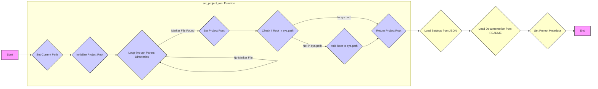
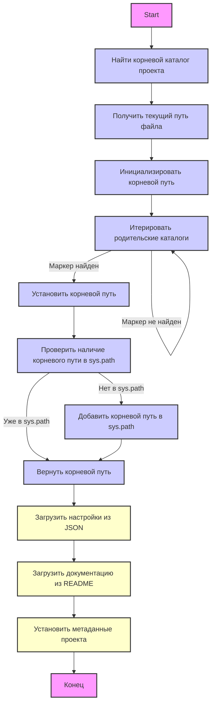
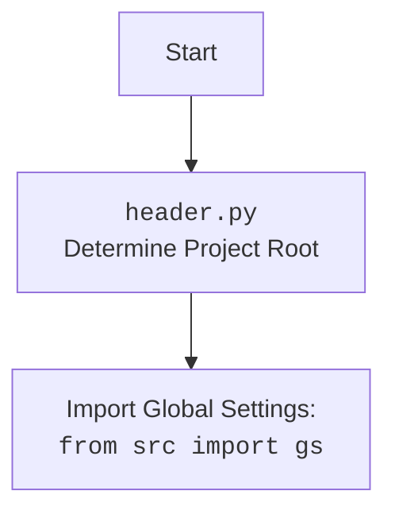

## ИНСТРУКЦИЯ:

Анализируй предоставленный код подробно и объясни его функциональность. Ответ должен включать три раздела:

1. **<алгоритм>**: Опиши рабочий процесс в виде пошаговой блок-схемы, включая примеры для каждого логического блока, и проиллюстрируй поток данных между функциями, классами или методами.
2. **<mermaid>**: Напиши код для диаграммы в формате `mermaid`, проанализируй и объясни все зависимости,
    которые импортируются при создании диаграммы.
    **ВАЖНО!** Убедитесь, что все имена переменных, используемые в диаграмме `mermaid`,
    имеют осмысленные и описательные имена. Имена переменных вроде `A`, `B`, `C`, и т.д., не допускаются!

    **Дополнительно**: Если в коде есть импорт `import header`, добавьте блок `mermaid` flowchart, объясняющий `header.py`:
    ```mermaid
    flowchart TD
        Start --> Header[<code>header.py</code><br> Determine Project Root]

        Header --> import[Import Global Settings: <br><code>from src import gs</code>]
    ```

3. **<объяснение>**: Предоставьте подробные объяснения:
   - **Импорты**: Их назначение и взаимосвязь с другими пакетами `src.`.
   - **Классы**: Их роль, атрибуты, методы и взаимодействие с другими компонентами проекта.
   - **Функции**: Их аргументы, возвращаемые значения, назначение и примеры.
   - **Переменные**: Их типы и использование.
   - Выделите потенциальные ошибки или области для улучшения.

Дополнительно, постройте цепочку взаимосвязей с другими частями проекта (если применимо).

Это обеспечивает всесторонний и структурированный анализ кода.
## Формат ответа: `.md` (markdown)
**КОНЕЦ ИНСТРУКЦИИ**

## <алгоритм>



**Пошаговое описание алгоритма:**

1.  **Начало**: Программа начинает выполнение с вызова функции `set_project_root()`.
2.  **Получение текущего пути**: Получается абсолютный путь к директории, где находится текущий файл (`header.py`). Например, если файл находится по пути `/home/user/hypotez/src/endpoints/hypo69/header.py`, то `current_path` будет `/home/user/hypotez/src/endpoints/hypo69`.
3.  **Инициализация корневого пути**: Корневой путь проекта (`__root__`) изначально устанавливается равным текущему пути. В нашем примере, `__root__` изначально `/home/user/hypotez/src/endpoints/hypo69`.
4.  **Поиск корневой директории**:
    *   Происходит итерация по родительским директориям, начиная с текущей (`/home/user/hypotez/src/endpoints/hypo69`, затем `/home/user/hypotez/src/endpoints`, далее `/home/user/hypotez/src` и так далее до `/home/user/hypotez`).
    *   Для каждой родительской директории проверяется, содержит ли она любой из файлов-маркеров (`__root__`, `.git`).
    *   При обнаружении директории с маркером, `__root__` переопределяется этим путем, и цикл прерывается. Если, например, файл `.git` находится в `/home/user/hypotez`, то `__root__` станет `/home/user/hypotez`.
5.  **Добавление корневого пути в `sys.path`**: Проверяется, есть ли путь до корневой директории (`__root__`) в `sys.path`. Если его нет, он добавляется в начало списка `sys.path`. Это необходимо для корректного импорта модулей из проекта.
6.  **Возврат корневого пути**: Функция возвращает определенный корневой путь проекта (`__root__`).
7.  **Загрузка настроек**:
    *   Попытка загрузить настройки из `settings.json`, расположенного в `/src` директории, относительно корневого пути.
    *   Если файл не найден или если JSON не валиден, исключение перехватывается, и `settings` остается `None`.
8.  **Загрузка документации**:
    *   Попытка загрузить строку документации из `README.MD`, расположенного в `/src` директории, относительно корневого пути.
    *   Если файл не найден или если произошла ошибка при чтении файла, исключение перехватывается, и `doc_str` остается `None`.
9.  **Установка метаданных проекта**:
    *   Метаданные проекта (`__project_name__`, `__version__`, `__doc__`, `__details__`, `__author__`, `__copyright__`, `__cofee__`) извлекаются из загруженных настроек (если они есть), или устанавливаются значения по умолчанию.

## <mermaid>





**Объяснение `mermaid` диаграммы:**

1.  **`Start --> FindProjectRoot`**: Процесс начинается с поиска корневого каталога проекта.
2.  **`FindProjectRoot --> SetCurrentPath`**: Функция `set_project_root` сначала получает абсолютный путь текущего файла.
3.  **`SetCurrentPath --> InitRootPath`**: Корневой путь проекта изначально устанавливается равным текущему пути файла.
4.  **`InitRootPath --> IterateParentDirs`**: Начинается итерация по родительским директориям текущего файла.
5.  **`IterateParentDirs -- "Маркер найден" --> SetRootPath`**: Если в одной из родительских директорий обнаружен маркерный файл (например, `__root__` или `.git`), корневой путь проекта обновляется.
6.  **`IterateParentDirs -- "Маркер не найден" --> IterateParentDirs`**: Если маркер не найден, цикл продолжается, переходя к следующей родительской директории.
7.  **`SetRootPath --> CheckSysPath`**: Проверяется, добавлен ли определенный корневой путь в `sys.path`.
8.  **`CheckSysPath -- "Нет в sys.path" --> AddToSysPath`**: Если корневой путь отсутствует в `sys.path`, он добавляется.
9.   **`CheckSysPath -- "Уже в sys.path" --> ReturnRootPath`**: Если корневой путь уже есть в `sys.path`, то он возвращается
10. **`AddToSysPath --> ReturnRootPath`**: После добавления пути в `sys.path`, функция возвращает корневой путь.
11. **`ReturnRootPath --> LoadSettings`**: Из файла `settings.json` загружаются настройки проекта.
12. **`LoadSettings --> LoadDoc`**: Из файла `README.MD` загружается документация проекта.
13. **`LoadDoc --> SetProjectMetadata`**: Устанавливаются метаданные проекта на основе загруженных настроек и документации.
14. **`SetProjectMetadata --> End`**: Конец выполнения.

**Дополнительный `mermaid` блок:**
*  Этот блок отображает импорт глобальных настроек `gs` из пакета `src`.

## <объяснение>

**Импорты:**

*   **`import sys`**: Модуль `sys` предоставляет доступ к некоторым переменным и функциям, которые взаимодействуют с интерпретатором Python. Используется для изменения `sys.path`, что позволяет импортировать модули из корневой директории проекта.
*   **`from pathlib import Path`**: Класс `Path` из модуля `pathlib` используется для работы с путями к файлам и директориям в кросс-платформенном стиле.

**Функция `set_project_root`:**

*   **Аргументы**:
    *   `marker_files` (tuple): Кортеж строк, содержащий имена файлов или директорий, которые используются для определения корня проекта. По умолчанию (`'__root__'`, `'.git'`).
*   **Возвращаемое значение**:
    *   `Path`: Объект `Path`, представляющий путь к корневой директории проекта.
*   **Назначение**:
    *   Определяет корневую директорию проекта, проходя вверх по родительским каталогам и останавливаясь, когда находит один из `marker_files`.
    *   Если корень проекта не найден, функция вернет директорию, в которой находится `header.py`.
    *   Добавляет корневой путь в `sys.path`, чтобы импорты внутри проекта работали корректно.
*   **Примеры**:
    *   Если `header.py` находится в `/home/user/hypotez/src/endpoints/hypo69/header.py`, и файл `.git` находится в `/home/user/hypotez`, то функция вернет объект `Path('/home/user/hypotez')`.
    *   Если маркеры не найдены, функция вернёт директорию, где находится файл `header.py`: `Path('/home/user/hypotez/src/endpoints/hypo69')`.

**Переменные:**

*   **`__root__`**: Объект `Path`, который хранит абсолютный путь к корневой директории проекта.
*   **`settings`**: Словарь (`dict`) или `None`, содержащий загруженные из `settings.json` настройки проекта.
*   **`doc_str`**: Строка (`str`) или `None`, содержащая загруженное из `README.MD` описание проекта.
*    **`__project_name__`**: Строка (`str`), представляющая название проекта. По умолчанию 'hypotez'.
*    **`__version__`**: Строка (`str`), представляющая версию проекта.
*   **`__doc__`**: Строка (`str`), представляющая документацию проекта.
*    **`__details__`**: Строка (`str`), представляющая детали проекта (в коде не используется, всегда пустая строка).
*   **`__author__`**: Строка (`str`), представляющая автора проекта.
*   **`__copyright__`**: Строка (`str`), представляющая авторские права на проект.
*   **`__cofee__`**: Строка (`str`), представляющая сообщение для пожертвований разработчику.
**Импорт `from src import gs`:**

*   Этот импорт добавляет глобальные настройки, хранящиеся в пакете `src`. Вероятно, `gs` содержит информацию о путях, конфигурациях или других настройках, которые используются в других частях проекта.
*   В данном файле `gs` используется для получения абсолютного пути до файла `settings.json` и `README.MD`.

**Цепочка взаимосвязей с другими частями проекта:**

1.  **Определение корня проекта**: Функция `set_project_root` является ключевой для определения абсолютного пути до корня проекта, что необходимо для правильной работы импортов внутри проекта.
2.  **Использование `gs`**:  Файл использует `from src import gs` для получения доступа к глобальным настройкам, что говорит о том, что он зависит от конфигураций, хранящихся в пакете `src`.
3.  **Загрузка настроек**: Загрузка файла `settings.json`, говорит о том, что код зависит от внешнего источника конфигураций, а именно структуры `json` файла.
4.  **Загрузка документации:** Загрузка файла `README.MD`, говорит о том, что код зависит от документации проекта.
5.  **Установка метаданных**: Установка метаданных проекта (`__project_name__`, `__version__`, `__doc__`, и т.д.) может использоваться в других частях проекта, например, при создании документации, или отображении информации о проекте.

**Потенциальные ошибки и области для улучшения:**

1.  **Обработка исключений**: В блоках `try-except` для открытия файлов `settings.json` и `README.MD`  используется `...` (Ellipsis) в качестве обработки исключений. Это подавляет ошибки без какой-либо обработки, что может затруднить отладку. Можно заменить `...` на более информативную обработку ошибок, например, запись в логи.
2.  **Значения по умолчанию**: Если `settings` является `None`, то для большинства метаданных устанавливаются пустые строки `''`, кроме `__project_name__` и `__cofee__`. Желательно установить значения по умолчанию для всех полей, которые могут понадобиться в дальнейшем.
3.  **Отсутствие проверки содержимого файла:** В случае успешного открытия файла, не проверяется, валидный ли `json`, который был загружен, или валидный ли `md` файл.
4.  **Жесткие пути:** Использование строковых путей, таких как `'src'` может привести к проблемам при изменении структуры проекта.
5.  **Отсутствие логирования:** При возникновении каких либо ошибок желательно их логгировать для удобства дальнейшей отладки.
6.  **Глобальные переменные:** Активное использование глобальных переменных может привести к проблемам с сопровождением проекта.