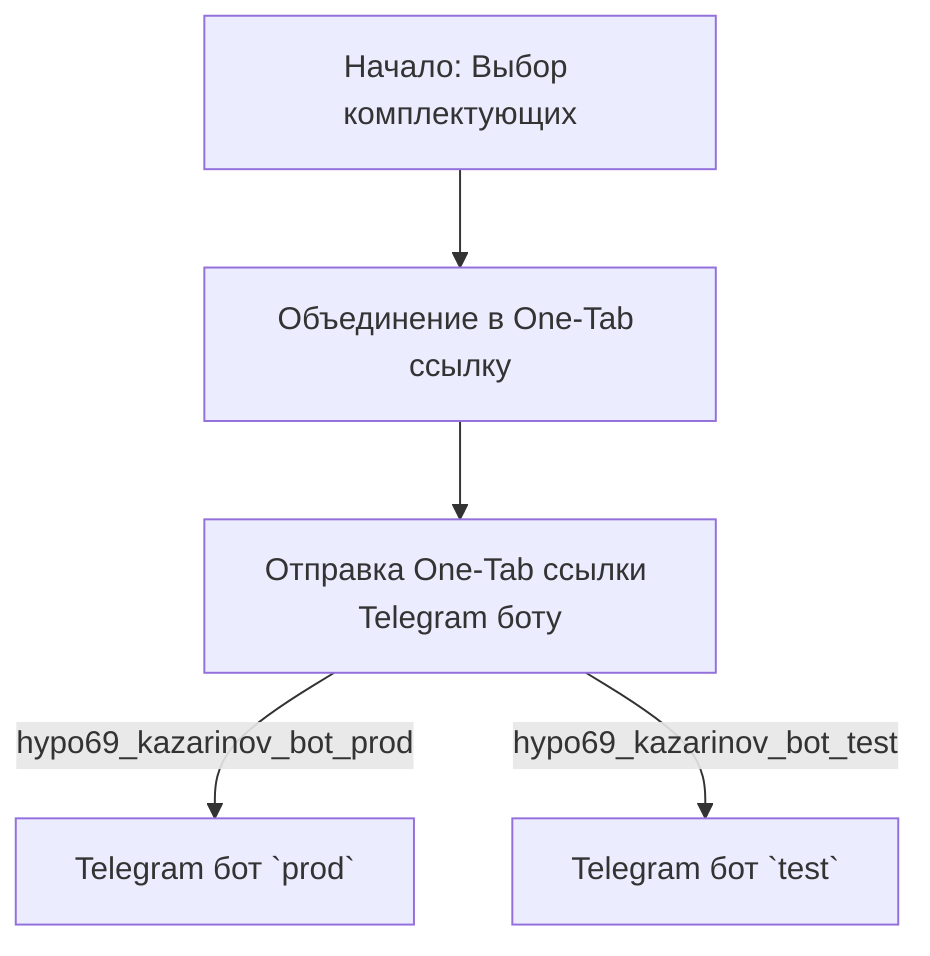
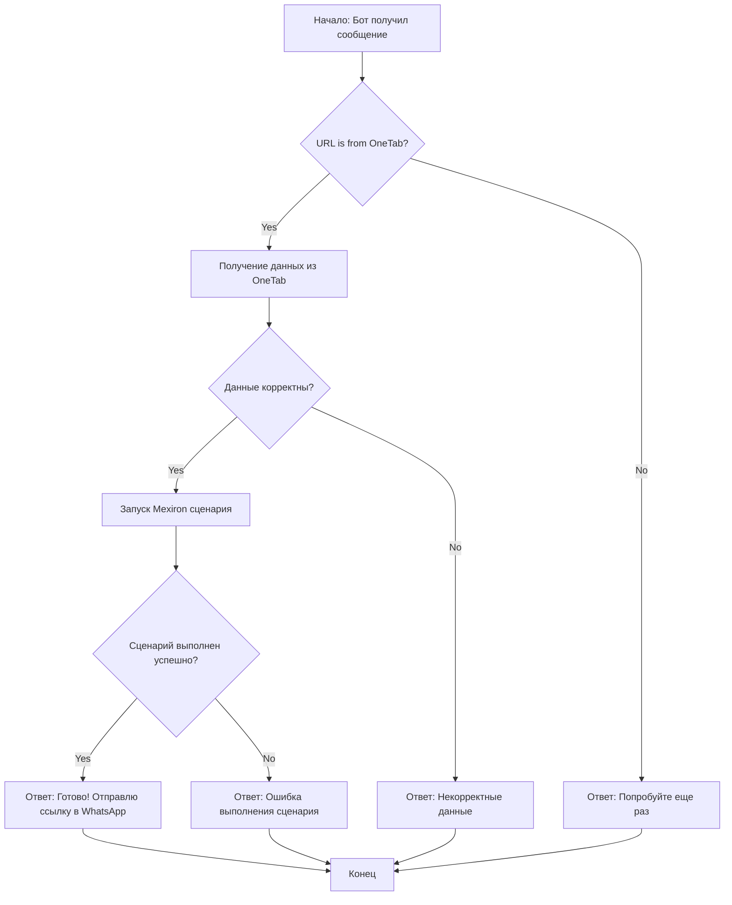

## ИНСТРУКЦИЯ:

Анализ предоставленного кода подробно и объяснение его функциональности.

## <алгоритм>

**Блок-схема рабочего процесса (Клиентская сторона):**

1.  **Start**: Пользователь начинает процесс, выбирая комплектующие для сборки компьютера.
    *   *Пример*: Пользователь выбирает процессор, материнскую плату, память и другие компоненты.
2.  **Combine**: Выбранные комплектующие объединяются в ссылку One-Tab.
    *   *Пример*: Ссылка `https://one-tab.co.il/12345678` формируется на основе выбранных комплектующих.
3.  **SendToBot**: Ссылка One-Tab отправляется в Telegram боту.
    *   *Пример*: Ссылка `https://one-tab.co.il/12345678` отправляется боту `hypo69_kazarinov_bot`.
4.  **ProdBot / TestBot**: Сообщение отправляется в соответствующий Telegram-бот.
    *   *Пример*: Сообщение уходит в `prod`-бот, если это рабочий процесс, или в `test`-бот для тестирования.

**Блок-схема рабочего процесса (Серверная сторона):**

1.  **Start**: Бот получает сообщение со ссылкой One-Tab.
    *   *Пример*: Бот получает сообщение от пользователя со ссылкой `https://one-tab.co.il/12345678`.
2.  **URL is from OneTab?**: Проверка, является ли ссылка ссылкой One-Tab.
    *   *Пример*: Проверяется, содержит ли ссылка `https://one-tab.co.il` в начале.
    *   *Поток данных*: Если да, переходим к следующему шагу, иначе - к шагу "Reply - Try again".
3.  **Get data from OneTab**: Получение данных со страницы One-Tab.
    *   *Пример*: Загружаются данные по ссылке `https://one-tab.co.il/12345678` и парсится её содержимое.
4.  **Data valid?**: Проверка корректности полученных данных.
    *   *Пример*: Проверка, что данные включают необходимые компоненты и соответствуют ожидаемому формату.
    *    *Поток данных*: Если данные валидные, переходим к шагу "Run Mexiron scenario", иначе к шагу "Reply Incorrect data".
5.  **Run Mexiron scenario**: Выполнение сценария Mexiron на основе полученных данных.
    *   *Пример*: Выполняется скрипт, который формирует PDF-отчет.
6.  **Scenario successful?**: Проверка успешности выполнения сценария.
    *   *Пример*: Проверяется, завершился ли сценарий без ошибок.
    *   *Поток данных*: Если сценарий выполнился успешно, переходим к шагу "Reply Done! I will send the link to WhatsApp", иначе к шагу "Reply Error running scenario".
7. **Reply Done! I will send the link to WhatsApp**: Успешное выполнение.
    *   *Пример*: Сообщение ботом "Готово! Отправлю ссылку на WhatsApp"
8.  **Reply Incorrect data**: Сообщение об ошибке невалидных данных.
    *   *Пример*: Сообщение ботом "Некорректные данные".
9.  **Reply Error running scenario**: Сообщение об ошибке выполнения сценария.
    *   *Пример*: Сообщение ботом "Ошибка выполнения сценария".
10. **Reply - Try again**: Сообщение ботом о необходимости повторной попытке.
    *  *Пример*: Сообщение ботом "Пожалуйста, попробуйте еще раз".
11. **Return**: Завершение процесса и возврат к началу ожидания сообщения.

## <mermaid>

**Описание диаграммы клиентской стороны:**

*   `StartClient`: Начало процесса выбора комплектующих пользователем.
*   `Combine`: Объединение выбранных комплектующих в ссылку One-Tab.
*   `SendToBot`: Отправка сформированной ссылки One-Tab в Telegram-бот.
*   `ProdBot`: Целевой Telegram-бот для рабочей среды. `hypo69_kazarinov_bot_prod` - имя бота.
*   `TestBot`: Целевой Telegram-бот для тестовой среды. `hypo69_kazarinov_bot_test` - имя бота.

**Описание диаграммы серверной стороны:**

*   `StartServer`: Начало обработки сообщения ботом.
*   `CheckURL`: Проверка, является ли URL ссылкой One-Tab.
*   `GetData`: Получение данных со страницы One-Tab.
*   `ValidateData`: Проверка корректности полученных данных.
*  `RunMexiron`: Запуск сценария Mexiron.
*   `CheckScenario`: Проверка, успешно ли выполнился сценарий.
*  `ReplyDone`: Отправка сообщения об успешном выполнении.
*  `ReplyInvalidData`: Отправка сообщения об ошибке невалидных данных.
* `ReplyError`: Отправка сообщения об ошибке выполнения сценария.
*  `ReplyTryAgain`: Отправка сообщения о необходимости повторной попытки.
*   `End`: Завершение обработки сообщения и возврат к ожиданию нового.

## <объяснение>

**Общее описание:**

Этот документ описывает логику работы Telegram-бота, который обрабатывает ссылки One-Tab для создания PDF-документов. Пользователь через клиентский интерфейс (например, веб-браузер) формирует ссылку One-Tab, содержащую информацию о выбранных комплектующих. Затем, бот на серверной стороне получает эту ссылку, проверяет ее валидность, извлекает данные, запускает сценарий формирования PDF-отчета и возвращает результат.

**Импорты:**

В данном коде нет явных импортов, однако, подразумевается, что в других файлах проекта (например, `kazarinov_bot.md` или в сценариях `scenarios/README.MD`) используются импорты для работы с Telegram API, парсинга HTML (One-Tab) и формирования PDF.

**Классы:**

*   `KazarinovTelegramBot`: Не описан в данном файле, но вероятно, это основной класс для бота, обрабатывающий сообщения от пользователей.
*   `BotHandler`: Класс для обработки логики бота (как видно из описания `Code side`).

**Функции:**

В данном файле отсутствуют описания функций, но можно предположить наличие следующих функций в других файлах, которые взаимодействуют с этим описанием:

*   `parse_one_tab_url(url)`: Функция для получения данных со страницы One-Tab.
    *   *Аргументы*: `url` - строка, URL One-Tab.
    *   *Возвращаемое значение*: Словарь с данными или `None`, если не удалось получить данные.
*   `validate_data(data)`: Функция для проверки валидности полученных данных.
    *   *Аргументы*: `data` - словарь с данными из One-Tab.
    *   *Возвращаемое значение*: `True`, если данные валидны, иначе `False`.
*   `run_mexiron_scenario(data)`: Функция для выполнения сценария формирования PDF.
    *   *Аргументы*: `data` - словарь с данными из One-Tab.
    *   *Возвращаемое значение*: `True`, если сценарий выполнился успешно, иначе `False`.
*  `send_message(chat_id, message)`: Отправка сообщения в Telegram.
    * *Аргументы*: `chat_id` - ID чата, `message` - строка.
    * *Возвращаемое значение*: Нет.

**Переменные:**

*   `url`: URL One-Tab, получаемый от пользователя.
*   `data`: Данные, извлеченные из URL One-Tab.
*   `chat_id`: ID чата пользователя.

**Потенциальные ошибки и области для улучшения:**

*   **Обработка ошибок**: В коде показана общая логика обработки ошибок, но в реальном коде необходима более детальная обработка исключений при получении данных с One-Tab, валидации данных и запуске сценария.
*   **Авторизация**: Необходима авторизация для работы с Telegram API.
*   **Безопасность**: Необходимо защитить бота от несанкционированного доступа и вредоносных URL.
*   **Логирование**: Добавить логирование для отслеживания процесса и ошибок.
*   **Обратная связь с пользователем**: Улучшить сообщения обратной связи, добавляя подробности об ошибках.
*   **Асинхронность**: Рассмотреть использование асинхронного программирования для улучшения производительности бота при обработке нескольких запросов.
*  **Отправка ссылки в WhatsApp**: Описано в сообщениях, но не реализовано в коде.

**Взаимосвязь с другими частями проекта:**

*   **`kazarinov_bot.md`**: Содержит, скорее всего, реализацию `KazarinovTelegramBot` и обработку запросов.
*   **`scenarios/README.MD`**: Содержит описание сценариев для генерации PDF на основе данных.
*   **`src/endpoints/kazarinov/`**: Все вместе они представляют собой единый модуль для обработки запросов и генерации PDF.

Таким образом, этот документ описывает основную логику работы бота, который принимает ссылки One-Tab, обрабатывает их и запускает сценарий для генерации PDF-отчетов.