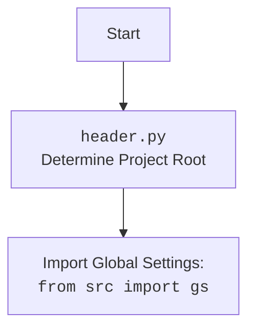

## ИНСТРУКЦИЯ:

Анализируй предоставленный код подробно и объясни его функциональность. Ответ должен включать три раздела:  

1.  **<алгоритм>**: Опиши рабочий процесс в виде пошаговой блок-схемы, включая примеры для каждого логического блока, и проиллюстрируй поток данных между функциями, классами или методами.  
2.  **<mermaid>**: Напиши код для диаграммы в формате `mermaid`, проанализируй и объясни все зависимости, 
    которые импортируются при создании диаграммы. 
    **ВАЖНО!** Убедитесь, что все имена переменных, используемые в диаграмме `mermaid`, 
    имеют осмысленные и описательные имена. Имена переменных вроде `A`, `B`, `C`, и т.д., не допускаются!  
    
    **Дополнительно**: Если в коде есть импорт `import header`, добавьте блок `mermaid` flowchart, объясняющий `header.py`:\
    ```mermaid
    flowchart TD
        Start --> Header[<code>header.py</code><br> Determine Project Root]
    
        Header --> import[Import Global Settings: <br><code>from src import gs</code>] 
    ```

3.  **<объяснение>**: Предоставьте подробные объяснения:  
    - **Импорты**: Их назначение и взаимосвязь с другими пакетами `src.`.  
    - **Классы**: Их роль, атрибуты, методы и взаимодействие с другими компонентами проекта.  
    - **Функции**: Их аргументы, возвращаемые значения, назначение и примеры.  
    - **Переменные**: Их типы и использование.  
    - Выделите потенциальные ошибки или области для улучшения.  

Дополнительно, постройте цепочку взаимосвязей с другими частями проекта (если применимо).  

Это обеспечивает всесторонний и структурированный анализ кода.
## Формат ответа: `.md` (markdown)
**КОНЕЦ ИНСТРУКЦИИ**

### <алгоритм>

1. **Запуск скрипта:**
   - Скрипт начинается с `if __name__ == "__main__":`, что означает, что функция `main()` будет вызвана при запуске скрипта.
   - Пример: `python kazarinov_bot.py`

2. **Инициализация `main()`:**
   - Создается экземпляр `FastApiServer` с заголовком "Kazarinov Bot API".
   - Создается экземпляр `KazarinovTelegramBot` с передачей экземпляра `fast_api`.
   - Загружается конфигурация бота из `kazarinov.json` с помощью `j_loads_ns`.
   - Пример: `fast_api = FastApi(title="Kazarinov Bot API")`, `bot = KazarinovTelegramBot(fast_api = fast_api)`

3. **Запуск FastApi:**
   - Запускается FastAPI-сервер с помощью `await bot.fast_api.start()`.
   - Пример: `await bot.fast_api.start()`

4. **Остановка бота:**
    - Блок `finally` всегда выполняется после блока `try`.
    - Проверяется, что экземпляр `bot` существует.
    - Останавливается приложение телеграм-бота, удаляется вебхук.
    - Пример: `await bot.application.stop()`, `await bot.application.bot.delete_webhook()`

5. **Инициализация `KazarinovTelegramBot`:**
    - Инициализируется режим работы (по умолчанию 'prod').
    - Определяется токен бота на основе режима работы (тестовый или продуктивный).
    - Создается экземпляр `BotHandler`, передаваемый в родительский класс.
    - Инициализируется родительский класс `TelegramBot` с токеном, портом из конфигурации и экземпляром `BotHandler`.
    - Пример: `bot = KazarinovTelegramBot()`

6. **Инициализация `GoogleGenerativeAI`:**
   - Создается экземпляр `GoogleGenerativeAI` с API-ключом и конфигурацией для генерации текста.
   -  Пример: `model = GoogleGenerativeAI(api_key=..., generation_config={"response_mime_type": "text/plain"})`

### <mermaid>

```mermaid
flowchart TD
    Start[Start Script] --> MainFunc[<code>main()</code>]
    
    MainFunc --> FastApiInit[Initialize <code>FastApiServer</code>: <br> <code>fast_api = FastApi(title="Kazarinov Bot API")</code>]
    FastApiInit --> BotInit[Initialize <code>KazarinovTelegramBot</code>: <br> <code>bot = KazarinovTelegramBot(fast_api = fast_api)</code>]
    BotInit --> LoadConfig[Load Bot Config: <br> <code>config = j_loads_ns(...)</code>]
    LoadConfig --> FastApiStart[Start FastApi Server: <br> <code>await bot.fast_api.start()</code>]
    FastApiStart --> FinallyBlock[<code>finally:</code> Block]
    FinallyBlock --> CheckBotInstance{Check if <code>bot</code> Instance Exists?}
    CheckBotInstance -- Yes --> StopBot[Stop Telegram Bot: <br> <code>await bot.application.stop()</code>]
    StopBot --> DeleteWebhook[Delete Telegram Webhook: <br> <code>await bot.application.bot.delete_webhook()</code>]
    DeleteWebhook --> BotStopped[Log "Bot stopped"]
    CheckBotInstance -- No --> End[End Script]
    DeleteWebhook --> End

    
    style MainFunc fill:#f9f,stroke:#333,stroke-width:2px
    style FastApiInit fill:#ccf,stroke:#333,stroke-width:2px
    style BotInit fill:#ccf,stroke:#333,stroke-width:2px
    style LoadConfig fill:#ccf,stroke:#333,stroke-width:2px
    style FastApiStart fill:#ccf,stroke:#333,stroke-width:2px
    style FinallyBlock fill:#ccf,stroke:#333,stroke-width:2px
    style CheckBotInstance fill:#ccf,stroke:#333,stroke-width:2px
    style StopBot fill:#ccf,stroke:#333,stroke-width:2px
    style DeleteWebhook fill:#ccf,stroke:#333,stroke-width:2px
    style BotStopped fill:#ccf,stroke:#333,stroke-width:2px
    style End fill:#ccf,stroke:#333,stroke-width:2px
    
    classDef method fill:#f9f,stroke:#333,stroke-width:2px
    classDef class fill:#ccf,stroke:#333,stroke-width:2px
    
    class MainFunc method;
    class FastApiInit class;
    class BotInit class;
    class LoadConfig class;
    class FastApiStart class;
    class FinallyBlock class;
    class CheckBotInstance class;
    class StopBot class;
    class DeleteWebhook class;
    class BotStopped class;
    class End class;

```


### <объяснение>

**Импорты:**

-   `asyncio`: Используется для асинхронного программирования, позволяет выполнять неблокирующие операции.
-   `pathlib.Path`: Используется для работы с файловыми путями, создавая кроссплатформенные пути.
-   `typing.List, Optional, Dict, Self`: Используется для аннотации типов, повышает читаемость и позволяет использовать статический анализ кода.
-   `types.SimpleNamespace`: Используется для создания простых объектов с атрибутами, что удобно для хранения конфигурации.
-   `telegram.Update`: Представляет обновления, полученные от Telegram.
-   `telegram.ext.Application, CommandHandler, MessageHandler, filters, CallbackContext`: Используется для создания и управления ботом Telegram.
-   `header`: Локальный модуль, вероятно, для определения пути к корню проекта и импорта глобальных настроек.
-   `src.gs`: Глобальные настройки приложения, содержат пути, API ключи и другие общие параметры.
-   `src.endpoints.bots.telegram.bot_web_hooks.TelegramBot`: Базовый класс для телеграм-ботов, обеспечивает общую логику работы.
-   `src.endpoints.kazarinov.bot_handlers.BotHandler`: Класс для обработки сообщений и событий, специфичных для этого бота.
-   `src.ai.gemini.GoogleGenerativeAI`: Класс для взаимодействия с Google Gemini AI.
-   `src.utils.url.is_url`: Функция для проверки, является ли строка URL.
-   `src.utils.jjson.j_loads_ns`: Функция для загрузки данных из JSON-файла в `SimpleNamespace`.
-    `src.logger.logger`: Используется для логирования событий и ошибок.
-   `src.fast_api.fast_api.FastApiServer`: Класс для запуска FastAPI-сервера.

**Классы:**

-   `KazarinovTelegramBot(TelegramBot)`:
    -   **Роль**: Основной класс для управления ботом Kazarinov.
    -   **Атрибуты**:
        -   `config`: `SimpleNamespace`, содержит конфигурацию бота, загруженную из `kazarinov.json`.
        -   `model`: `GoogleGenerativeAI`, модель для взаимодействия с Google Gemini AI.
    -   **Методы**:
        -   `__init__(self, mode: Optional[str] = None)`: Инициализирует бота, определяет токен, режим работы, создает `BotHandler` и вызывает родительский конструктор.

**Функции:**

-   `main()`:
    -   **Назначение**: Главная функция, запускающая бота.
    -   **Аргументы**: Нет.
    -   **Возвращаемое значение**: Нет.
    -   **Пример**: Вызывается автоматически при запуске скрипта.
        - Создается экземпляр `FastApiServer` с заголовком "Kazarinov Bot API".
        - Создается экземпляр `KazarinovTelegramBot` с передачей экземпляра `fast_api`.
        - Загружается конфигурация бота из `kazarinov.json` с помощью `j_loads_ns`.
        - Запускается FastAPI-сервер с помощью `await bot.fast_api.start()`.
        - Обрабатывается блок `finally` с остановкой приложения телеграм-бота, удаляется вебхук.

**Переменные:**

-   `config`: Экземпляр `SimpleNamespace`, содержит конфигурационные данные, загруженные из `kazarinov.json`.
-   `model`: Экземпляр `GoogleGenerativeAI`, модель для взаимодействия с Google Gemini AI.
-   `mode`: Строка, определяющая режим работы бота (`test` или `prod`).
-   `token`: Строка, токен для подключения к Telegram API.
-   `bot_handler`: Экземпляр `BotHandler`, класс для обработки сообщений и событий бота.
-   `fast_api`: Экземпляр `FastApiServer`, для запуска и управления FastAPI-сервером.

**Взаимосвязи:**

-   `KazarinovTelegramBot` наследуется от `TelegramBot`, переиспользуя его функциональность для работы с Telegram.
-   `KazarinovTelegramBot` использует `GoogleGenerativeAI` для обработки запросов с использованием модели Gemini.
-   `KazarinovTelegramBot` использует `BotHandler` для обработки сообщений и событий, специфичных для этого бота.
-   `main()` управляет жизненным циклом бота, а также FastAPI-сервера.

**Потенциальные ошибки и области для улучшения:**

-   **Жестко закодированный режим:** Режим работы бота (`'prod'`) установлен в коде, что затрудняет изменение режима без модификации кода. Следует предусмотреть возможность изменения через переменные окружения или параметры командной строки.
-   **Обработка ошибок:** Обработка ошибок в `finally` блоке при остановке бота, логирует ошибку, но не обрабатывает ее более детально. Стоит предусмотреть более детальный механизм обработки ошибок и их логирования.
-   **Зависимости:** Зависимость от конкретного вебдрайвера (`firefox`) задана через коментарии, что может вызвать неоднозначность.

**Цепочка взаимосвязей с другими частями проекта:**

-   Использует `header` для определения корня проекта и глобальных настроек.
-   Использует `gs` из `src` для доступа к глобальным переменным и настройкам.
-   Использует `TelegramBot` из `src` для базовой функциональности телеграм-бота.
-   Использует `BotHandler` из `src` для кастомной логики бота.
-   Использует `GoogleGenerativeAI` из `src` для взаимодействия с моделью Gemini.
-   Использует `j_loads_ns` из `src` для загрузки конфигурации.
-   Использует `is_url` из `src` для проверки URL.
-   Использует `logger` из `src` для логирования.
-   Использует `FastApiServer` из `src` для запуска и управления FastAPI-сервером.