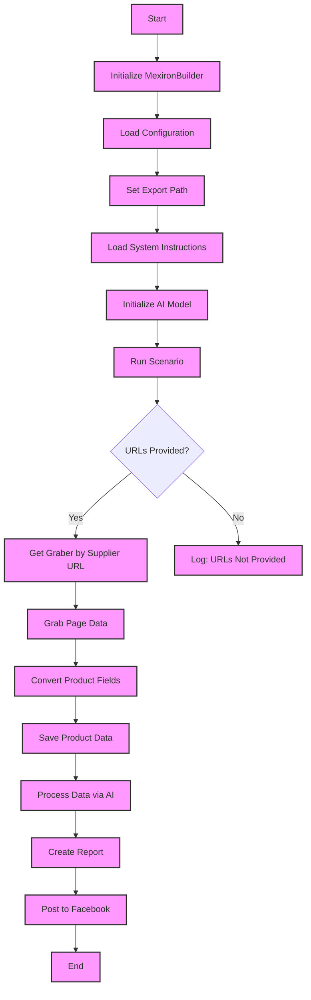
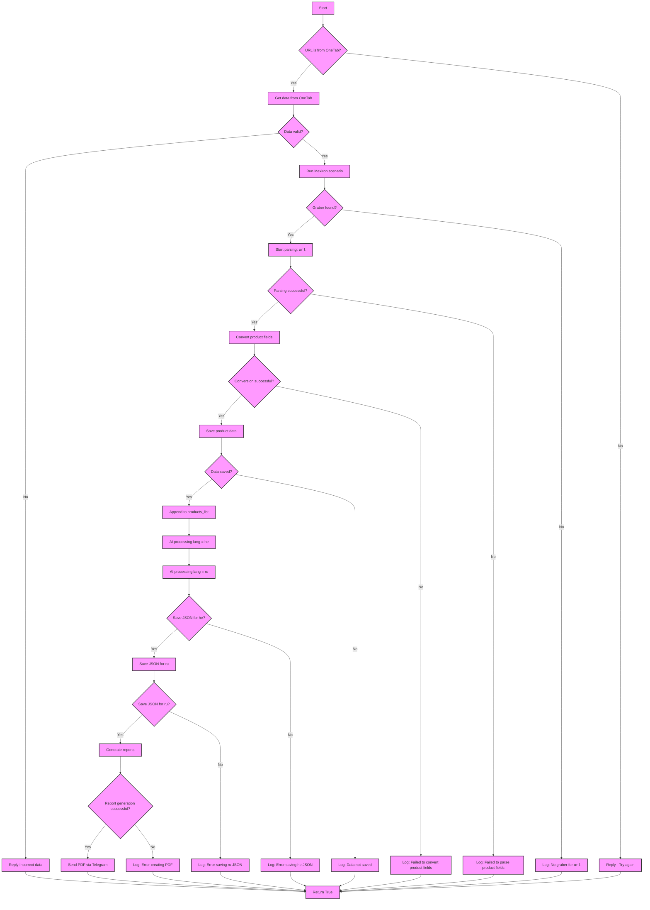
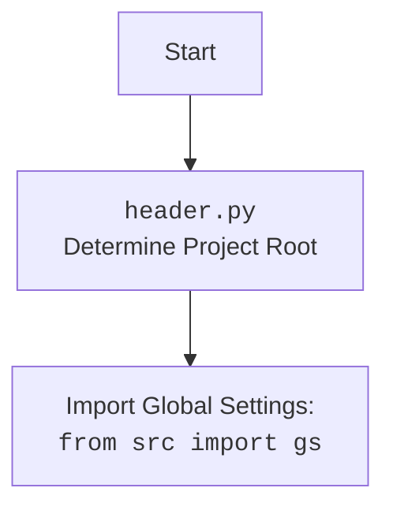

## АНАЛИЗ КОДА: `hypotez/src/endpoints/kazarinov/scenarios/scenario_pricelist.md`

### 1. <алгоритм>

**Обзор**:
Скрипт `scenario_pricelist.md` предназначен для автоматизации процесса создания "мехирона" (прайс-листа) для Сергея Казаринова. Он выполняет следующие шаги: сбор данных о продуктах с различных сайтов, обработку этих данных с помощью AI, сохранение данных в файлы, генерацию отчетов и публикацию данных в Facebook.

**Блок-схема процесса (основной сценарий)**:

1.  **Начало**: Запускается скрипт.
    *   Пример: Вызов скрипта через командную строку или как часть автоматизированного процесса.
2.  **Инициализация `MexironBuilder`**: Создается экземпляр класса `MexironBuilder` для управления процессом.
    *   Пример: `mexiron_builder = MexironBuilder(driver, mexiron_name="test_mexiron")`.
3.  **Загрузка конфигурации**: Загружаются параметры конфигурации из JSON-файла (путь к файлу конфигурации не указан, полагаемся на `gs`).
    *   Пример: Загрузка настроек, таких как API-ключи, параметры сохранения файлов и т.д.
4.  **Установка пути экспорта**: Определяется путь, куда будут сохраняться результаты.
    *   Пример: `self.export_path = "output/test_mexiron"`.
5.  **Загрузка инструкций для AI**: Загружаются инструкции для AI-модели, управляющей обработкой текста.
    *   Пример: Инструкции по обработке описаний товаров.
6.  **Инициализация AI-модели**: Инициализируется модель Google Generative AI.
    *   Пример: Создание экземпляра класса `Gemini` из `src.ai.gemini`.
7.  **Запуск основного сценария**: Вызывается метод `run_scenario`, где происходит основная логика скрипта.
    *   Пример: `mexiron_builder.run_scenario(urls=["https://example1.com", "https://example2.com"])`.
8.  **Проверка наличия URL**: Проверяется, были ли предоставлены URL для парсинга.
    *   Пример: Проверка `if urls is not None`
9.  **Получение грабера по URL**: Если URL предоставлены, определяется подходящий грабер для сайта.
    *   Пример: `graber = self.get_graber_by_supplier_url(url)`.
10. **Парсинг страницы**: Грабер извлекает данные о продукте со страницы.
    *   Пример: `product_data = graber.grab_page()`.
11. **Конвертация полей продукта**: Данные преобразуются в стандартизированный формат словаря.
    *   Пример: `formatted_data = self.convert_product_fields(product_data)`.
12. **Сохранение данных**: Данные о продукте сохраняются в файл.
    *   Пример: `self.save_product_data(formatted_data)`.
13. **Обработка данных AI**: Данные пропускаются через AI-модель для обработки (генерация текста или классификация).
    *   Пример: `ai_response = self.process_ai(formatted_data, lang='ru')`.
14. **Создание отчета**: Генерируются HTML и PDF-отчеты из обработанных данных.
    *   Пример: `self.create_report(ai_response, html_file, pdf_file)`.
15. **Публикация в Facebook**: Данные публикуются в Facebook через соответствующий модуль.
    *   Пример: `self.post_facebook(mexiron_data)`.
16. **Конец**: Скрипт завершает свою работу.

**Блок-схема для метода `run_scenario`**:

1.  **Начало**: Запускается метод `run_scenario`.
2.  **Проверка OneTab**: Проверяется, является ли URL ссылкой OneTab.
    *   Пример: `if 'onetab' in url:`
3.  **Извлечение данных из OneTab**: Если это OneTab, данные извлекаются из него.
    *   Пример:  логика извлечения данных из OneTab (нет деталей в описании).
4.  **Проверка данных**: Проверяется, валидны ли полученные данные.
    *   Пример: Проверка наличия обязательных полей
5. **Запуск сценария Mexiron**: Запускается основной сценарий `Mexiron`
    * Пример: вызов метода `self._run_mexiron_scenario(url)`
6.  **Поиск грабера**: Определяется грабер для конкретного URL.
    *   Пример: `graber = self.get_graber_by_supplier_url(url)`.
7.  **Парсинг**:  Происходит парсинг страницы.
    *   Пример: `product_fields = graber.grab_page()`
8.  **Конвертация полей**: Происходит конвертация полей продукта.
     *   Пример: `product_data = self.convert_product_fields(product_fields)`
9.  **Сохранение данных**: Сохранение данных в файл.
     *   Пример:  `self.save_product_data(product_data)`
10. **Добавление в список продуктов**: Данные добавляются в список `products_list`.
    *  Пример: `self.products_list.append(product_data)`
11. **Обработка AI (he)**: Обработка данных AI для языка he (иврит).
     *   Пример: `ai_response_he = self.process_ai(products_list, lang='he')`
12. **Обработка AI (ru)**: Обработка данных AI для языка ru (русский).
     *   Пример: `ai_response_ru = self.process_ai(products_list, lang='ru')`
13. **Сохранение JSON (he)**: Сохранение JSON-данных для языка he.
      *  Пример: запись в файл данных `ai_response_he`
14. **Сохранение JSON (ru)**: Сохранение JSON-данных для языка ru.
      *  Пример: запись в файл данных `ai_response_ru`
15. **Генерация отчетов**: Создание HTML и PDF-отчетов.
     *   Пример: `self.create_report(data, html_path, pdf_path)`
16. **Отправка PDF через Telegram**: Отправка PDF-отчета через Telegram.
17. **Завершение**: Возвращает True.

### 2. <mermaid>

**Объяснение зависимостей `mermaid`:**

1.  **Основные узлы**:
    *   `Start`: Начало процесса.
    *   `End`: Конец процесса.
    *   `InitMexironBuilder`: Инициализация класса `MexironBuilder`.
    *   `LoadConfig`: Загрузка конфигурации из файла.
    *   `SetExportPath`: Установка пути для экспорта данных.
    *   `LoadSystemInstruction`: Загрузка инструкций для AI.
    *   `InitModel`: Инициализация AI-модели.
    *   `RunScenario`: Запуск основного сценария.
    *   `CheckURLs`: Проверка наличия URL-адресов.
    *   `GetGraber`: Получение грабера для сайта поставщика.
    *   `GrabPage`: Извлечение данных со страницы.
    *   `ConvertFields`: Конвертация полей продукта.
    *   `SaveData`: Сохранение данных о продукте.
    *   `ProcessAI`: Обработка данных с использованием AI.
    *   `CreateReport`: Генерация отчетов.
    *   `PostFacebook`: Публикация данных в Facebook.
    *    `LogNoURLs`: Логирование отсутствия URL адресов

2.  **Логические узлы (ромбы)**:
    *   `CheckURLs`: Условный переход в зависимости от наличия URL.

3.  **Потоки управления**:
    *   Стрелки (`-->`) показывают последовательность выполнения операций.
    *   Условные переходы (например, `CheckURLs -->|Yes|`) показывают, в каком направлении пойдет выполнение, в зависимости от условий.

4. **Специальный  блок `run_scenario`**:
    *   `Start`: Начало сценария
     * `IsOneTab`: Проверка, является ли URL ссылкой OneTab.
    *   `GetDataFromOneTab`: получение данных из OneTab.
     * `ReplyTryAgain`: ответ с просьбой попробовать еще раз
    *   `IsDataValid`: проверка валидности данных
    *    `ReplyIncorrectData`: ответ об ошибке в данных
     *   `RunMexironScenario`: запуск основного сценария Mexiron
     * `IsGraberFound`: Проверка наличия грабера
    *   `StartParsing`: начало парсинга страницы
     * `LogNoGraber`: запись в лог об отсутсвии грабера
    *    `IsParsingSuccessful`: проверка успешности парсинга
     *   `ConvertProductFields`: конвертация полей продукта
     * `LogParsingFailed`: запись в лог об ошибке при парсинге
    *    `IsConversionSuccessful`: проверка успешности конвертации
     *   `SaveProductData`: сохранение данных продукта
     *  `LogConversionFailed`: запись в лог об ошибке при конвертации
    *    `IsDataSaved`: проверка успешности сохранения данных
     *   `AppendToProductsList`: добавление данных в список
     *  `LogDataNotSaved`: запись в лог об ошибке при сохранении
    *    `ProcessAIHe`: обработка данных AI для языка he (иврит)
    *    `ProcessAIRu`: обработка данных AI для языка ru (русский)
    *    `SaveHeJSON`: сохранение JSON данных для he
      * `LogHeJSONError`: запись в лог об ошибке при сохранении JSON
    *    `SaveRuJSON`: сохранение JSON данных для ru
      * `LogRuJSONError`: запись в лог об ошибке при сохранении JSON
    *  `IsRuJSONSaved`: проверка успешности сохранения JSON
    *    `GenerateReports`: генерация отчетов
    *    `IsReportGenerationSuccessful`: проверка успешности генерации отчетов
      *   `LogPDFError`: запись в лог об ошибке при создании PDF
    *    `SendPDF`: отправка PDF через Telegram
    *   `ReturnTrue`: возврат значения True
5. **Зависимости `header.py`**
     *   `Start`: Начало процесса.
     *   `Header`: Выполнение кода в `header.py` для определения корневой директории проекта.
     *   `import`: Импорт глобальных настроек из `src.gs`.

### 3. <объяснение>

**Импорты:**

*   `selenium`: Используется для автоматизации действий в браузере, например, для сбора данных с веб-страниц.
*   `asyncio`: Используется для асинхронных операций, позволяя параллельно выполнять несколько задач и ускорять выполнение скрипта.
*   `pathlib`: Используется для работы с путями к файлам и директориям, предоставляя объектно-ориентированный способ управления файловой системой.
*   `types`:  Используется для создания простых пространств имен (`SimpleNamespace`), которые позволяют создавать объекты с динамически добавляемыми атрибутами.
*   `typing`: Используется для аннотации типов, делая код более читаемым и позволяя отлавливать ошибки на этапе разработки.
*  `src.ai.gemini`: используется для интеграции с AI Gemini от Google для обработки текста.
*  `src.suppliers.*.graber`: Используются для сбора данных с разных сайтов поставщиков. Каждый грабер отвечает за конкретный сайт.
*  `src.endpoints.advertisement.facebook.scenarios`: используется для публикации данных в Facebook

**Класс `MexironBuilder`:**

*   **Роль**: Основной класс, управляющий процессом создания "мехирона".
*   **Атрибуты**:
    *   `driver`: Экземпляр `Selenium WebDriver`, используется для взаимодействия с браузером.
    *   `export_path`: Путь для сохранения результатов (файлов данных, отчетов).
    *   `mexiron_name`: Имя "мехирона" (прайс-листа), используется для формирования имен файлов и отчетов.
    *   `price`: Цена обработки.
    *    `timestamp`: отметка времени старта процесса.
    *   `products_list`: Список словарей с обработанными данными о продуктах.
    *   `model`: Экземпляр AI-модели для обработки данных.
    *   `config`: Конфигурация, загруженная из файла.
*   **Методы**:
    *   `__init__(self, driver: Driver, mexiron_name: Optional[str] = None)`: Конструктор класса.
    *   `run_scenario(self, system_instruction: Optional[str] = None, price: Optional[str] = None, mexiron_name: Optional[str] = None, urls: Optional[str | List[str]] = None, bot = None) -> bool`:  Запускает основной сценарий: парсит страницы, обрабатывает данные через AI, сохраняет результаты и публикует в facebook.
    *    `_run_mexiron_scenario(self, url)`: Внутренний метод, выполняющий основную логику обработки данных для одного URL.
    *   `get_graber_by_supplier_url(self, url: str)`: Возвращает грабер для конкретного поставщика.
    *   `convert_product_fields(self, f: ProductFields) -> dict`: Конвертирует поля продукта в формат словаря.
    *   `save_product_data(self, product_data: dict)`: Сохраняет данные о продукте в файл.
    *   `process_ai(self, products_list: List[str], lang: str, attempts: int = 3) -> tuple | bool`: Обрабатывает список данных через AI-модель.
    *   `post_facebook(self, mexiron: SimpleNamespace) -> bool`: Публикует данные в Facebook.
    *   `create_report(self, data: dict, html_file: Path, pdf_file: Path)`: Генерирует отчеты (HTML и PDF).

**Функции:**

*   Методы класса `MexironBuilder` являются функциями, которые выполняют конкретные действия в рамках общего процесса.
*   **Примеры:**
    *   `run_scenario`: Принимает URL, инструкции для AI, цену, имя мехирона. Возвращает `True` или `False` в зависимости от успеха выполнения.
    *   `get_graber_by_supplier_url`: Принимает URL. Возвращает экземпляр грабера или `None`.
    *   `convert_product_fields`: Принимает объект данных продукта. Возвращает словарь с данными.
    *   `process_ai`: Принимает список данных, язык и количество попыток. Возвращает обработанные данные.

**Переменные:**

*   `driver` (объект `selenium.webdriver.Chrome` или аналогичный): Управляет браузером.
*   `export_path` (строка): Путь для сохранения результатов.
*   `mexiron_name` (строка): Имя "мехирона".
*   `price` (строка): цена для обработки.
*   `timestamp`: отметка времени.
*   `products_list` (список словарей): Содержит обработанные данные о продуктах.
*   `model` (экземпляр AI-модели): Для обработки данных через AI.
*   `config` (словарь): Содержит настройки приложения.
*    `url` (строка): URL-адрес страницы.
*    `graber` (объект): Экземпляр грабера для конкретного сайта.
*   `product_data` (словарь): данные о товаре.
*  `ai_response_he` (словарь): данные после обработки AI для языка he
*  `ai_response_ru` (словарь): данные после обработки AI для языка ru
*    `html_file` (pathlib.Path): Путь к HTML-отчету.
*   `pdf_file` (pathlib.Path): Путь к PDF-отчету.
* `mexiron` (SimpleNamespace): Processed data for publication.

**Потенциальные ошибки и улучшения:**

*   **Обработка ошибок**: Хотя в коде есть упоминания об обработке ошибок, отсутствуют подробности, как именно они обрабатываются и логируются (необходимо добавить более детальные логи).
*   **Зависимости**: Зависимости указаны в основном тексте, но нет явных импортов в коде, что затрудняет анализ. (Надо добавить импорт зависимостей в код)
*   **Конфигурация**: Способ загрузки и использования конфигурации не описан (необходимо добавить загрузку конфигурации через `src.gs`)
*   **Грабберы**: Нет информации о реализации и структуре граберов (необходимо добавить описание как работают граберы).
*  **Отправка данных через Telegram** Отсутствует код для отправки PDF через Telegram (необходимо добавить имплементацию)
*   **OneTab**: Отсутствует реализация получения данных из OneTab.

**Взаимосвязи с другими частями проекта:**

*   Скрипт интегрируется с `src.ai.gemini` для обработки данных с использованием AI.
*   Использует граберы из `src.suppliers.*.graber` для сбора данных с различных веб-сайтов.
*   Взаимодействует с `src.endpoints.advertisement.facebook.scenarios` для публикации данных в Facebook.
*  Использует `src.webdriver.driver` для управления браузером через Selenium.
*  Использует `src.gs` для получения глобальных настроек проекта.

Этот анализ предоставляет подробное описание функциональности скрипта, его зависимостей и возможных проблем, а также предлагает пути улучшения.