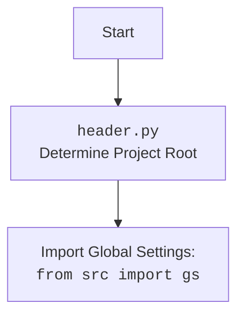

## АНАЛИЗ КОДА: `hypotez/src/endpoints/kazarinov/scenarios/scenario_pricelist.ru.md`

### 1. **<алгоритм>**

**Общее описание:**

Скрипт `scenario_pricelist.ru.md` автоматизирует процесс создания "мехирона" для Сергея Казаринова. Он включает извлечение данных о продуктах из различных источников, обработку этих данных через модель ИИ, генерацию отчетов и публикацию в Facebook.

**Пошаговая блок-схема:**

1.  **Инициализация `MexironBuilder`:**
    - Создается экземпляр класса `MexironBuilder` с драйвером браузера (Selenium WebDriver).
    - Пример: `mexiron_builder = MexironBuilder(driver)`.

2.  **Загрузка конфигурации:**
    - Загружаются настройки из JSON-файла, включая пути, параметры ИИ и т.д.
    - Пример: `self.config = load_config()`.

3.  **Установка пути экспорта:**
    - Определяется директория, куда будут сохраняться результаты работы скрипта (файлы данных, отчеты).
    - Пример: `self.export_path = Path(self.config.export_path)`.

4.  **Загрузка системных инструкций:**
    - Загружаются текстовые инструкции для ИИ, описывающие, как обрабатывать данные о продуктах.
    - Пример: `system_instruction = load_system_instruction()`.

5.  **Инициализация модели ИИ:**
    - Создается экземпляр модели Google Generative AI для обработки данных.
    - Пример: `self.model = Gemini(...)`.

6. **Запуск основного сценария (`run_scenario`)**
    - Основной процесс начинается с проверки, является ли URL из OneTab.
    - Пример: `mexiron_builder.run_scenario(urls=urls)`.

7. **Извлечение данных (если URL из OneTab):**
   - Если URL из OneTab, данные извлекаются оттуда.
   - Если URL не из OneTab, возвращается сообщение "Try again".

8. **Проверка валидности данных:**
    - Проверяются данные, извлеченные из OneTab.
    - Если данные не валидны, возвращается сообщение "Incorrect data".

9.  **Проверка наличия URL-адресов:**
    - Скрипт проверяет, предоставлены ли URL-адреса для парсинга.
    - Пример: `if urls:`

10. **Получение грабера:**
    - Если URL-адреса предоставлены, для каждого URL определяется соответствующий грабер.
    - Пример: `graber = self.get_graber_by_supplier_url(url)`.

11. **Извлечение данных страницы:**
    - Грабер извлекает данные со страницы поставщика.
    - Пример: `product_fields = graber.grab_page(driver, url)`.

12. **Конвертация полей продукта:**
    - Извлеченные данные преобразуются в словарь.
    - Пример: `product_data = self.convert_product_fields(product_fields)`.

13. **Сохранение данных продукта:**
    - Данные о продукте сохраняются в файл.
    - Пример: `self.save_product_data(product_data)`.

14. **Обработка данных через ИИ:**
    - Данные передаются в модель ИИ для обработки на языках `he` и `ru`.
    - Пример: `ai_result = self.process_ai(products_list, 'he')`.

15.  **Сохранение JSON:**
    - Результаты работы ИИ сохраняются в JSON файлы.
    -  Пример: `self._save_json_data(ai_data_he,  file_path)`.
        
16. **Генерация отчетов:**
    - На основе обработанных данных генерируются HTML и PDF отчеты.
    - Пример: `self.create_report(data, html_file, pdf_file)`.

17. **Публикация в Facebook:**
    - Если нужно, данные публикуются в Facebook.
    - Пример: `self.post_facebook(mexiron_data)`.

18. **Завершение работы скрипта:**
    - Процесс завершается.

**Пример потока данных:**
```
   [URL] --> [Graber] --> [ProductFields] --> [ProductData (dict)] --> [AI Model] --> [Report Data] --> [Facebook]
```

### 2. **<mermaid>**

```mermaid
flowchart TD
    Start[Start] --> InitMexironBuilder[Init MexironBuilder: <code>MexironBuilder(driver)</code>]
    InitMexironBuilder --> LoadConfig[Load Configuration: <code>config.json</code>]
    LoadConfig --> SetExportPath[Set Export Path: <code>config.export_path</code>]
    SetExportPath --> LoadSystemInstruction[Load System Instruction: <code>system_instruction.txt</code>]
    LoadSystemInstruction --> InitAIModel[Init AI Model: <code>Gemini()</code>]
     InitAIModel --> RunScenario[Run Scenario: <code>run_scenario()</code>]
    RunScenario --> CheckURLs{Check URLs Provided?}
    CheckURLs -- Yes --> GetGraber[Get Graber: <code>get_graber_by_supplier_url()</code>]
    CheckURLs -- No --> LogNoURLs[Log: No URLs Provided]
    GetGraber --> GrabPage[Grab Page Data: <code>graber.grab_page()</code>]
    GrabPage --> ConvertFields[Convert Fields: <code>convert_product_fields()</code>]
    ConvertFields --> SaveData[Save Data: <code>save_product_data()</code>]
    SaveData --> ProcessAIHe[Process AI (he): <code>process_ai(lang='he')</code>]
    ProcessAIHe --> ProcessAIRu[Process AI (ru): <code>process_ai(lang='ru')</code>]
    ProcessAIRu --> SaveJSONHe[Save JSON (he)]
    SaveJSONHe --> SaveJSONRu[Save JSON (ru)]
     SaveJSONRu--> GenerateReport[Generate Report: <code>create_report()</code>]
    GenerateReport --> PostFacebook[Post to Facebook: <code>post_facebook()</code>]
    PostFacebook --> End[End]
        LogNoURLs --> End
    
    
     
        style Start fill:#f9f,stroke:#333,stroke-width:2px
        style End fill:#ccf,stroke:#333,stroke-width:2px

```
**Объяснение `mermaid`:**

*   **`Start`**: Начало выполнения сценария.
*   **`InitMexironBuilder`**: Инициализация класса `MexironBuilder` с экземпляром `driver` (Selenium WebDriver).
*   **`LoadConfig`**: Загрузка конфигурационных параметров из JSON файла.
*   **`SetExportPath`**: Настройка пути, куда будут сохраняться сгенерированные данные и отчеты.
*   **`LoadSystemInstruction`**: Загрузка инструкций для модели ИИ из текстового файла.
*   **`InitAIModel`**: Инициализация модели Google Gemini AI.
*   **`RunScenario`**: Запуск основного сценария, который включает парсинг, обработку и сохранение данных.
*   **`CheckURLs`**: Проверка, предоставлены ли URL-адреса для обработки.
*   **`GetGraber`**: Получение соответствующего грабера (парсера) на основе URL.
*   **`LogNoURLs`**: Логирование сообщения, если URL-адреса не предоставлены.
*  **`GrabPage`**: Извлечение данных со страницы с использованием полученного грабера.
*   **`ConvertFields`**: Преобразование извлеченных данных в нужный формат словаря.
*   **`SaveData`**: Сохранение данных о продукте в файл.
*  **`ProcessAIHe`**: Обработка данных с использованием ИИ для языка иврит.
*  **`ProcessAIRu`**: Обработка данных с использованием ИИ для русского языка.
*   **`SaveJSONHe`**: Сохранение JSON для языка иврит.
*   **`SaveJSONRu`**: Сохранение JSON для русского языка.
*   **`GenerateReport`**: Создание отчетов в HTML и PDF форматах.
*   **`PostFacebook`**: Публикация данных в Facebook.
*   **`End`**: Конец выполнения сценария.


**Объяснение `header.py` `mermaid`:**

*   **`Start`**: Начало выполнения кода `header.py`.
*   **`Header`**: `header.py` определяет корневой каталог проекта.
*   **`import`**: Импортируются глобальные настройки проекта `gs` из `src`.

### 3. **<объяснение>**

**Импорты:**

*   `src.webdriver.driver`: Модуль для управления Selenium WebDriver, используемый для автоматизации браузера.
*   `pathlib`: Модуль для работы с путями к файлам и директориям.
*   `types`: Модуль для создания простых пространств имен.
*   `typing`: Модуль для аннотаций типов, используемых для статической проверки типов.
*   `src.ai.gemini`: Модуль для интеграции с моделью Google Generative AI (Gemini).
*   `src.suppliers.*.graber`: Модули, содержащие граберы (парсеры) для различных поставщиков (например, `src.suppliers.amazon.graber`).
*   `src.endpoints.advertisement.facebook.scenarios`: Модуль для публикации данных в Facebook.

**Класс: `MexironBuilder`**

*   **Роль**: Основной класс, управляющий процессом создания мехирона.
*   **Атрибуты**:
    *   `driver`: Экземпляр Selenium WebDriver для взаимодействия с веб-браузером.
    *   `export_path`: Путь к директории для сохранения результатов.
    *   `mexiron_name`: Имя мехирона.
    *   `price`: Цена.
    *   `timestamp`: Временная метка.
    *   `products_list`: Список обработанных продуктов.
    *   `model`: Модель Google Generative AI.
    *   `config`: Конфигурация, загруженная из JSON-файла.

*   **Методы**:
    *   `__init__(self, driver, mexiron_name=None)`: Инициализация объекта `MexironBuilder` и его атрибутов.
    *   `run_scenario(self, system_instruction=None, price=None, mexiron_name=None, urls=None, bot=None)`: Основной метод для запуска сценария парсинга, обработки и сохранения данных.
    *   `get_graber_by_supplier_url(self, url)`: Возвращает грабер для заданного URL.
    *   `convert_product_fields(self, f)`: Преобразует поля продукта в словарь.
    *   `save_product_data(self, product_data)`: Сохраняет данные продукта в файл.
    *   `process_ai(self, products_list, lang, attempts=3)`: Обрабатывает данные через модель ИИ на языках `ru` и `he`.
    *  `_save_json_data(self, data, file_path)`: Сохраняет данные в JSON файл.
    *   `post_facebook(self, mexiron)`: Публикует данные в Facebook.
    *   `create_report(self, data, html_file, pdf_file)`: Генерирует HTML и PDF отчеты.

**Функции:**

*   Все функции, описанные выше, являются методами класса `MexironBuilder`.
*   Назначение каждой функции описано в разделе "Методы" класса `MexironBuilder`.

**Переменные:**

*   **`driver`**: Экземпляр класса `Driver` из `src.webdriver.driver`, используется для управления веб-браузером.
*   **`urls`**: Список или строка, содержащая URL-адреса страниц продуктов для парсинга.
*   **`config`**: Конфигурация загруженная из JSON файла.
*   **`system_instruction`**: Текст с инструкциями для ИИ.
*   **`product_data`**: Словарь, содержащий информацию о продукте после обработки.
*   **`mexiron_name`**:  Пользовательское имя для процесса мехирона
*    **`price`**:  Цена для обработки
*   **`lang`**: Язык, используемый для обработки данных через ИИ (русский или иврит).
*    **`attempts`**: Количество попыток повторного запроса в случае неудачи.

**Потенциальные ошибки и области для улучшения:**

*   **Обработка ошибок**: Хотя скрипт включает обработку ошибок, можно улучшить логику обработки исключений, чтобы предоставлять более информативные сообщения об ошибках и пытаться восстановить работу в случае сбоев.
*   **Асинхронность**: Использование асинхронных операций для параллельного выполнения запросов к разным поставщикам или для обработки нескольких URL может значительно ускорить выполнение скрипта.
*   **Модульность**: Разделение класса `MexironBuilder` на более мелкие классы, выполняющие конкретные задачи, может улучшить читаемость и сопровождаемость кода.
*   **Тестирование**: Необходимо добавить автоматизированные тесты для проверки корректности работы различных частей скрипта.

**Взаимосвязи с другими частями проекта:**

*   **`src.webdriver.driver`**: Используется для создания экземпляра драйвера браузера, который необходим для парсинга веб-страниц.
*   **`src.ai.gemini`**: Отвечает за обработку данных с помощью модели Google Generative AI.
*   **`src.suppliers.*.graber`**:  Отвечает за извлечение информации со страниц различных поставщиков.
*  **`src.endpoints.advertisement.facebook.scenarios`**: Используется для публикации данных в Facebook.

Этот анализ обеспечивает подробное понимание функциональности кода, его взаимосвязей и потенциальных областей для улучшения.