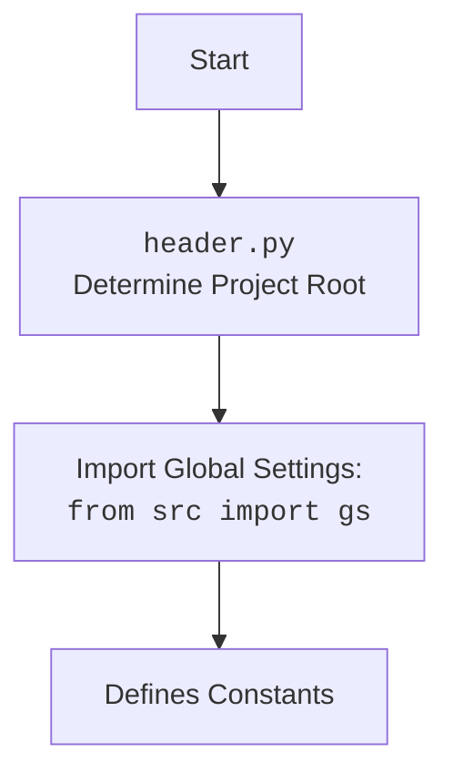

## Анализ кода `hypotez/src/endpoints/prestashop/customer.py`

### 1. <алгоритм>

Этот код предназначен для работы с клиентами в PrestaShop через API. Основной класс `PrestaCustomer` наследуется от класса `PrestaShop` и предоставляет методы для добавления, удаления, обновления и получения информации о клиентах.

**Блок-схема рабочего процесса:**

1.  **Инициализация `PrestaCustomer`**:
    *   При создании экземпляра `PrestaCustomer` происходит инициализация с использованием `api_domain` и `api_key`. Эти параметры могут быть переданы напрямую или через словарь `credentials`.
    *   Проверяется наличие обоих параметров `api_domain` и `api_key`. Если какой-либо из них отсутствует, выбрасывается исключение `ValueError`.
    *   Вызывается конструктор родительского класса `PrestaShop` с переданными параметрами.

2.  **Методы для работы с клиентами**:
    *   `add_customer_PrestaShop(name, email)`: Добавляет нового клиента в PrestaShop. (Реализация не показана в предоставленном коде).
    *   `delete_customer_PrestaShop(customer_id)`: Удаляет клиента из PrestaShop по его ID. (Реализация не показана в предоставленном коде).
    *   `update_customer_PrestaShop(customer_id, new_name)`: Обновляет информацию о клиенте в PrestaShop по его ID. (Реализация не показана в предоставленном коде).
    *   `get_customer_details_PrestaShop(customer_id)`: Получает детальную информацию о клиенте из PrestaShop по его ID. (Реализация не показана в предоставленном коде).

**Пример потока данных:**

```
PrestaCustomer(credentials={'api_domain': 'example.com', 'api_key': '123'})
--> __init__(credentials)
--> api_domain = credentials['api_domain']  # api_domain = 'example.com'
--> api_key = credentials['api_key']  # api_key = '123'
--> super().__init__(api_domain, api_key)  # Инициализация PrestaShop
```

### 2. <mermaid>

```mermaid
flowchart TD
    Start --> PrestaCustomerInit[PrestaCustomer <br> __init__]
    PrestaCustomerInit --> CheckCredentials{Проверка credentials is not None?}
    CheckCredentials -- Yes --> GetApiDomain[Получение api_domain из credentials]
    CheckCredentials -- No --> CheckApiDomainKey{Проверка api_domain и api_key?}
    GetApiDomain --> GetApiKey[Получение api_key из credentials]
    GetApiKey --> CheckApiDomainKey
    CheckApiDomainKey -- No api_domain or no api_key --> RaiseValueError[Выброс ValueError]
    CheckApiDomainKey -- api_domain and api_key --> SuperInit[super().__init__(api_domain, api_key)]
    RaiseValueError --> End
    SuperInit --> End
    

```

**Объяснение зависимостей:**

*   `attr`, `attrs` из `attr`: используются для объявления классов с автоматической генерацией методов, таких как `__init__`, `__repr__` и других.
*   `Path` из `pathlib`: используется для работы с путями к файлам и директориям.
*   `Union` из `typing`: используется для указания, что переменная может иметь один из нескольких типов.
*   `SimpleNamespace` из `types`: используется для создания простых объектов с атрибутами, доступными через точку.
*   `header`: Предположительно, содержит общие функции или настройки для проекта.
*   `src.gs`: Глобальные настройки проекта.
*   `src.logger.logger`: Модуль логирования.
*   `src.utils.jjson.j_loads`: Функция для загрузки JSON из файла.
*   `.api.PrestaShop`: Базовый класс для работы с PrestaShop API.
*   `src.logger.exceptions.PrestaShopException`: Пользовательское исключение для PrestaShop.
*   `Optional` из `typing`: используется для указания, что переменная может быть `None`.

Дополнительный блок `mermaid` для `header.py`:



### 3. <объяснение>

**Импорты:**

*   `sys`, `os`: Стандартные модули Python для работы с системными функциями и операционной системой.
*   `attr`, `attrs` из `attr`: Используются для упрощения создания классов, автоматически генерируя методы, такие как `__init__`, `__repr__` и другие.
*   `Path` из `pathlib`: Используется для удобной работы с путями к файлам и директориям.
*   `Union` из `typing`: Позволяет указывать, что переменная может иметь один из нескольких типов (например, `str` или `int`).
*   `SimpleNamespace` из `types`: Удобный способ создания объектов, атрибуты которых можно задавать как поля.
*   `header`: Пользовательский модуль, вероятно, содержащий общие функции или настройки для проекта.
*   `src.gs`: Доступ к глобальным настройкам проекта.
*   `src.logger.logger`: Модуль логирования для записи информации о работе программы.
*   `src.utils.jjson.j_loads`: Функция для загрузки данных из JSON-файла.
*   `.api.PrestaShop`: Базовый класс для взаимодействия с PrestaShop API (родительский класс для `PrestaCustomer`).
*   `src.logger.exceptions.PrestaShopException`: Пользовательское исключение, специфичное для ошибок, возникающих при работе с PrestaShop.
*    `Optional` из `typing`:  Указывает, что переменная может иметь значение определенного типа или `None`.

**Класс `PrestaCustomer`:**

*   **Роль:** Предоставляет методы для работы с клиентами в PrestaShop API.
*   **Атрибуты:**
    *   Наследует атрибуты от класса `PrestaShop` (например, `api_domain`, `api_key`).
*   **Методы:**
    *   `__init__(self, credentials=None, api_domain=None, api_key=None, *args, **kwards)`: Конструктор класса. Инициализирует параметры подключения к PrestaShop API.
        *   `credentials`: Может быть словарем или объектом `SimpleNamespace`, содержащим `api_domain` и `api_key`.
        *   `api_domain`: Домен PrestaShop API.
        *   `api_key`: Ключ API для доступа к PrestaShop.
    *   `add_customer_PrestaShop(self, name, email)`: Добавляет нового клиента. (Не реализовано в предоставленном коде).
    *   `delete_customer_PrestaShop(self, customer_id)`: Удаляет клиента. (Не реализовано в предоставленном коде).
    *   `update_customer_PrestaShop(self, customer_id, new_name)`: Обновляет информацию о клиенте. (Не реализовано в предоставленном коде).
    *   `get_customer_details_PrestaShop(self, customer_id)`: Получает информацию о клиенте. (Не реализовано в предоставленном коде).
*   **Взаимодействие:**
    *   Наследуется от `PrestaShop`, что позволяет использовать общую логику для работы с API.
    *   Использует `src.logger.logger` для логирования.
    *   Использует `src.utils.jjson.j_loads` для загрузки конфигурационных данных (если необходимо).
    *   Может выбрасывать исключение `PrestaShopException` в случае ошибок.

**Функции:**

*   `__init__`:
    *   **Аргументы:**
        *   `credentials (Optional[dict | SimpleNamespace], optional)`: Словарь или объект SimpleNamespace с параметрами `api_domain` и `api_key`. Defaults to `None`.
        *   `api_domain (Optional[str], optional)`: Домен API. Defaults to `None`.
        *   `api_key (Optional[str], optional)`: Ключ API. Defaults to `None`.
    *   **Возвращаемое значение:** `None`
    *   **Назначение:** Инициализация экземпляра класса `PrestaCustomer`.
    *   **Пример:**

```python
customer = PrestaCustomer(api_domain='example.com', api_key='123')
customer = PrestaCustomer(credentials={'api_domain': 'example.com', 'api_key': '123'})
```

**Переменные:**

*   `credentials`:  Словарь или объект `SimpleNamespace`, содержащий учетные данные для доступа к API.
*   `api_domain`: Строка, представляющая домен API PrestaShop.
*   `api_key`: Строка, представляющая ключ API для доступа к PrestaShop.

**Потенциальные ошибки и области для улучшения:**

*   В коде отсутствуют реализации методов `add_customer_PrestaShop`, `delete_customer_PrestaShop`, `update_customer_PrestaShop` и `get_customer_details_PrestaShop`. Необходимо добавить их, используя API PrestaShop.
*   Не хватает обработки ошибок при взаимодействии с API PrestaShop. Следует добавить блоки `try...except` для обработки возможных исключений и логирования ошибок с использованием `logger.error`.
*   Было бы полезно добавить валидацию входных данных (например, проверку формата email) перед отправкой запросов к API.

**Цепочка взаимосвязей с другими частями проекта:**

*   `PrestaCustomer` зависит от `PrestaShop` для выполнения API-запросов.
*   Использует `src.logger.logger` для логирования, что позволяет отслеживать работу класса и выявлять ошибки.
*   Может использовать `src.utils.jjson.j_loads` для загрузки конфигурации из JSON-файла, что обеспечивает гибкость в настройке параметров подключения к API.
*   Взаимодействует с `src.logger.exceptions.PrestaShopException` для обработки специфичных ошибок PrestaShop.