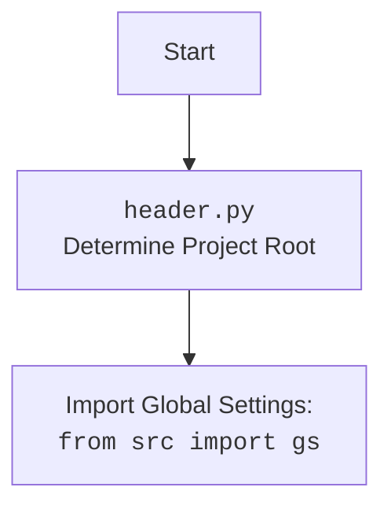

# Проект `hypotez`
# Роль `code explainer`

## АНАЛИЗ КОДА: `hypotez/src/endpoints/prestashop/pricelist.py`

### 1. <алгоритм>

1.  **Инициализация `PriceListRequester`**:
    *   Создается экземпляр класса `PriceListRequester` с использованием учетных данных API (`api_credentials`).
    *   Вызывается конструктор родительского класса `PrestaShop` с параметрами `api_domain` и `api_key`.

2.  **Запрос цен (`request_prices`)**:
    *   Метод `request_prices` принимает список товаров (`products`).
    *   Внутри метода вызывается API PrestaShop для получения цен на товары.
    *   Формируется словарь, где ключами являются товары, а значениями - их цены.
    *   Возвращается полученный словарь.

3.  **Обновление источника (`update_source`)**:
    *   Метод `update_source` принимает новый источник данных (`new_source`).
    *   Внутри метода происходит обновление текущего источника данных (`self.source`).

4.  **Модификация цены товара (`modify_product_price`)**:
    *   Метод `modify_product_price` принимает название товара (`product`) и новую цену (`new_price`).
    *   Внутри метода вызывается API PrestaShop для изменения цены товара.

### 2. <mermaid>

```mermaid
flowchart TD
    Start --> A[PriceListRequester Initialization]
    A --> B{api_credentials}
    B -- api_domain & api_key --> C[PrestaShop Initialization]
    C --> D[request_prices(products)]
    D --> E{products}
    E --> F[API Call to PrestaShop]
    F --> G{Product Prices}
    G --> H[Return Dictionary]
    H --> I[update_source(new_source)]
    I --> J{new_source}
    J --> K[Modify self.source]
    K --> L[modify_product_price(product, new_price)]
    L --> M{product & new_price}
    M --> N[API Call to Modify Price]
    N --> End

```

**Объяснение зависимостей:**

*   `PriceListRequester` зависит от `PrestaShop` для выполнения API-запросов.
*   Метод `request_prices` принимает список товаров (`products`) в качестве входных данных и возвращает словарь с ценами.
*   Метод `update_source` принимает новый источник данных (`new_source`) для обновления источника цен.
*   Метод `modify_product_price` принимает название товара (`product`) и новую цену (`new_price`) для изменения цены товара.



### 3. <объяснение>

#### Импорты:

*   `sys`, `os`: Стандартные модули Python для работы с системными переменными и операционной системой.
*   `attr, attrs`: Библиотека `attrs` для создания классов данных.
*   `Path`: Модуль `pathlib` для работы с путями к файлам и директориям.
*   `Union`: Тип из модуля `typing` для указания, что переменная может иметь один из нескольких типов.
*   `header`: Модуль `header` для определения корневого каталога проекта.
*   `src.gs`: Глобальные настройки проекта.
*   `src.logger.logger`: Модуль логирования.
*   `src.utils.jjson`: Модуль для работы с JSON файлами.
*   `.api.PrestaShop`: Класс `PrestaShop` для взаимодействия с API PrestaShop.
*   `types.SimpleNamespace`: Класс для создания объектов с атрибутами.

#### Классы:

*   `PriceListRequester`:
    *   Роль: Класс для запроса и управления списком цен из PrestaShop.
    *   Атрибуты:
        *   `api_domain`: Домен API PrestaShop.
        *   `api_key`: Ключ API PrestaShop.
        *   `source`: Источник данных для запроса цен.
    *   Методы:
        *   `__init__`: Инициализирует объект класса, вызывая конструктор родительского класса `PrestaShop`.
        *   `request_prices`: Запрашивает список цен для указанных товаров.
        *   `update_source`: Обновляет источник данных для запроса цен.
        *   `modify_product_price`: Модифицирует цену указанного товара.
    *   Взаимодействие:
        *   Наследует класс `PrestaShop` для выполнения API-запросов.

#### Функции:

*   `__init__(self, api_credentials)`:
    *   Аргументы:
        *   `api_credentials`: Словарь с учетными данными API.
    *   Возвращаемое значение: Нет.
    *   Назначение: Инициализирует объект класса `PriceListRequester` и вызывает конструктор родительского класса `PrestaShop`.
*   `request_prices(self, products)`:
    *   Аргументы:
        *   `products`: Список товаров, для которых требуется получить цены.
    *   Возвращаемое значение: Словарь, где ключами являются товары, а значениями - их цены.
    *   Назначение: Запрашивает список цен для указанных товаров из API PrestaShop.
*   `update_source(self, new_source)`:
    *   Аргументы:
        *   `new_source`: Новый источник данных.
    *   Возвращаемое значение: Нет.
    *   Назначение: Обновляет источник данных для запроса цен.
*   `modify_product_price(self, product, new_price)`:
    *   Аргументы:
        *   `product`: Название товара.
        *   `new_price`: Новая цена товара.
    *   Возвращаемое значение: Нет.
    *   Назначение: Модифицирует цену указанного товара в API PrestaShop.

#### Переменные:

*   `api_credentials`: Словарь с учетными данными API.
*   `products`: Список товаров.
*   `new_source`: Новый источник данных.
*   `product`: Название товара.
*   `new_price`: Новая цена товара.

#### Потенциальные ошибки и области для улучшения:

*   В методах `request_prices` и `modify_product_price` отсутствует реальная реализация взаимодействия с API PrestaShop. Необходимо добавить код для выполнения API-запросов.
*   Необходимо добавить обработку ошибок при выполнении API-запросов.
*   Метод `update_source` не имеет логики проверки корректности нового источника данных.

#### Взаимосвязи с другими частями проекта:

*   Класс `PriceListRequester` использует класс `PrestaShop` из модуля `.api` для взаимодействия с API PrestaShop.
*   Модуль `header` используется для определения корневого каталога проекта.
*   Глобальные настройки проекта хранятся в `src.gs`.
*   Для логирования используется модуль `src.logger.logger`.
*   Для работы с JSON файлами используется модуль `src.utils.jjson`.