## <алгоритм>

1.  **Инициализация `FastApi`:**
    *   При создании экземпляра `FastApi` (класс-синглтон), вызывается `__new__`, который гарантирует создание только одного экземпляра класса.
    *   В `__new__` создаётся экземпляр, если его ещё нет, инициализируются атрибуты `_initialized`, `server_tasks` (для хранения задач сервера) и `servers` (для хранения экземпляров сервера).
    *   В `__init__` устанавливается `title` и `host`, создается экземпляр `APIRouter` и флаг `_initialized` устанавливается в `True`.

2.  **Добавление маршрутов:**
    *   Метод `add_route` принимает `path` (путь маршрута), `func` (функцию-обработчик) и `methods` (список HTTP методов).
    *   Он использует декоратор `@functools.wraps(func)` для сохранения метаданных исходной функции и создает функцию-обертку `wrapper`.
    *   Метод `add_api_route` из `APIRouter` добавляет новый маршрут, связывая `path` и `wrapper`.

3.  **Регистрация роутера:**
    *   Метод `register_router` включает маршрутизатор в приложение FastAPI с помощью `include_router`.

4.  **Запуск сервера:**
    *   Метод `start` принимает `port`.
    *   Если сервер уже запущен на этом порту, выводится сообщение, и функция завершается.
    *   В противном случае создается асинхронная задача с помощью `asyncio.create_task`, запускающая метод `_start_server`.
    *   `_start_server` создаёт конфигурацию Uvicorn и экземпляр сервера, сохраняя его в словаре `servers`, и запускает сервер асинхронно.
       -  `uvicorn.Config` создает конфигурацию сервера, которая включает в себя сам экземпляр `FastApi`, хост, порт и уровень логирования.
       -  `uvicorn.Server` создает экземпляр сервера, который и запускается в методе `_start_server`
    *   Созданная задача сохраняется в словаре `server_tasks` для контроля.

5.  **Остановка сервера:**
    *   Метод `stop` принимает `port`.
    *   Проверяет, запущен ли сервер на указанном порту.
    *   Если сервер запущен, он останавливается асинхронно через `await self.servers[port].stop()`.

6.  **Остановка всех серверов:**
    *   Метод `stop_all` перебирает все ключи (порты) в словаре `servers` и останавливает каждый сервер, вызывая метод `stop` в цикле.

7.  **Возврат экземпляра приложения FastAPI**
     * Метод `get_app` возвращает экземпляр приложения FastAPI, что позволяет получить доступ к его методам.

8.  **Пример использования:**
    *   В примере создается экземпляр `FastApi`.
    *   Добавляются два маршрута: `/hello` (GET) и `/post` (POST).
    *   Регистрируется роутер.
    *   Сервер запускается на порту 8080, затем динамически добавляется порт 8081.
    *   После некоторой задержки, останавливается сервер на порту 8080, а затем все сервера.
    *   Пример запускается в асинхронном цикле событий.

```mermaid
flowchart TD
    subgraph FastApi Class
        Start(Start) --> New[<code>__new__</code><br> Singleton Creation]
         New -- Instance Created --> Init[<code>__init__</code><br>Initialize App]
        New -- Instance Exists --> Init
         Init --> RouterCreation[Create APIRouter]
        RouterCreation --> AddRoute[<code>add_route</code><br> Add Route]
        AddRoute --> RegisterRouter[<code>register_router</code><br> Include Router]
        RegisterRouter --> StartServer[<code>start</code><br> Start Server on Port]
        StartServer -- Server Not Running --> CreateTask[Create Async Task <code>_start_server</code>]
        StartServer -- Server Running --> End[End Start]
         CreateTask --> StartUvicorn[<code>_start_server</code><br> Start Uvicorn Server]
          StartUvicorn --> Serve[<code>server.serve</code>]
           Serve --> StopServer[<code>stop</code> <br> Stop Server on Port]
         StopServer -- Server Running --> StopUvicorn[<code>server.stop</code>]
         StopServer -- Server Not Running --> EndStop[End Stop]
         StopUvicorn --> StopAllServers[<code>stop_all</code><br> Stop All Servers]
          StopAllServers --> EndAllStop[End Stop All]
        End --> EndAllStop
         EndStop --> EndAllStop
      EndAllStop --> GetApp[<code>get_app</code><br> Get FastAPI Instance]
    GetApp --> EndProg[End Programm]
     end
```

## <mermaid>

**Описание импортов `mermaid`:**
*   `flowchart TD`: Задает тип диаграммы (блок-схема) и направление потока (сверху вниз).
*   `Start`, `New`, `Init`, `RouterCreation`, `AddRoute`, `RegisterRouter`, `StartServer`, `CreateTask`, `StartUvicorn`, `Serve`, `StopServer`, `StopUvicorn`, `StopAllServers`, `EndAllStop`, `EndStop`, `EndProg`: Обозначения для блоков диаграммы, описывающих шаги в коде.
*   `-->`: Обозначает поток управления между блоками.

## <объяснение>

### Импорты:

*   `from fastapi import FastAPI as Fapi, APIRouter`: Импортирует класс `FastAPI` как `Fapi` и `APIRouter` из библиотеки `fastapi`.
    *   `FastAPI` используется для создания основного приложения FastAPI.
    *   `APIRouter` используется для создания набора маршрутов, которые можно подключать к приложению.
*   `import uvicorn`: Импортирует `uvicorn` - ASGI сервер, который используется для запуска приложения FastAPI.
*   `from typing import List, Callable, Dict, Any`: Импортирует типы для аннотации типов данных:
    *   `List`: Список.
    *   `Callable`: Функция.
    *   `Dict`: Словарь.
    *   `Any`: Любой тип.
*   `import functools`: Импортирует модуль для работы с функциями высшего порядка, в данном случае используется декоратор `wraps`.
*   `import threading`: Импортирует модуль для работы с потоками. Этот импорт присутствует, но в коде явно не используется.
*   `import asyncio`: Импортирует модуль для асинхронного программирования, позволяющий выполнять неблокирующие операции.

### Класс `FastApi`:

*   **`_instance`**: Статическая переменная, хранящая единственный экземпляр класса (синглтон).
*   **`server_tasks`**: Словарь для хранения асинхронных задач, которые запускают сервер на каждом порту. Ключ - порт, значение - асинхронная задача.
*   **`servers`**: Словарь для хранения экземпляров серверов `uvicorn`. Ключ - порт, значение - экземпляр сервера.
*   **`__new__(cls, *args, **kwargs)`**:
    *   Метод, вызываемый при создании нового экземпляра класса.
    *   Реализует паттерн "синглтон", гарантируя создание только одного экземпляра класса.
    *   Если экземпляр не создан, создает его, инициализирует `_initialized` в `False`, `server_tasks` и `servers` пустыми словарями.
*   **`__init__(self, title: str = "FastAPI Singleton Server", host: str = "127.0.0.1", **kwargs)`**:
    *   Метод инициализации экземпляра.
    *   Проверяет, не был ли экземпляр уже инициализирован. Если был - возвращает управление.
    *   Вызывает конструктор родительского класса `FastAPI` с заданными параметрами `title` и `kwargs`.
    *   Инициализирует атрибут `router` экземпляром `APIRouter`.
    *   Устанавливает атрибут `host`.
    *   Устанавливает флаг `_initialized` в `True`, чтобы предотвратить повторную инициализацию.
*   **`add_route(self, path: str, func: Callable, methods: List[str] = ["GET"], **kwargs)`**:
    *   Метод для добавления маршрута в приложение.
    *   Принимает путь, функцию-обработчик, список методов HTTP (по умолчанию GET), а также дополнительные аргументы.
    *   Использует `functools.wraps` для сохранения метаданных исходной функции.
    *   Создает функцию-обертку `wrapper`, которая вызывает исходную функцию.
    *   Добавляет маршрут в `APIRouter` с помощью `add_api_route`.
*   **`register_router(self)`**:
    *   Метод для регистрации роутера в приложении, включает роутер в экземпляр FastAPI.
*   **`_start_server(self, port: int)`**:
    *   Асинхронный метод для запуска сервера Uvicorn на указанном порту.
    *   Создает конфигурацию Uvicorn с помощью `uvicorn.Config`, настраивая хост, порт и уровень логирования.
    *   Создает экземпляр сервера `uvicorn.Server`.
    *   Сохраняет экземпляр сервера в словаре `servers`.
    *   Запускает сервер асинхронно с помощью `await server.serve()`.
*   **`start(self, port: int)`**:
    *   Метод для запуска сервера на определенном порту.
    *   Проверяет, запущен ли уже сервер на данном порту, если да выводит сообщение и завершается.
    *   Если нет, создаёт асинхронную задачу `_start_server` и сохраняет ее в словаре `server_tasks`.
*   **`stop(self, port: int)`**:
    *   Асинхронный метод для остановки сервера на определенном порту.
    *   Проверяет, запущен ли сервер на данном порту, если да то останавливает его.
*    **`stop_all(self)`**:
    * Асинхронный метод для остановки всех серверов
    * Перебирает все порты из словаря `servers` и останавливает их.
*  **`get_app(self)`**:
     * Метод для возврата экземпляра приложения FastAPI
     * Возвращает экземпляр `self`, чтобы иметь доступ к методам FastAPI

### Функции:

*   `test_function()`: Асинхронная функция для обработки GET-запросов.
*    `test_post(data: Dict[str, str])`: Функция для обработки POST-запросов, принимает данные в формате словаря.
*   `main()`: Основная асинхронная функция примера использования.
    *   Создает экземпляр `FastApi`.
    *   Добавляет маршруты `/hello` и `/post`.
    *   Регистрирует роутер.
    *   Запускает сервер на порту 8080, затем динамически добавляет порт 8081.
    *   Останавливает сервер на порту 8080, а затем все серверы.

### Переменные:

*   `api`: Экземпляр класса `FastApi`.
*   `port`: Целочисленная переменная, обозначающая порт сервера.
*   `task`: Асинхронная задача для управления сервером.
*    `data`: Словарь, передаваемый в функцию `test_post` для обработки POST-запросов.
*    `title`: Заголовок для приложения FastAPI.
*    `host`: Хост для запуска сервера.
* `config`: Конфигурация сервера Uvicorn.
* `server`: Экземпляр сервера Uvicorn.

### Потенциальные ошибки и улучшения:

*   **Отсутствует обработка исключений:** В методах `start` и `stop` не обрабатываются возможные исключения при запуске и остановке сервера.
*   **Отсутствует обработка ошибок:** В методах `start` нет обработки случаев когда сервер не смог запуститься.
*   **Неявное использование потоков:** Модуль `threading` импортируется, но явно не используется в коде. Можно его убрать.
*   **Логирование:** Было бы полезно добавить более детальное логирование событий, таких как старт и остановка сервера.
*  **Использование `list(self.servers.keys())` в методе `stop_all`:** создание списка ключей словаря на каждом вызове цикла может быть не оптимальным. Можно было бы просто итерировать словарь.

### Цепочка взаимосвязей:

*   `FastApi` является обёрткой над `FastAPI` и `uvicorn`, что позволяет упростить управление серверами и портами.
*   Функции `test_function` и `test_post` являются примерами обработчиков запросов.
*   `asyncio` обеспечивает возможность асинхронного запуска и остановки серверов.
*   Пример использования демонстрирует, как можно динамически запускать и останавливать сервера.

В целом, код представляет собой хорошо структурированный класс для управления серверами FastAPI, обеспечивающий возможность динамического управления портами и ресурсами.