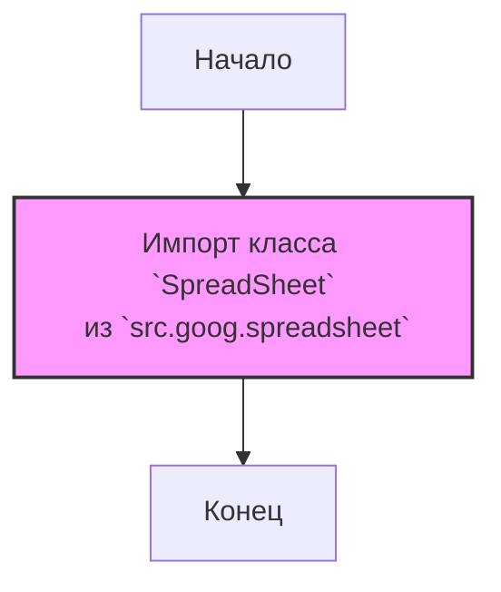

## АНАЛИЗ КОДА: `src/goog/__init__.py`

### 1. <алгоритм>

**Описание:**

1.  **Начало**: Запускается интерпретатор Python.
2.  **Импорт:** Выполняется импорт класса `SpreadSheet` из модуля `src.goog.spreadsheet`.
3.  **Конец:** Завершение выполнения скрипта, класс `SpreadSheet` готов к использованию в других частях пакета `src.goog`.

**Пример:**

Представим, что в другом файле, например, `src/main.py`, вы хотите использовать класс `SpreadSheet`:

```python
# src/main.py
from src.goog import SpreadSheet

my_spreadsheet = SpreadSheet("my_sheet_id") # Создается экземпляр SpreadSheet
my_spreadsheet.read_data() # Вызывается метод
```

В этом случае импорт `from src.goog import SpreadSheet` делает класс `SpreadSheet` доступным для использования.

### 2. <mermaid>



**Объяснение зависимостей:**

*   `Start`: Начало выполнения файла `__init__.py`.
*   `ImportSpreadSheet`: Импортирует класс `SpreadSheet` из модуля `spreadsheet.py`, который находится в той же директории `src.goog`. Это означает, что `__init__.py` зависит от файла `spreadsheet.py` для определения класса `SpreadSheet`.
*   `End`: Завершение выполнения файла `__init__.py`.

### 3. <объяснение>

**Импорты:**

*   `from .spreadsheet import SpreadSheet`: Этот импорт загружает класс `SpreadSheet` из модуля `spreadsheet.py`, который находится в том же пакете (`src.goog`).  Точка (`.`) в начале пути импорта указывает на относительный импорт в рамках текущего пакета. Этот класс предназначен для работы с Google Sheets.

**Классы:**

*   `SpreadSheet`: Класс, который, вероятно, содержит методы и атрибуты для взаимодействия с Google Sheets. Он может включать методы для чтения, записи, обновления и других операций с таблицами.  Подробности о его структуре и методах можно найти в файле `src/goog/spreadsheet.py`.

**Функции:**

*   В данном файле нет явно определенных функций, но импорт `SpreadSheet` делает доступным методы, определенные внутри класса `SpreadSheet` в файле `spreadsheet.py`.

**Переменные:**

*   В данном файле нет явно определенных переменных.

**Потенциальные ошибки или области для улучшения:**

*   **Отсутствие документации:** В файле отсутствует документация о самом модуле, как и отсутствует описание функциональности. Было бы полезно добавить docstring в начало файла `__init__.py`, чтобы описать назначение пакета `goog`.
*   **Обработка ошибок:** Код импорта не содержит обработки исключений. При возникновении проблем при импорте могут возникнуть непредвиденные ситуации.

**Цепочка взаимосвязей с другими частями проекта:**

*   `src.goog`: Этот пакет, вероятно, предназначен для взаимодействия с Google API, в частности с Google Sheets.
*   `src.goog.spreadsheet`: Модуль, который содержит класс `SpreadSheet` и логику работы с таблицами.
*   Другие модули проекта могут импортировать и использовать класс `SpreadSheet` из пакета `src.goog` для работы с таблицами. Например,  `src/main.py` может импортировать `SpreadSheet` для доступа к гугл таблицам.

**Заключение:**

Файл `__init__.py` пакета `src.goog` выполняет простую задачу: он делает класс `SpreadSheet` доступным для использования в других частях проекта, импортируя его из модуля `src.goog.spreadsheet`.  Он служит точкой входа в пакет и обеспечивает удобный способ использования функциональности работы с Google Sheets, инкапсулированной в `SpreadSheet`.