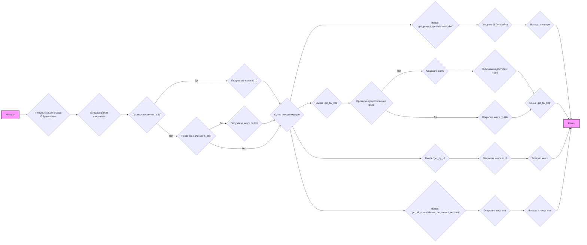

## АНАЛИЗ КОДА: `src/goog/spreadsheet/bberyakov/gspreadsheet.py`

### 1. <алгоритм>

**Блок-схема:**



**Примеры:**

1.  **Инициализация класса `GSpreadsheet`:**
    *   Создается экземпляр класса `GSpreadsheet` с указанием `s_id` (ID таблицы Google Sheets).
    *   Загружаются учетные данные из файла `goog/onela-hypotez-1aafa5e5d1b5.json`.
    *   Вызывается метод `get_by_id`, который открывает таблицу по ID.

2.  **Инициализация класса `GSpreadsheet`:**
    *   Создается экземпляр класса `GSpreadsheet` с указанием `s_title` (заголовка таблицы Google Sheets).
    *   Загружаются учетные данные из файла `goog/onela-hypotez-1aafa5e5d1b5.json`.
    *   Вызывается метод `get_by_title`, который открывает таблицу по названию.

3.  **Вызов метода `get_project_spreadsheets_dict`:**
    *   Метод загружает JSON файл `goog/spreadsheets.json`
    *   Метод возвращает словарь, представляющий структуру данных из JSON.

4.  **Вызов метода `get_by_title`:**
    *   Метод `get_by_title` принимает на вход `sh_title` (название таблицы)
    *   Если книга с таким заголовком не существует, то создается новая книга
    *   Если книга существует, то она открывается
    *   Публикация доступа к таблице для пользователя `d07708766@gmail.com` с правами `writer`

5.  **Вызов метода `get_by_id`:**
    *   Метод `get_by_id` принимает на вход `sh_id` (id таблицы)
    *   Метод открывает таблицу по её ID, используя `gclient.open_by_key()`

6.   **Вызов метода `get_all_spreadsheets_for_current_account`:**
    *   Метод `get_all_spreadsheets_for_current_account` открывает все таблицы текущего аккаунта

### 2. <mermaid>

```mermaid
flowchart TD
    subgraph GSpreadsheet Class
        A[GSpreadsheet<br>Class]
        B[__init__(self, s_id, s_title)]
        C[get_project_spreadsheets_dict(self)]
        D[get_by_title(self, sh_title)]
        E[get_by_id(self, sh_id)]
        F[get_all_spreadsheets_for_current_account(self)]
         A --> B
        A --> C
        A --> D
        A --> E
        A --> F
    end
    
     subgraph Spreadsheet Class
        G[Spreadsheet<br>Class (from global_settingspread)]
    end
    
    subgraph gspread Package
        H[gspread.client]
        I[gspread.service_account]
         B --> I
        
        E-->H
    end
    
     subgraph json Package
        J[json.loads()]
    end
    C-->J
    A --> G
```

**Объяснение `mermaid` диаграммы:**

1.  **`GSpreadsheet Class`**:
    *   `GSpreadsheet`: Представляет класс, который управляет Google Sheets.
    *   `__init__`: Инициализация экземпляра `GSpreadsheet`.
    *   `get_project_spreadsheets_dict`: Метод для получения словаря настроек из JSON-файла.
    *   `get_by_title`: Метод для получения Google Sheet по его названию.
    *  `get_by_id`: Метод для получения Google Sheet по его ID.
    *  `get_all_spreadsheets_for_current_account`: Метод для получения всех Google Sheets текущего аккаунта.

2.  **`Spreadsheet Class`**:
    *   `Spreadsheet (from global_settingspread)`: базовый класс `Spreadsheet` (импортируется из `global_settingspread`), от которого наследуется `GSpreadsheet`.

3.  **`gspread Package`**:
    *   `gspread.client`:  клиент Google Sheets API из библиотеки `gspread`.
    *    `gspread.service_account`: Функция для аутентификации через сервисный аккаунт.

4.  **`json Package`**:
    *   `json.loads()`: Функция для загрузки данных из JSON файла.

### 3. <объяснение>

**Импорты:**

*   `from global_settingspread import Spreadsheet, service_account`: Импортирует класс `Spreadsheet` и функцию `service_account` из модуля `global_settingspread`.
    *   `Spreadsheet`:  Является базовым классом для `GSpreadsheet`.
    *   `service_account`: Функция для аутентификации с помощью сервисного аккаунта Google.
*   `import gspread`: Импортирует библиотеку `gspread` для работы с Google Sheets API.
*   `import json`: Импортирует библиотеку `json` для работы с JSON файлами.
*   `from typing import List, Type, Union`: Импортирует типы данных для аннотации типов в Python.

**Класс `GSpreadsheet`:**

*   **Роль:** Управляет операциями с Google Sheets.
*   **Атрибуты:**
    *   `gsh`:  Экземпляр класса `Spreadsheet` для работы с книгой Google Sheets. Изначально равен `None`.
    *   `gclient`: Клиент `gspread` для доступа к Google Sheets API.
*   **Методы:**
    *   `__init__(self, s_id: str = None, s_title: str = None, *args, **kwards)`: Конструктор класса. Принимает `s_id` или `s_title` для инициализации. Загружает учетные данные из JSON файла `goog/onela-hypotez-1aafa5e5d1b5.json` и создает экземпляр клиента `gspread`.
    *   `get_project_spreadsheets_dict(self) -> dict`: Читает данные из файла `goog/spreadsheets.json` и возвращает их в виде словаря.
    *   `get_by_title(self, sh_title: str = 'New Spreadsheet')`: Открывает книгу Google Sheets по ее названию. Если книги нет, то создает новую.
    *   `get_by_id(self, sh_id: str) -> Spreadsheet`: Открывает книгу Google Sheets по ее ID.
    *   `get_all_spreadsheets_for_current_account(self)`: Возвращает все книги текущего аккаунта.

**Функции:**
Все функции являются методами класса `GSpreadsheet` и описаны в разделе **Класс `GSpreadsheet`**

**Переменные:**
*  `secret_file`: Локальная переменная которая содержит путь к файлу с ключами доступа.
*  `s_id`: Идентификатор книги.
*  `s_title`: Название книги.
*  `sh_title`: Название книги, которое необходимо создать или открыть
*  `sh_id`: Идентификатор книги, которую необходимо открыть.

**Потенциальные ошибки и области для улучшения:**

*   **Обработка исключений:** Отсутствует обработка исключений при чтении JSON файла, открытии или создании Google Sheets. Необходимо добавить блоки `try-except` для обработки возможных ошибок.
*   **Константы**: Путь к файлу `goog/onela-hypotez-1aafa5e5d1b5.json`  и имя пользователя `d07708766@gmail.com` должны быть вынесены в константы.
*   **Комментарии**: Описание методов можно улучшить, сделав их более подробными.
*   **Разделение ответственности**: В методе `get_by_title` происходит одновременно создание и открытие таблиц. Можно разделить эти операции.

**Взаимосвязь с другими частями проекта:**

*   Класс `GSpreadsheet` наследует от класса `Spreadsheet`, который, вероятно, определен в `global_settingspread`.
*   Использует `gspread` для взаимодействия с Google Sheets API.
*   Использует файл `goog/onela-hypotez-1aafa5e5d1b5.json` для аутентификации, предполагается что этот файл находится в корневой директории проекта.
*   Использует JSON файл `goog/spreadsheets.json` для получения настроек.