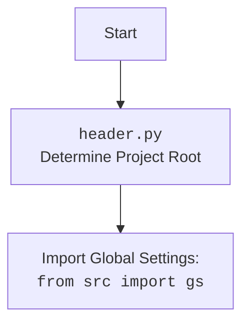

## ИНСТРУКЦИЯ:

Анализируй предоставленный код подробно и объясни его функциональность. Ответ должен включать три раздела:

1.  **<алгоритм>**: Опиши рабочий процесс в виде пошаговой блок-схемы, включая примеры для каждого логического блока, и проиллюстрируй поток данных между функциями, классами или методами.
2.  **<mermaid>**: Напиши код для диаграммы в формате `mermaid`, проанализируй и объясни все зависимости,
    которые импортируются при создании диаграммы.
    **ВАЖНО!** Убедитесь, что все имена переменных, используемые в диаграмме `mermaid`,
    имеют осмысленные и описательные имена. Имена переменных вроде `A`, `B`, `C`, и т.д., не допускаются!

    **Дополнительно**: Если в коде есть импорт `import header`, добавьте блок `mermaid` flowchart, объясняющий `header.py`:
    ```mermaid
    flowchart TD
        Start --> Header[<code>header.py</code><br> Determine Project Root]

        Header --> import[Import Global Settings: <br><code>from src import gs</code>]
    ```

3.  **<объяснение>**: Предоставьте подробные объяснения:
    -   **Импорты**: Их назначение и взаимосвязь с другими пакетами `src.`.
    -   **Классы**: Их роль, атрибуты, методы и взаимодействие с другими компонентами проекта.
    -   **Функции**: Их аргументы, возвращаемые значения, назначение и примеры.
    -   **Переменные**: Их типы и использование.
    -   Выделите потенциальные ошибки или области для улучшения.

Дополнительно, постройте цепочку взаимосвязей с другими частями проекта (если применимо).

Это обеспечивает всесторонний и структурированный анализ кода.
## Формат ответа: `.md` (markdown)
**КОНЕЦ ИНСТРУКЦИИ**

### <алгоритм>

1. **Инициализация `ReachSpreadsheet`**:
   - Создается экземпляр класса `ReachSpreadsheet`.
   - Пытается загрузить учетные данные Google из JSON-файла, расположенного во временной директории (`gs.path.tmp / 'e-cat-346312-137284f4419e.json'`).
   - Создает HTTP-авторизованный клиент и сервисные объекты для `sheets` и `drive` API.
   - Инициализирует переменные: `spreadsheetId`, `sheetId`, `sheetTitle`, `requests`, `valueRanges`.
   - Если возникают ошибки при создании учетных данных, выводится сообщение об ошибке.

    *Пример:*
    ```python
    ss = ReachSpreadsheet(debugMode=True)
    # Инициализация переменных и попытка создать учетные данные
    ```

2.  **Создание новой таблицы (`create`)**:
    -   Принимает `title`, `sheetTitle`, `rows`, `cols`, `locale` и `timeZone` в качестве параметров.
    -   Использует `self.service.spreadsheets().create()` для создания новой таблицы.
    -   Сохраняет `spreadsheetId`, `sheetId` и `sheetTitle`.
    -   Если `debugMode` установлен, выводит информацию о созданной таблице с помощью `pprint`.

    *Пример:*
    ```python
    ss.create("My New Spreadsheet", "Sheet1", rows=500, cols=20)
    # Создание таблицы и заполнение переменных
    ```

3.  **Совместное использование (`share`, `shareWithEmailForReading` и т.д.)**:
    -   `share` принимает словарь `shareRequestBody` с параметрами доступа.
    -   Использует `self.driveService.permissions().create()` для предоставления доступа.
    -   Если `debugMode` установлен, выводит информацию о предоставленном доступе.
    -   `shareWithEmailForReading`, `shareWithEmailForWriting`, `shareWithAnybodyForReading`, `shareWithAnybodyForWriting` являются обертками над `share` с предустановленными параметрами доступа.

    *Пример:*
    ```python
    ss.shareWithEmailForWriting("test@example.com")
    # Предоставление доступа на запись пользователю
    ```

4.  **Получение URL таблицы (`getSheetURL`)**:
    -   Проверяет, установлены ли `spreadsheetId` и `sheetId`.
    -   Формирует и возвращает URL таблицы Google Sheets.
    *Пример:*
     ```python
    url = ss.getSheetURL()
    # Вернет ссылку на таблицу
     ```

5.  **Установка таблицы по ID (`setSpreadsheetById`)**:
    -   Принимает `spreadsheetId`.
    -   Использует `self.service.spreadsheets().get()` для получения информации о таблице.
    -   Сохраняет `spreadsheetId`, `sheetId` и `sheetTitle`.
    -   Если `debugMode` установлен, выводит информацию о таблице.

    *Пример:*
    ```python
    ss.setSpreadsheetById("spreadsheet_id_123")
    # Установка текущей таблицы
    ```

6.  **Выполнение подготовленных запросов (`runPrepared`)**:
    -   Проверяет, установлен ли `spreadsheetId`.
    -   Использует `self.service.spreadsheets().batchUpdate()` для выполнения накопленных запросов из `self.requests`.
    -   Использует `self.service.spreadsheets().values().batchUpdate()` для выполнения обновлений значений из `self.valueRanges`.
    -   Если `debugMode` установлен, выводит результаты выполнения запросов.
    -   Очищает списки `self.requests` и `self.valueRanges`.
    -   Возвращает результаты выполнения запросов.

    *Пример:*
    ```python
    ss.prepare_setColumnWidth(0, 150)
    ss.prepare_setValues("A1:B2", [["data1", "data2"], ["data3", "data4"]])
    replies, responses = ss.runPrepared()
     # Выполнение запросов
    ```

7.  **Подготовка запросов на добавление листа (`prepare_addSheet`) и добавление листа (`addSheet`)**:
    -   `prepare_addSheet` добавляет запрос на добавление листа в `self.requests`.
    -   `addSheet` вызывает `prepare_addSheet`, затем `runPrepared` для выполнения запроса, и возвращает `sheetId` нового листа.

    *Пример:*
    ```python
    new_sheet_id = ss.addSheet("New Sheet", rows=200, cols=15)
    # Добавление листа и получение его ID
    ```

8.  **Преобразование диапазона ячеек в GridRange (`toGridRange`)**:
    -   Принимает строку с диапазоном ячеек (например, "A1:B2").
    -   Преобразует её в словарь `GridRange`.
     *Пример:*
    ```python
    grid_range = ss.toGridRange("A1:B2")
    # Преобразование диапазона в объект
    ```

9. **Подготовка запросов на изменение размеров колонок и строк (`prepare_setDimensionPixelSize`, `prepare_setColumnsWidth`, `prepare_setColumnWidth`, `prepare_setRowsHeight`, `prepare_setRowHeight`)**:
    - `prepare_setDimensionPixelSize` добавляет запрос на изменение размера указанного измерения (`dimension`) в диапазоне `startIndex` - `endIndex`.
    -  Остальные функции являются обертками над `prepare_setDimensionPixelSize` с предустановленными `dimension` (`COLUMNS` или `ROWS`).

    *Пример:*
    ```python
        ss.prepare_setColumnWidth(0, 150)
        # Подготовка запроса на изменение ширины колонки
    ```

10. **Подготовка запросов на установку значений (`prepare_setValues`)**:
    -   Добавляет запрос на установку значений в заданный диапазон ячеек в `self.valueRanges`.
    -   `majorDimension` задает ориентацию данных: по строкам или по столбцам.

    *Пример:*
    ```python
        ss.prepare_setValues("A1:B2", [["value1", "value2"], ["value3", "value4"]])
        # Подготовка запроса на установку значений
    ```

11. **Подготовка запросов на объединение ячеек (`prepare_mergeCells`)**:
    - Добавляет запрос на объединение ячеек в заданном диапазоне в `self.requests`.
     *Пример:*
    ```python
        ss.prepare_mergeCells("A1:B2")
        # Подготовка запроса на объединение ячеек
    ```

12. **Подготовка запросов на форматирование ячеек (`prepare_setCellStringFormatterormat`, `prepare_setCellStringFormatterormats`)**:
     - `prepare_setCellStringFormatterormat` добавляет запрос на форматирование ячеек с помощью `repeatCell`.
     - `prepare_setCellStringFormatterormats` добавляет запрос на форматирование ячеек с помощью `updateCells`.
    *Пример:*
    ```python
        ss.prepare_setCellStringFormatterormat("A1:B2", {"textFormat": {"bold": True}})
        ss.prepare_setCellStringFormatterormats("A1:B2", [[{"textFormat": {"bold": True}}, {"backgroundColor": htmlColorToJSON("#FF0000")}]])
        # Подготовка запросов на форматирование ячеек
    ```

13. **Вспомогательная функция `htmlColorToJSON`**:
    -   Преобразует HTML-цвет (например, "#RRGGBB") в JSON-представление цвета.
        *Пример:*
     ```python
    color = htmlColorToJSON("#FF0000")
    # Вернет json представление цвета
     ```
### <mermaid>

```mermaid
flowchart TD
    Start[Start] --> Init[<code>ReachSpreadsheet.__init__</code><br>Load Credentials, Create Services];
    Init --> CreateSpreadsheet{Create Spreadsheet?};
    CreateSpreadsheet -- Yes --> Create[<code>ReachSpreadsheet.create</code><br>Create New Spreadsheet];
    CreateSpreadsheet -- No --> SetSpreadsheet{Set Spreadsheet by ID?};
     SetSpreadsheet -- Yes --> SetByID[<code>ReachSpreadsheet.setSpreadsheetById</code><br>Set Spreadsheet by ID];
     SetSpreadsheet -- No -->  AccessSheet{Access Sheet?};
        AccessSheet -- Yes -->  AddSheet[<code>ReachSpreadsheet.addSheet</code><br>Add New Sheet];
        AccessSheet -- No --> UpdateData{Update Sheet Data?}
            UpdateData -- Yes --> PrepareUpdateData[Prepare Data Updates<br><code>ReachSpreadsheet.prepare_*</code>];
             PrepareUpdateData --> RunPrepared[<code>ReachSpreadsheet.runPrepared</code><br>Batch Update Spreadsheet];
            UpdateData -- No --> ShareAccess{Share Access?}
              ShareAccess -- Yes --> Share[<code>ReachSpreadsheet.share*</code><br>Share Spreadsheet];
             ShareAccess -- No --> GetUrl{Get Sheet URL?};
              GetUrl -- Yes --> GetSheetURL[<code>ReachSpreadsheet.getSheetURL</code><br>Get Spreadsheet URL];
             GetUrl -- No --> End[End];
    Create -->  Share1[<code>ReachSpreadsheet.shareWithAnybodyForWriting</code><br>Share Spreadsheet];
    Share1 --> End;
    SetByID --> AccessSheet;
     AddSheet --> UpdateData;
    RunPrepared --> End;
    Share --> End;
    GetSheetURL --> End;


     classDef function fill:#f9f,stroke:#333,stroke-width:2px
    class Init,Create,SetByID,AddSheet,RunPrepared,Share,GetSheetURL  function;

     classDef condition fill:#ccf,stroke:#333,stroke-width:2px
    class CreateSpreadsheet,SetSpreadsheet,AccessSheet,UpdateData,ShareAccess,GetUrl condition;
```



### <объяснение>

**Импорты**:

-   `httplib2`: Используется для создания HTTP-клиента для взаимодействия с Google API.
-   `googleapiclient.discovery`: Используется для создания сервисных объектов Google API (Sheets API v4 и Drive API v3).
-   `googleapiclient.errors`: Используется для обработки ошибок Google API.
-   `oauth2client.service_account.ServiceAccountCredentials`: Используется для аутентификации с помощью сервисного аккаунта Google.
-   `tempfile`: Используется для работы с временными файлами (непосредственно в данном коде не используется, но может быть использовано в `src.gs`).
-   `header`: Кастомный модуль для определения корневой директории проекта (см. `mermaid` диаграмму выше)
-   `src.gs`: Глобальные настройки проекта, импортируется из `src`.
-    `src.utils.jjson`: Содержит функции `j_loads_ns` и `j_dumps` для работы с JSON.
-   `src.utils.printer`: Содержит функцию `pprint` для красивого вывода данных (используется для отладки).
-   `src.logger.logger`: Модуль логирования для записи ошибок и другой важной информации.

**Классы**:

-   `SpreadsheetError`: Базовый класс для исключений, связанных с работой с Google Sheets.
-   `SpreadsheetNotSetError`: Исключение, возникающее, когда операции выполняются без установленного `spreadsheetId`.
-   `SheetNotSetError`: Исключение, возникающее, когда операции выполняются без установленного `sheetId`.
-   `ReachSpreadsheet`:
    -   **Роль**: Является основным классом, предоставляющим интерфейс для работы с Google Sheets API v4.
    -   **Атрибуты**:
        -   `debugMode`: Флаг для включения режима отладки (вывод в консоль подробной информации).
        -   `credentials`: Учетные данные для доступа к Google API.
        -   `httpAuth`: Авторизованный HTTP-клиент.
        -   `service`: Сервисный объект для работы с Sheets API v4.
        -   `driveService`: Сервисный объект для работы с Drive API v3.
        -   `spreadsheetId`: ID текущей таблицы.
        -   `sheetId`: ID текущего листа в таблице.
        -   `sheetTitle`: Название текущего листа.
        -   `requests`: Список запросов для пакетного обновления таблицы.
        -   `valueRanges`: Список диапазонов значений для пакетного обновления значений ячеек.
    -   **Методы**:
        -   `__init__`: Конструктор, инициализирует класс и загружает учетные данные.
        -   `create`: Создает новую таблицу.
        -   `share`: Предоставляет доступ к таблице.
        -   `shareWithEmailForReading`, `shareWithEmailForWriting`, `shareWithAnybodyForReading`, `shareWithAnybodyForWriting`: Упрощенные методы для предоставления доступа.
        -   `getSheetURL`: Возвращает URL таблицы.
        -   `setSpreadsheetById`: Устанавливает текущую таблицу по ID.
        -   `runPrepared`: Выполняет пакетные запросы.
        -   `prepare_addSheet`: Подготавливает запрос на добавление листа.
        -   `addSheet`: Добавляет новый лист и делает его текущим.
        -   `toGridRange`: Преобразует строку с диапазоном ячеек в GridRange.
        -    `prepare_setDimensionPixelSize`: Подготавливает запрос на изменение размера строк или колонок.
        -   `prepare_setColumnsWidth`, `prepare_setColumnWidth`, `prepare_setRowsHeight`, `prepare_setRowHeight`: Подготавливает запросы на изменение ширины колонок и высоты строк.
        -   `prepare_setValues`: Подготавливает запрос на установку значений.
        -   `prepare_mergeCells`: Подготавливает запрос на объединение ячеек.
        -   `prepare_setCellStringFormatterormat`, `prepare_setCellStringFormatterormats`: Подготавливает запросы на форматирование ячеек.

**Функции**:

-   `htmlColorToJSON(htmlColor)`:
    -   **Аргументы**: `htmlColor` - строка, представляющая цвет в HTML формате (например, "#FF0000").
    -   **Возвращаемое значение**: Словарь с ключами 'red', 'green', 'blue' и значениями от 0.0 до 1.0.
    -   **Назначение**: Преобразует HTML-цвет в JSON-представление цвета, которое можно использовать в Google Sheets API.

**Переменные**:

-   `jsonKeyFileName`: Полный путь к файлу с ключом сервисного аккаунта Google.
-   `spreadsheetId`, `sheetId`, `sheetTitle`: Переменные экземпляра класса `ReachSpreadsheet`, которые хранят идентификаторы и название текущей таблицы и листа.
-   `requests`, `valueRanges`: Переменные экземпляра класса `ReachSpreadsheet`, которые хранят списки запросов на пакетное обновление.

**Цепочка взаимосвязей с другими частями проекта**:

-   `src.gs`: `ReachSpreadsheet` использует `gs.path.tmp` для доступа к временной директории, где хранится JSON файл с ключом сервисного аккаунта.
-   `src.utils.jjson`: Не используется напрямую в коде, но может использоваться в других модулях, связанных с Google Sheets API.
-   `src.utils.printer`: Используется для вывода отладочной информации с помощью функции `pprint`.
-   `src.logger.logger`: Используется для логирования ошибок, возникающих при работе с Google Sheets API.

**Потенциальные ошибки и области для улучшения**:

-   Обработка ошибок: Хотя в коде есть общая обработка исключений, хорошо было бы добавить более детальную обработку ошибок Google API.
-   Отсутствие проверок: В некоторых местах (например, в `toGridRange`) нет полной проверки входных данных.
-   Использование магических чисел: Значения по умолчанию (например, размеры листов) стоит вынести в константы.
-   Тесты: Код содержит тестовые функции, но их стоит выделить в отдельный файл и оформить как тесты с помощью `unittest`.
-   Комментарии: Некоторые части кода нуждаются в более подробных комментариях.

Этот анализ обеспечивает полное понимание кода, его функциональности, и связей с другими частями проекта.