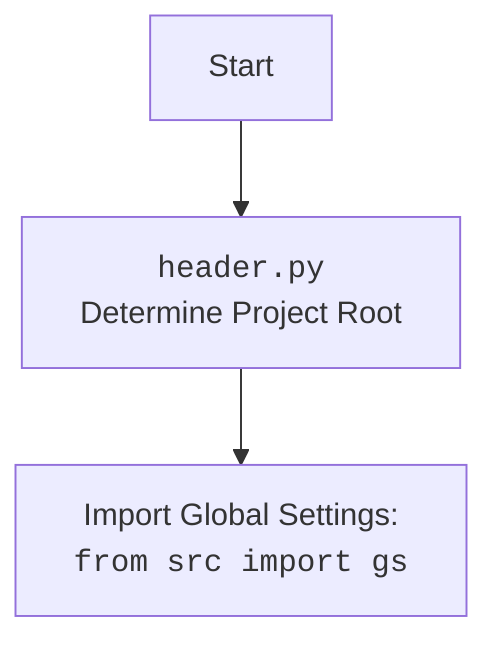

## Анализ кода `header.py`

### <алгоритм>

1. **Определение корневой директории проекта:**
   -  Начало: Программа запускается.
   -  `os.getcwd()`: Получаем текущую рабочую директорию. Например, это может быть `/home/user/hypotez/src/suppliers/_examples`.
   -  `os.getcwd().rfind('hypotez')`: Ищем индекс последнего вхождения строки 'hypotez' в текущей рабочей директории. В нашем примере это будет `11`.
   -  `os.getcwd()[:os.getcwd().rfind('hypotez') + 7]`: Извлекаем подстроку от начала текущей директории до символа, следующего за словом "hypotez", включая само слово "hypotez" (добавляем `+7`). Результатом будет строка `/home/user/hypotez`.
   -  `Path(...)`: Создаем объект `Path` из полученной строки, что позволяет удобно манипулировать путями.  `dir_root` теперь представляет собой `Path` объект для корневой директории проекта, например, `/home/user/hypotez`.

2. **Добавление корневой директории в `sys.path`:**
   - `str(dir_root)`: Преобразуем `Path` объект в строку.
   - `sys.path.append(...)`: Добавляем строку с корневой директорией в `sys.path`. Это позволяет Python находить модули из корневой директории при импорте.
   -  Пример: Если корневая директория `/home/user/hypotez`, то в sys.path добавится строка "/home/user/hypotez".

3. **Определение директории `src`:**
    - `Path(dir_root, 'src')`: Создаем объект `Path`, представляющий путь к директории `src`, расположенной внутри корневой директории. Если `dir_root` равен `/home/user/hypotez`, то `dir_src` будет `/home/user/hypotez/src`.

4. **Добавление корневой директории в `sys.path` еще раз:**
   - `sys.path.append(str(dir_root))`: Повторно добавляем строку с корневой директорией в `sys.path`, хотя это может показаться избыточным.

### <mermaid>

```mermaid
flowchart TD
    Start --> GetCurrentWorkingDirectory[Получить текущую рабочую директорию: <code>os.getcwd()</code>]
    GetCurrentWorkingDirectory --> FindHypotezIndex[Найти индекс подстроки 'hypotez': <code>os.getcwd().rfind('hypotez')</code>]
    FindHypotezIndex --> ExtractProjectRoot[Извлечь корневую директорию проекта: <code>os.getcwd()[:index + 7]</code>]
    ExtractProjectRoot --> CreatePathObjectRoot[Создать объект Path для корневой директории: <code>Path(root_dir)</code>]
    CreatePathObjectRoot --> AppendRootToSysPath[Добавить корневую директорию в <code>sys.path</code>]
    AppendRootToSysPath --> CreatePathObjectSrc[Создать объект Path для директории <code>src</code>: <code>Path(root_dir, 'src')</code>]
   CreatePathObjectSrc --> AppendRootToSysPath2[Добавить корневую директорию в <code>sys.path</code> (повторно)]
    AppendRootToSysPath2 --> End

    style Start fill:#f9f,stroke:#333,stroke-width:2px
    style End fill:#ccf,stroke:#333,stroke-width:2px
```



### <объяснение>

**Импорты:**

-   `import os`: Модуль `os` предоставляет функции для взаимодействия с операционной системой, включая работу с файловой системой. Используется для получения текущей рабочей директории (`os.getcwd()`) и её обработки.
-   `import sys`: Модуль `sys` предоставляет доступ к некоторым переменным и функциям, которые взаимодействуют с интерпретатором Python. Здесь используется для добавления путей к директориям в список `sys.path`, что позволяет импортировать модули из этих директорий.
-   `from pathlib import Path`: Класс `Path` из модуля `pathlib` предоставляет объектно-ориентированный способ работы с путями файлов и директорий, что упрощает код по сравнению с использованием строковых путей.

**Переменные:**

-   `dir_root: Path`: Переменная типа `Path`, которая хранит путь к корневой директории проекта. Определяется динамически на основе текущей рабочей директории.
-   `dir_src: Path`: Переменная типа `Path`, которая хранит путь к директории `src` внутри корневой директории проекта.

**Функции:**

-   Функции как таковой нет, но есть последовательный блок инструкций:
    - `os.getcwd()`: Возвращает строку, представляющую текущую рабочую директорию.
    - `os.getcwd().rfind('hypotez')`: Возвращает индекс последнего вхождения подстроки 'hypotez' в строку, представляющую текущую рабочую директорию, или -1, если подстрока не найдена.
    -  `Path(...)`: Создает объект `Path` из указанной строки.
    -  `sys.path.append(...)`: Добавляет строку с путем в список `sys.path`.

**Объяснение функциональности:**

Данный скрипт `header.py` предназначен для определения корневой директории проекта "hypotez" и добавления ее в список путей поиска модулей (`sys.path`) Python. Это позволяет импортировать модули из других частей проекта, независимо от того, где находится скрипт в иерархии директорий.  Скрипт также добавляет путь к директории `src`, что может быть необходимо для дальнейшей работы с проектом.
  
**Потенциальные ошибки или области для улучшения:**

-  **Повторное добавление корневой директории в `sys.path`**: Строка `sys.path.append (str (dir_root) )` добавляется дважды. Это не приведет к ошибке, но избыточно и может быть удалено.
- **Жестко заданная подстрока `hypotez`:** Поиск корневой директории основан на жестко заданной подстроке `hypotez`. Если имя проекта изменится или структура проекта будет другой, то данный скрипт может не работать. Более гибким решением будет использование переменной окружения или конфигурационного файла для определения корневой директории.
-   **Отсутствие проверки нахождения `hypotez`**: Код не проверяет, что подстрока `hypotez` действительно присутствует в текущей директории. В случае отсутствия будет ошибка.  Следует добавить проверку, чтобы обработать такую ситуацию.

**Взаимосвязь с другими частями проекта:**

Этот скрипт, вероятно, предназначен для импортирования в другие модули проекта `hypotez`. Путем добавления корневой директории в `sys.path`, модули из разных директорий могут импортировать модули и пакеты из `src`, такие как `gs` (Global Settings). Это обеспечивает модульность и возможность переиспользования кода.

**Пример использования (гипотетический):**

Предположим, что есть файл `my_module.py` внутри `src/` и мы хотим импортировать его из файла `example.py` в `src/suppliers/_examples/`:

```python
# src/suppliers/_examples/example.py
import sys
from pathlib import Path
import os
# Импортируем header.py, чтобы добавить пути в sys.path.
from src.suppliers._examples import header
from src import my_module # импорт из src, работает благодаря header.py

# Теперь можно использовать функции и классы из my_module
my_module.some_function()
```