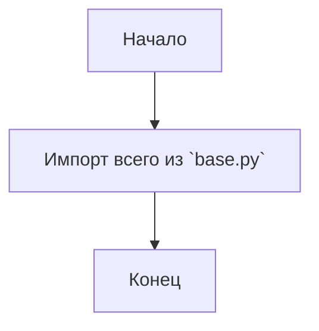
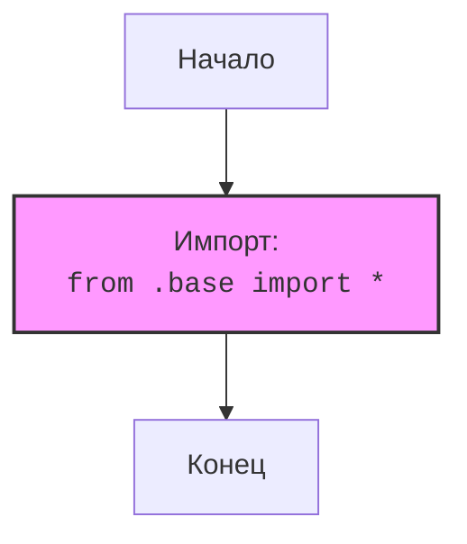

## АНАЛИЗ КОДА: `hypotez/src/suppliers/aliexpress/api/_examples/iop/__init__.py`

### 1. <алгоритм>

**Описание:**

Данный код представляет собой файл `__init__.py` в директории `src/suppliers/aliexpress/api/_examples/iop`. Файл является частью пакета Python и выполняет роль точки входа для модуля `iop`. В данном случае он импортирует все (*) имена из файла `base.py`, который расположен в той же директории.

**Пошаговая блок-схема:**

**Пример:**

1. **Начало**: Выполнение кода начинается с интерпретатора Python.
2. **Импорт из `base.py`**:  Все определения (классы, функции, переменные) из файла `base.py`, находящегося в том же каталоге, импортируются в пространство имен модуля `iop`. Например, если `base.py` содержит класс `AliexpressIOPClient` и функцию `create_client`, они становятся доступными в `iop` через `iop.AliexpressIOPClient` и `iop.create_client`.
3. **Конец**: Завершение выполнения файла. Модуль `iop` готов к использованию.

### 2. <mermaid>

**Анализ диаграммы:**

- `Start`: Начальная точка выполнения кода.
- `ImportBase`:  Блок, представляющий инструкцию импорта всех имен из `base.py`.
- `End`: Конечная точка выполнения кода.

**Описание зависимостей:**

- `from .base import *`: Эта строка означает импорт всех публичных (не начинающихся с `_`) имен из модуля `base.py`, расположенного в текущей директории. `base.py` должен существовать и содержать полезные определения, которые будут использованы в `iop`.

### 3. <объяснение>

**Импорты:**

-   `from .base import *`: 
    -   `.` (точка) означает текущую директорию, где расположен файл `__init__.py`.
    -   `base` указывает на файл `base.py`, который рассматривается как модуль.
    -   `*`  означает, что импортируются все публичные (не начинающиеся с `_`) имена (переменные, функции, классы) из `base.py`.
    -   **Назначение:** Этот импорт делает содержимое модуля `base.py` напрямую доступным в пространстве имен модуля `iop`.  Это позволяет пользователям модуля `iop` обращаться к классам, функциям и переменным из `base.py` как к атрибутам модуля `iop` (например, `iop.ClassName` или `iop.function_name()`).
    - **Взаимосвязь с `src`:** Этот импорт связывает `iop` с `base.py`, которые являются частью одной подсистемы в `src/suppliers/aliexpress/api/_examples`.

**Классы**:
*   В данном файле не объявлены классы напрямую, но импорт `*` из `base.py` подразумевает, что классы, объявленные в `base.py`, станут частью `iop`. Например, если в `base.py` есть класс `AliexpressIOPClient`, он будет доступен как `iop.AliexpressIOPClient`.

**Функции:**

*   Аналогично классам, функции, определенные в `base.py`, будут доступны как атрибуты `iop`. Например, если `base.py` имеет функцию `create_client`, она будет доступна как `iop.create_client`.

**Переменные:**
*   Как и для классов и функций, переменные, определенные в `base.py`, будут доступны через `iop`.

**Потенциальные ошибки и области для улучшения:**

-   **Импорт `*`:** Использование импорта `*` (импорт всех имен) может привести к конфликтам имен, если в `base.py` есть определения, которые перекрываются с именами, определенными в других модулях. Рекомендуется импортировать только нужные имена (`from .base import ClassName, function_name`) или же импортировать модуль и обращаться к именам через точку (`import base` и затем `base.ClassName`).
-   **Отсутствие явных определений**: Сам файл `__init__.py` не содержит явных определений классов, функций или переменных, все они предполагаются из `base.py`. Это делает анализ кода зависимым от содержимого `base.py`, что усложняет понимание контекста без анализа `base.py`.
-   **Неявная зависимость**: Зависимость от `base.py` не является явной в текущем файле, хотя она и очевидна из импорта. Это делает код менее прозрачным для тех, кто незнаком со структурой модуля.

**Цепочка взаимосвязей:**

1.  **`src`**: Корень проекта.
2.  **`suppliers`**: Директория, содержащая код, относящийся к поставщикам.
3.  **`aliexpress`**: Директория, содержащая код для работы с AliExpress.
4.  **`api`**: Директория, содержащая код для взаимодействия с API AliExpress.
5.  **`_examples`**: Директория, содержащая примеры использования API.
6.  **`iop`**:  Модуль, который, вероятно, связан с каким-то конкретным API (IOP).
7.  **`__init__.py`**: Этот файл делает модуль `iop` импортируемым и перенаправляет содержимое `base.py` в пространство имен `iop`.
8.  **`base.py`**: (не проанализирован, но является ключевой частью)  Содержит основные классы, функции и переменные для модуля `iop`, которые становятся частью публичного интерфейса `iop` через импорт `*`.