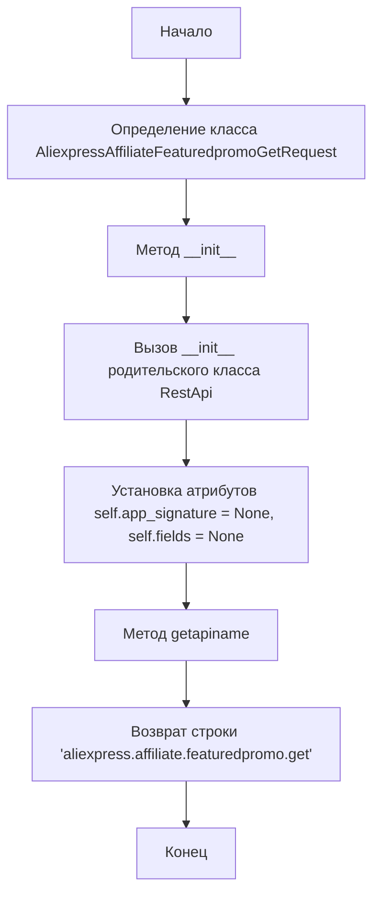
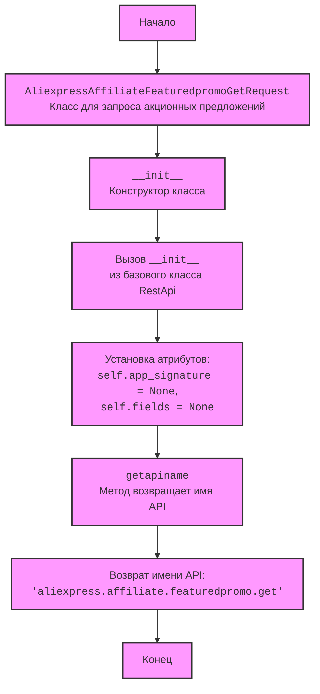
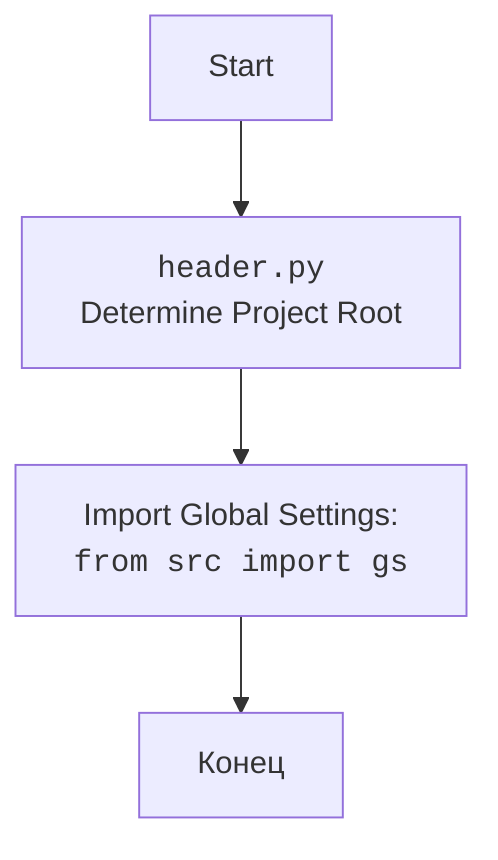

## Анализ кода `AliexpressAffiliateFeaturedpromoGetRequest.py`

### 1. <алгоритм>

**Блок-схема:**

**Примеры для каждого логического блока:**

*   **Start**: Начало выполнения скрипта.
*   **ClassDef**: Создание класса `AliexpressAffiliateFeaturedpromoGetRequest`. Этот класс предназначен для отправки запроса к API AliExpress для получения данных об акционных предложениях.
*   **InitMethod**: Инициализация экземпляра класса. При создании объекта `AliexpressAffiliateFeaturedpromoGetRequest` вызывается конструктор `__init__`, который принимает домен и порт API в качестве аргументов (по умолчанию `api-sg.aliexpress.com` и `80`).
    *   Пример: `request_obj = AliexpressAffiliateFeaturedpromoGetRequest()` создаст объект с доменом `api-sg.aliexpress.com` и портом `80`.
    *   Пример: `request_obj = AliexpressAffiliateFeaturedpromoGetRequest(domain="test.aliexpress.com", port=443)` создаст объект с доменом `test.aliexpress.com` и портом `443`.
*   **BaseClassInit**: Вызов конструктора базового класса `RestApi`. Это устанавливает домен и порт для выполнения запроса.
*   **SetAttrs**: Инициализация атрибутов `app_signature` и `fields` экземпляра класса.
    *   `self.app_signature` -  предположительно,  ключ для подписи запросов (изначально `None`).
    *   `self.fields` -  поля,  которые необходимо запросить в ответе API (изначально `None`).
*   **GetApiNameMethod**: Вызов метода `getapiname()`. Метод возвращает имя API, к которому будет сделан запрос.
    *   Пример: Вызов `request_obj.getapiname()` вернет строку `'aliexpress.affiliate.featuredpromo.get'`.
*   **ReturnApiName**: Возвращает имя API для запроса.
*   **End**: Завершение работы скрипта.

### 2. <mermaid>

**Анализ зависимостей `mermaid`:**

*   `AliexpressAffiliateFeaturedpromoGetRequest`  является классом,  который наследуется от `RestApi`,  это указывает на связь между этими классами.
*   Метод `__init__` в классе `AliexpressAffiliateFeaturedpromoGetRequest` вызывает `__init__` базового класса `RestApi` для инициализации общих параметров.
*   Класс имеет два атрибута: `app_signature` и `fields`, которые используются при формировании запроса.
*   Метод `getapiname` возвращает имя API.

**mermaid для `header.py`:**

### 3. <объяснение>

**Импорты:**

*   `from ..base import RestApi`: Импортирует класс `RestApi` из модуля `base`, находящегося на один уровень выше в директории (`src/suppliers/aliexpress/api/base.py`).  `RestApi` вероятно, является базовым классом для отправки запросов к API. Он, скорее всего, содержит общую логику для формирования и отправки HTTP-запросов, включая установку домена и порта API. Это позволяет избежать дублирования кода для разных типов запросов.

**Классы:**

*   `AliexpressAffiliateFeaturedpromoGetRequest`: Этот класс является конкретной реализацией запроса к API AliExpress для получения списка акционных предложений.
    *   **Роль**:  Представляет структуру запроса к API.
    *   **Атрибуты**:
        *   `app_signature`: Изначально `None`, вероятно, предназначен для хранения подписи приложения (ключ для авторизации).
        *   `fields`: Изначально `None`, вероятно,  для хранения списка полей,  которые необходимо запросить в ответе API.
    *   **Методы**:
        *   `__init__(self, domain="api-sg.aliexpress.com", port=80)`: Конструктор класса. Инициализирует объект, устанавливая домен и порт API. Вызывает конструктор базового класса `RestApi` для настройки соединения.
        *   `getapiname(self)`: Возвращает строку `'aliexpress.affiliate.featuredpromo.get'`,  которая представляет имя API-метода, к которому будет отправлен запрос.
    *   **Взаимодействие**: Класс наследуется от `RestApi`,  используя его функциональность для отправки запросов.

**Функции:**

*   `__init__`:
    *   **Аргументы**:
        *   `self`: Ссылка на текущий объект.
        *   `domain`: Доменное имя API (по умолчанию `api-sg.aliexpress.com`).
        *   `port`: Порт API (по умолчанию `80`).
    *   **Возвращаемое значение**: `None`.
    *   **Назначение**: Инициализирует объект `AliexpressAffiliateFeaturedpromoGetRequest`, устанавливает значения атрибутов `domain`, `port` и вызывает `__init__` базового класса `RestApi` для дальнейшей инициализации.
*   `getapiname`:
    *   **Аргументы**:
        *   `self`: Ссылка на текущий объект.
    *   **Возвращаемое значение**: Строка `'aliexpress.affiliate.featuredpromo.get'`.
    *   **Назначение**: Возвращает имя API-метода.

**Переменные:**

*   `self.app_signature`: Атрибут экземпляра класса, изначально равен `None`, предназначен для хранения подписи приложения.
*   `self.fields`: Атрибут экземпляра класса, изначально равен `None`, предназначен для хранения списка полей.

**Потенциальные ошибки и области для улучшения:**

*   Отсутствует механизм для установки `app_signature` и `fields`.  Скорее всего эти поля должны быть установлены перед выполнением запроса. Необходимо добавить методы, позволяющие устанавливать их значения.
*   Код не обрабатывает ошибки API. Не хватает try/except блоков для обработки возможных исключений при запросах.
*   Для более ясного понимания логики работы хорошо бы добавить докстринги с описанием каждого класса и метода.

**Взаимосвязь с другими частями проекта:**

*   Класс `AliexpressAffiliateFeaturedpromoGetRequest` является частью модуля, занимающегося взаимодействием с API AliExpress (`src/suppliers/aliexpress/api`). Он использует базовый класс `RestApi` (`src/suppliers/aliexpress/api/base.py`).
*   Вероятно, существует механизм, который использует этот класс для отправки запросов к API AliExpress.

**Дополнительно:**

*   Этот код представляет собой шаблон для создания класса, предназначенного для выполнения запроса к API.
*   Реализация логики отправки запроса и обработки ответов находится в базовом классе `RestApi`.