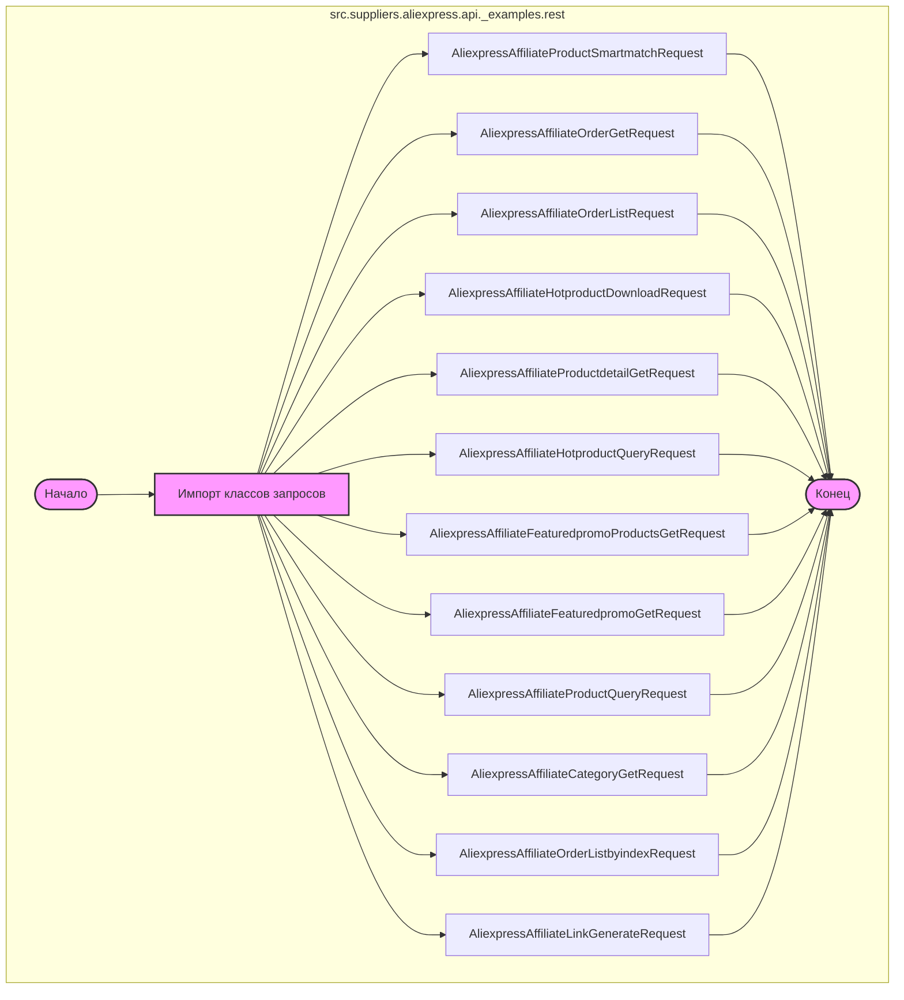

## Анализ кода `hypotez/src/suppliers/aliexpress/api/_examples/rest/__init__.py`

### 1. <алгоритм>

1.  **Начало**: Инициализация модуля `src.suppliers.aliexpress.api._examples.rest`.
2.  **Импорт классов:** Из текущей директории (обозначенной `.`) импортируются классы, каждый из которых представляет определенный запрос к API Aliexpress.
    *   Пример: `from .AliexpressAffiliateProductSmartmatchRequest import AliexpressAffiliateProductSmartmatchRequest` - импортирует класс `AliexpressAffiliateProductSmartmatchRequest`, который используется для запроса подбора товара.
    *   Другие импортируемые классы: `AliexpressAffiliateOrderGetRequest` (запрос конкретного заказа), `AliexpressAffiliateOrderListRequest` (запрос списка заказов), `AliexpressAffiliateHotproductDownloadRequest` (запрос на скачивание горячих товаров), `AliexpressAffiliateProductdetailGetRequest` (запрос информации о товаре), `AliexpressAffiliateHotproductQueryRequest` (запрос горячих товаров), `AliexpressAffiliateFeaturedpromoProductsGetRequest` (запрос товаров с промоакциями), `AliexpressAffiliateFeaturedpromoGetRequest` (запрос промоакций), `AliexpressAffiliateProductQueryRequest` (запрос товаров), `AliexpressAffiliateCategoryGetRequest` (запрос категорий товаров), `AliexpressAffiliateOrderListbyindexRequest` (запрос списка заказов по индексу), `AliexpressAffiliateLinkGenerateRequest` (запрос на генерацию партнерской ссылки).
3.  **Конец**: Модуль готов к использованию, предоставляя доступ к классам для отправки запросов к API Aliexpress.

### 2. <mermaid>

**Объяснение `mermaid`:**

*   **`flowchart TD`**: Определяет тип диаграммы как блок-схему (flowchart) и направление сверху вниз (TD).
*   **`subgraph src.suppliers.aliexpress.api._examples.rest`**: Создает подграф, представляющий модуль, в котором находятся классы.
*   **`Start([Начало])` и `End([Конец])`**: Начало и конец процесса.
*   **`ImportClasses[Импорт классов запросов]`**: Блок, представляющий импорт всех классов запросов.
*   **`AliexpressAffiliateProductSmartmatchRequest`, `AliexpressAffiliateOrderGetRequest`, ..., `AliexpressAffiliateLinkGenerateRequest`**: Каждый блок представляет импортируемый класс, который соответствует определенному запросу к API Aliexpress.
*   **`-->`**: Стрелки, указывающие на поток импорта и зависимостей.
*   **`classDef classFill fill:#f9f,stroke:#333,stroke-width:2px;` и `class ImportClasses,Start,End classFill`**: определяет стиль для ключевых блоков для лучшей визуализации.
*   **`linkStyle default stroke:#333,stroke-width:1px`**: определяет стиль для стрелок для лучшей визуализации.

Диаграмма показывает, что модуль `__init__.py` импортирует набор классов, каждый из которых представляет определенный тип запроса к API Aliexpress. Это позволяет другим частям проекта использовать эти классы для взаимодействия с API.

### 3. <объяснение>

#### Импорты:

*   `from .AliexpressAffiliateProductSmartmatchRequest import AliexpressAffiliateProductSmartmatchRequest`:
    *   **Назначение**: Импортирует класс `AliexpressAffiliateProductSmartmatchRequest` из файла `AliexpressAffiliateProductSmartmatchRequest.py` (находится в текущей директории).
    *   **Взаимосвязь**: Этот класс используется для отправки запросов на подбор товаров через API Aliexpress.
*   Аналогичным образом импортируются все остальные классы, каждый из которых предназначен для определенного типа запроса к API. Например, `AliexpressAffiliateOrderGetRequest` для получения информации о конкретном заказе, `AliexpressAffiliateOrderListRequest` для получения списка заказов и т.д.
*   Все импорты используют относительный импорт (`.`), что означает, что модули импортируются из текущей директории.
*   **Взаимосвязь с пакетами `src`**: Все эти классы являются частью более крупной структуры проекта, где `src` является корневой директорией, `suppliers` определяет поставщиков, `aliexpress` - конкретный поставщик, `api` содержит API, `_examples` это примеры использования и `rest` - REST API. Таким образом, они являются частью системы, взаимодействующей с API Aliexpress для получения различной информации.

#### Классы:

*   Каждый импортированный класс (например, `AliexpressAffiliateProductSmartmatchRequest`, `AliexpressAffiliateOrderGetRequest` и т.д.) представляет собой класс-запрос.
*   **Роль**: Эти классы инкапсулируют логику создания конкретных запросов к API Aliexpress. Скорее всего, они содержат методы для формирования URL-запроса, установки параметров запроса и обработки ответа.
*   **Атрибуты**: Классы, вероятно, имеют атрибуты, которые определяют параметры запроса (например, `product_id`, `order_id`, `page_number`, `page_size` и т.д.)
*   **Методы**: Каждый класс скорее всего имеет метод, который выполняет запрос к API и возвращает данные, и вероятно также методы для валидации параметров.
*   **Взаимодействие**: Эти классы будут использоваться другими частями проекта, которые хотят взаимодействовать с API Aliexpress. Создается экземпляр класса запроса, устанавливаются параметры, вызывается метод для отправки запроса, а затем обрабатывается полученный ответ.

#### Функции:

*   В данном файле нет явных функций, но классы предоставляют функциональность через свои методы.
*   Примеры функциональности:
    *   `AliexpressAffiliateProductSmartmatchRequest`: метод для отправки запроса на подбор товаров.
    *   `AliexpressAffiliateOrderGetRequest`: метод для получения информации о конкретном заказе.
    *   `AliexpressAffiliateOrderListRequest`: метод для получения списка заказов.
    *   `AliexpressAffiliateHotproductDownloadRequest`: метод для скачивания горячих товаров.
    *   `AliexpressAffiliateProductdetailGetRequest`: метод для получения информации о товаре.
    *   `AliexpressAffiliateHotproductQueryRequest`: метод для получения списка горячих товаров.
    *   `AliexpressAffiliateFeaturedpromoProductsGetRequest`: метод для получения списка товаров с промоакциями.
    *    `AliexpressAffiliateFeaturedpromoGetRequest`: метод для получения списка промоакций.
    *   `AliexpressAffiliateProductQueryRequest`: метод для получения списка товаров.
    *   `AliexpressAffiliateCategoryGetRequest`: метод для получения списка категорий товаров.
    *    `AliexpressAffiliateOrderListbyindexRequest`: метод для получения списка заказов по индексу.
    *    `AliexpressAffiliateLinkGenerateRequest`: метод для генерации партнерской ссылки.

#### Переменные:

*   В данном файле нет явных переменных, но внутри каждого импортированного класса будут переменные для хранения параметров запроса и результата.

#### Потенциальные ошибки и области для улучшения:

*   **Обработка ошибок**: В классы запросов следует добавить более детальную обработку ошибок при выполнении запросов к API Aliexpress.
*   **Логирование**: Хорошей практикой является добавление логирования запросов и ответов для отладки и мониторинга.
*   **Валидация**: Усилить валидацию входных параметров.
*   **Документация**: Добавить docstrings для классов и методов, чтобы облегчить их использование.

#### Цепочка взаимосвязей:

1.  Этот файл `__init__.py` является частью пакета `src.suppliers.aliexpress.api._examples.rest`, который отвечает за примеры использования REST API Aliexpress.
2.  Импортированные классы используются в других частях проекта для отправки запросов к API Aliexpress.
3.  Обычно эти запросы отправляются в рамках бизнес-логики приложения, например, для получения данных о товарах, заказах, промоакциях и т.д.
4.  Полученные данные затем могут быть использованы для формирования отчетов, отображения на веб-странице, или других целей.

Этот подробный анализ предоставляет полное понимание структуры, функциональности и взаимосвязей данного модуля.