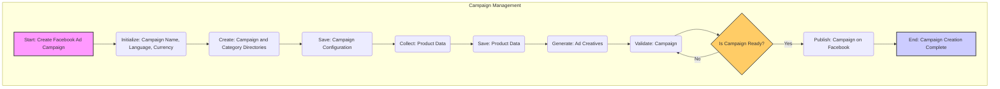

## Анализ модуля `campaign`

### 1. <алгоритм>

**Описание:** Модуль `campaign` отвечает за полный цикл создания и запуска рекламных кампаний на Facebook. Он охватывает все этапы от инициализации до публикации, обеспечивая структурированный подход к управлению рекламным процессом.

**Пошаговая блок-схема:**

1. **Начало: Создание рекламной кампании для размещения на Facebook:**
   - *Пример:* Пользователь запускает скрипт для создания новой рекламной кампании.
2. **Инициализация названия кампании, языка и валюты:**
   - *Пример:* Пользователь вводит название кампании "Summer Sale 2024", выбирает язык "en" и валюту "USD".
3. **Создание директорий для кампании и категорий:**
   - *Пример:* Создаются папки `campaigns/summer_sale_2024`, `campaigns/summer_sale_2024/category1`, `campaigns/summer_sale_2024/category2`.
4. **Сохранение конфигурации кампании:**
   - *Пример:* Сохраняется файл `config.json` с информацией о названии, языке и валюте.
5. **Сбор данных о продуктах:**
   - *Пример:* Вызывается функция `collect_products(source='ali')` для сбора данных о товарах с AliExpress или `collect_products(source='html')` для сбора данных из HTML файла.
6. **Сохранение данных о продуктах:**
   - *Пример:* Сохраняется файл `products.json` с информацией о собранных товарах.
7. **Создание рекламных материалов:**
    - *Пример:* Создаются изображения и тексты для рекламных объявлений на основе данных о продуктах.
8. **Проверка кампании:**
   - *Пример:* Проверяется наличие всех необходимых материалов, правильность конфигурации и корректность данных.
9. **Готова ли кампания?:**
   - *Пример:* Если кампания не готова (обнаружены ошибки), возвращаемся на этап проверки. Если готова, переходим к публикации.
10. **Публикация кампании на Facebook:**
    - *Пример:* Используется Facebook API для создания и запуска рекламной кампании.
11. **Конец: Завершение создания рекламной кампании:**
    - *Пример:* Скрипт завершает свою работу.

**Поток данных:**

- Данные о кампании (название, язык, валюта) вводятся пользователем и сохраняются в конфигурацию.
- Данные о продуктах собираются из внешних источников (AliExpress или HTML) и сохраняются в виде JSON.
- Данные о продуктах и конфигурация используются для создания рекламных материалов.
- Рекламные материалы и конфигурация отправляются на проверку.
- Одобренная кампания отправляется на публикацию через Facebook API.

### 2. <mermaid>

**Объяснение зависимостей:**

Диаграмма в формате `mermaid` показывает последовательность шагов в процессе создания рекламной кампании. Она демонстрирует поток данных от начала инициализации кампании до публикации на Facebook. Каждый шаг представлен в виде узла с осмысленным названием, и стрелки показывают порядок их выполнения. В самом начале происходит запуск процесса создания рекламной кампании, далее происходит инициализация основных параметров кампании, создание необходимых директорий и сохранение конфигурации. Далее идет сбор данных о товарах, их сохранение и генерация рекламных материалов. После чего происходит проверка готовности кампании к публикации. И в конце происходит публикация на Facebook и завершение процесса создания кампании.

### 3. <объяснение>

**Общая структура:**

Модуль `campaign` представляет собой ключевой компонент системы управления рекламой на Facebook. Он структурирован таким образом, чтобы обеспечить понятный и повторяемый процесс создания рекламных кампаний. Модуль охватывает следующие основные этапы: инициализацию, сбор данных, создание рекламных материалов, проверку и публикацию.

**Детализация этапов:**

1.  **Инициализация**:
    *   **Назначение**: Подготовка начальных параметров для кампании, таких как название, язык и валюта. Это позволяет кастомизировать кампанию для конкретной аудитории.
    *   **Пример**: Присвоение значений `campaign_name = "Test Campaign"`, `language = "en"`, `currency = "USD"`.
    *   **Потенциальные улучшения**: Добавить проверку валидности введенных данных (например, проверка формата валюты).

2.  **Создание директорий**:
    *   **Назначение**: Организация файлов проекта путем создания папок для кампании и ее категорий.
    *   **Пример**: Создание `campaigns/test_campaign/`, `campaigns/test_campaign/category1/`.
    *   **Потенциальные улучшения**: Использовать относительные пути для создания директорий для большей гибкости.

3.  **Сохранение конфигурации**:
    *   **Назначение**: Сохранение настроек кампании в виде файла (обычно `json`), чтобы их можно было легко загрузить и использовать повторно.
    *   **Пример**: Запись в `config.json` данных: `{ "name": "Test Campaign", "language": "en", "currency": "USD" }`.
    *   **Потенциальные улучшения**: Добавить возможность загрузки и обновления конфигурации из файла.

4.  **Сбор данных о продуктах**:
    *   **Назначение**: Извлечение информации о товарах либо с AliExpress, либо из HTML-файла.
    *   **Пример**: Вызов `collect_products(source='ali')` или `collect_products(source='html')`.
    *   **Потенциальные улучшения**: Добавить возможность сбора данных из других источников, добавить обработку ошибок при сборе данных.

5.  **Сохранение данных о продуктах**:
    *   **Назначение**: Сохранение собранной информации о продуктах в файл (`products.json`) для дальнейшей обработки.
    *   **Пример**: Запись в `products.json` данных: `[{"name": "Product 1", "price": 10}, {"name": "Product 2", "price": 20}]`.
    *   **Потенциальные улучшения**: Добавить возможность сохранения данных в другие форматы (например, CSV).

6.  **Создание рекламных материалов**:
    *   **Назначение**: Генерация текста и изображений для рекламных объявлений на основе данных о продуктах.
    *   **Пример**: Создание текстовых объявлений и подбор изображений из данных о продуктах.
    *   **Потенциальные улучшения**: Добавить шаблоны для генерации рекламных текстов.

7.  **Проверка кампании**:
    *   **Назначение**: Проверка готовности кампании к публикации. Проверка наличия данных, корректности конфигурации и т.д.
    *   **Пример**: Проверка наличия файлов `config.json` и `products.json`, проверка валидности данных в них.
    *   **Потенциальные улучшения**: Добавить логирование ошибок.

8.  **Публикация кампании на Facebook**:
    *   **Назначение**: Публикация рекламной кампании на Facebook.
    *   **Пример**: Отправка данных о кампании в Facebook API.
    *   **Потенциальные улучшения**: Добавить обработку ошибок при работе с API, добавить мониторинг состояния опубликованной кампании.

**Взаимосвязь с другими частями проекта:**

-   **`src.ali` или `src.html`**: Модули, которые отвечают за сбор данных о продуктах.
-   **`facebook_api`** (не показан): Предположительно, модуль, который отвечает за взаимодействие с Facebook API для публикации кампании.
-   **`src.gs`**: Загрузка глобальных настроек проекта, таких как путь к директориям.

**Потенциальные ошибки и улучшения:**

-   **Обработка ошибок**: Везде необходимо добавить более надежную обработку ошибок.
-   **Логирование**: Добавить логирование для отслеживания процесса создания кампании.
-   **Модульность**: Разбить модуль на несколько более мелких, чтобы повысить его читаемость и переиспользуемость.
-   **Тестирование**: Написать тесты для каждой функции и класса, чтобы гарантировать стабильность работы.

В целом, модуль `campaign` представляет собой хорошо структурированный процесс управления рекламными кампаниями, который может быть улучшен за счет добавления более детальной обработки ошибок, логирования и более глубокой интеграции с другими модулями проекта.