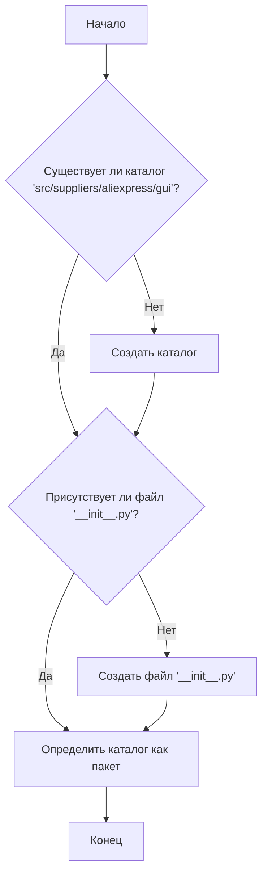

### **Анализ кода `hypotez/src/suppliers/aliexpress/gui/__init__.py`**

#### **1. <алгоритм>**:
Этот файл `__init__.py` служит для инициализации пакета `src.suppliers.aliexpress.gui`. Его основная цель — указать Python, что каталог следует рассматривать как пакет, позволяя модулям внутри этого каталога быть импортированными и использованными в других частях проекта. Поскольку в предоставленном коде нет явных операторов импорта или инициализации, основная функция заключается в определении пакета.

**Блок-схема:**

#### **2. <mermaid>**:
В данном коде нет импортов, поэтому нет необходимости описывать какие-либо зависимости.  `__init__.py` просто обозначает каталог как пакет Python.

#### **3. <объяснение>**:

- **Расположение файла**: Файл расположен в `hypotez/src/suppliers/aliexpress/gui/__init__.py`. Это указывает на то, что он является частью пакета GUI, относящегося к поставщику AliExpress в проекте `hypotez`.

- **Импорты**: В предоставленном коде отсутствуют импорты. Это означает, что `__init__.py` в основном используется для указания того, что каталог `gui` является пакетом Python.

- **Классы**: В этом файле нет классов.

- **Функции**: В этом файле нет функций.

- **Переменные**: В этом файле нет переменных.

**Цепочка взаимосвязей**:
- Этот файл является частью структуры пакета. Другие модули в пакете `src.suppliers.aliexpress.gui` могут импортироваться и использоваться в других частях проекта, в частности, в модулях, связанных с пользовательским интерфейсом (GUI) для поставщика AliExpress.