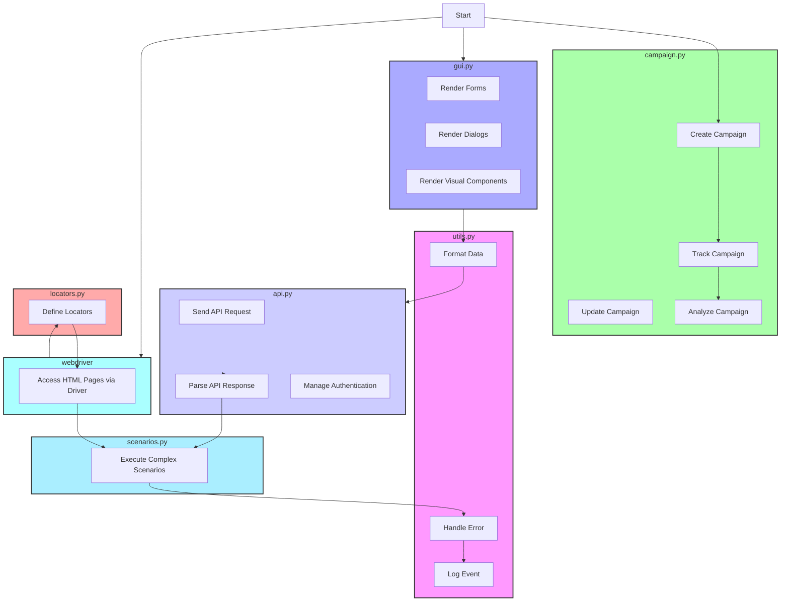

## Анализ модуля `aliexpress`

### 1. <алгоритм>
Модуль `aliexpress` предназначен для взаимодействия с платформой `aliexpress.com` и предоставляет два основных метода доступа к данным: через `webdriver` (непосредственный доступ к HTML-страницам) и через `API` (для получения аффилиатных ссылок и кратких описаний товаров). Внутри модуля выделены несколько подмодулей, каждый из которых имеет свою специфическую роль:

1.  **`utils`**: Этот подмодуль содержит вспомогательные функции и классы, которые используются в других частях модуля. Он выполняет такие задачи, как:
    - **Форматирование данных**: Например, преобразование строк, чисел или дат в нужный формат.
    - **Обработка ошибок**: Перехват исключений и их логирование, а также предоставление пользовательских сообщений об ошибках.
    - **Логирование**: Запись важных событий и действий для отладки и анализа.
    - **Пример**: Преобразование строки с ценой "12.34$" в число `12.34` для дальнейших расчетов.
2.  **`api`**: Этот подмодуль предназначен для взаимодействия с API AliExpress. Он выполняет следующие действия:
    - **Отправка запросов**: Формирование и отправка HTTP-запросов к API AliExpress.
    - **Обработка ответов**: Парсинг JSON или других форматов данных, полученных от API.
    - **Управление аутентификацией**: Реализация механизма аутентификации, если это требуется для API.
    - **Пример**: Отправка запроса на получение аффилиатной ссылки для товара с определенным ID и обработка полученного ответа.
3.  **`campaign`**: Этот подмодуль предназначен для управления маркетинговыми кампаниями на AliExpress. Он включает:
    - **Создание кампаний**: Настройка параметров новых кампаний, таких как бюджет, целевая аудитория и ключевые слова.
    - **Обновление кампаний**: Изменение параметров существующих кампаний.
    - **Отслеживание кампаний**: Мониторинг эффективности кампаний, просмотр статистики.
    - **Анализ кампаний**: Оценка данных о производительности кампаний и оптимизация на основе этих данных.
    - **Пример**: Создание новой кампании для продвижения определенной категории товаров и отслеживание ее эффективности в течение недели.
4.  **`gui`**: Этот подмодуль предоставляет графический интерфейс для взаимодействия с функциональностью AliExpress. Он содержит:
    - **Формы**: Создание форм для ввода данных пользователем.
    - **Диалоги**: Отображение сообщений и запросов пользователю.
    - **Визуальные компоненты**: Создание кнопок, полей ввода и других элементов интерфейса.
    - **Пример**: Реализация формы для ввода параметров товара для поиска аффилиатной ссылки.
5.  **`locators`**: Этот подмодуль содержит определения локаторов элементов на веб-страницах AliExpress. Он используется для:
    - **Идентификации элементов**: Определение уникальных путей (например, CSS-селекторов или XPath) для доступа к элементам на странице.
    - **Автоматического взаимодействия**: Использование WebDriver для нахождения элементов и выполнения действий (например, кликов, ввода текста).
    - **Пример**: Определение CSS-селектора для кнопки "Купить" на странице товара для автоматического нажатия на нее.
6.  **`scenarios`**: Этот подмодуль определяет сложные последовательности действий. Он включает в себя:
    - **Сценарии взаимодействия**: Комбинации API-запросов, действий через GUI, и других операций.
    - **Управление операциями**: Синхронизация товаров, управление заказами, запуск и отслеживание кампаний.
    - **Пример**: Сценарий по автоматическому поиску товара, сбору информации о нем, и генерации аффилиатной ссылки.
    
**Поток данных:**

1.  Пользовательский ввод может происходить через `gui` подмодуль.
2.  Данные обрабатываются и форматируются с помощью `utils` подмодуля.
3.  `api` подмодуль отправляет запросы к AliExpress API и получает ответы.
4.  `webdriver` через `locators` взаимодействует с веб-страницами AliExpress, если это необходимо.
5.  `campaign` подмодуль обрабатывает данные кампаний.
6.  `scenarios` подмодуль объединяет различные операции в сложные сценарии.

### 2. <mermaid>

### 3. <объяснение>

**Импорты:**

В данном коде не используются явные импорты, поскольку это описание структуры модуля, а не конкретный программный код. Однако, подразумевается, что каждый из подмодулей (`utils`, `api`, `campaign`, `gui`, `locators`, `scenarios`) может иметь свои импорты из других частей проекта (`src`) или сторонних библиотек.

**Подмодули (как классы):**

Каждый из перечисленных подмодулей в структуре `aliexpress` можно рассматривать как класс или набор классов.

*   **`utils`**:
    *   **Роль**: Предоставляет вспомогательные функции для всего модуля `aliexpress`.
    *   **Атрибуты**: Не описаны, но могут включать настройки логирования или форматирования.
    *   **Методы**: Например, `format_data(data, format_type)`, `handle_error(exception)`, `log_event(message)`.
    *   **Взаимодействие**: Используется во всех остальных подмодулях для выполнения общих задач.
*   **`api`**:
    *   **Роль**: Обеспечивает взаимодействие с AliExpress API.
    *   **Атрибуты**: Могут включать параметры для аутентификации, URL API.
    *   **Методы**: Например, `send_request(url, params, method)`, `parse_response(response)`, `authenticate(credentials)`.
    *   **Взаимодействие**: Используется для получения данных и управления аккаунтом.
*   **`campaign`**:
    *   **Роль**: Управляет маркетинговыми кампаниями.
    *   **Атрибуты**: Могут включать данные о кампаниях.
    *   **Методы**: Например, `create_campaign(campaign_data)`, `update_campaign(campaign_id, campaign_data)`, `track_campaign(campaign_id)`, `analyze_campaign(campaign_id)`.
    *   **Взаимодействие**: Может взаимодействовать с `api` для отправки данных и с `gui` для отображения информации.
*   **`gui`**:
    *   **Роль**: Предоставляет графический интерфейс для пользователей.
    *   **Атрибуты**: Не описаны, но могут включать объекты для форм, диалогов.
    *   **Методы**: Например, `render_form(form_data)`, `show_dialog(message, type)`, `add_component(type, data)`.
    *   **Взаимодействие**: Используется для взаимодействия с пользователем, может использовать другие подмодули для выполнения задач.
*   **`locators`**:
    *   **Роль**: Определяет локаторы элементов для веб-страниц AliExpress.
    *   **Атрибуты**: Содержит определения CSS-селекторов, XPath.
    *   **Методы**: Может иметь методы для получения локаторов, например `get_locator(element_name)`.
    *   **Взаимодействие**: Используется подмодулем `webdriver` для доступа к элементам на странице.
*   **`scenarios`**:
    *   **Роль**: Определяет последовательности действий.
    *   **Атрибуты**: Может содержать наборы сценариев (например, список функций или объектов).
    *   **Методы**: Например, `execute_scenario(scenario_name)`.
    *   **Взаимодействие**: Использует другие подмодули для выполнения комплексных операций.

**Функции (примеры):**

*   `utils.format_data(data, format_type)`: Принимает данные и тип формата, возвращает отформатированные данные. Например, `format_data("12.34$", "float")` вернет `12.34`.
*   `api.send_request(url, params, method)`: Отправляет запрос к API и возвращает ответ.
*   `campaign.create_campaign(campaign_data)`: Создает новую кампанию и возвращает ее ID.
*   `gui.render_form(form_data)`: Отображает форму для ввода данных.
*    `locators.get_locator(element_name)`: Возвращает локатор для указанного элемента.
*   `scenarios.execute_scenario(scenario_name)`: Запускает выполнение сценария.

**Переменные:**
Переменные, используемые в этих модулях, будут иметь различные типы, в зависимости от их назначения:
*   Строки (например, URL, токены, запросы)
*   Числа (например, ID товаров, стоимость)
*   Списки (например, список товаров, список результатов)
*   Словари (например, параметры API, данные форм)

**Потенциальные ошибки и области для улучшения:**

*   **Обработка ошибок API:** Недостаточная обработка ошибок при взаимодействии с API может привести к сбоям.
*   **Аутентификация:** Недостаточно защищенное управление ключами API.
*   **WebDriver**: Зависимость от структуры веб-страниц AliExpress, которые могут меняться.
*   **Логирование**: Недостаточное логирование может затруднить отладку.
*   **GUI**: Отсутствие проверки корректности ввода данных пользователем.

**Взаимосвязи с другими частями проекта:**

*   Модуль `aliexpress` вероятно является частью большего проекта, включающего другие модули для работы с различными поставщиками.
*   `utils` может быть общим для других модулей поставщиков.
*   `api` может использовать общие библиотеки для HTTP-запросов.
*   `gui` может использовать общие компоненты для пользовательского интерфейса.

Этот анализ обеспечивает всестороннее понимание структуры и функциональности модуля `aliexpress`, а также его места в более широкой архитектуре проекта.