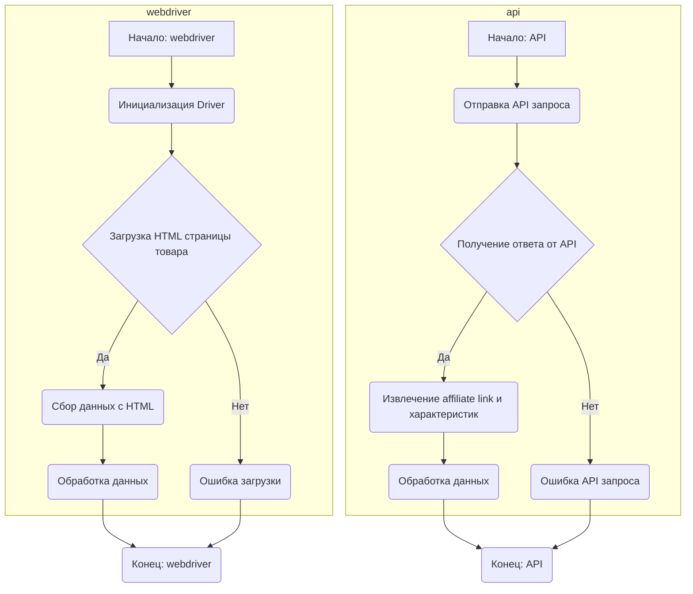

## Анализ модуля `aliexpress`

### 1. <алгоритм>

**Описание:**

Модуль `aliexpress` предназначен для взаимодействия с поставщиком `aliexpress.com`. Он предоставляет два основных способа доступа к данным: через `webdriver` и через `API`.

*   **webdriver**: Используется для прямого доступа к HTML-страницам товара, позволяя эмулировать действия пользователя и собирать данные, включая переход по категориям.
*   **api**: Применяется для получения партнерских ссылок (`affiliate link`) и кратких характеристик товара.

**Пошаговая блок-схема:**

**Примеры:**

*   **webdriver:**
    1.  Инициализируется драйвер браузера (`B`).
    2.  Загружается страница конкретного товара по URL (`C`).
    3.  Данные, такие как цена, описание и название товара, извлекаются из HTML-кода (`D`).
    4.  Извлеченные данные обрабатываются и подготавливаются для использования (`F`).
*   **api:**
    1.  Формируется и отправляется API-запрос для получения данных о товаре (`H`).
    2.  Получается ответ от API (`I`).
    3.  Извлекается партнерская ссылка и краткие характеристики товара (`J`).
    4.  Полученные данные обрабатываются для дальнейшего использования (`L`).

```mermaid
flowchart TD
    subgraph aliexpress_module [aliexpress.py]
    A[Начало] --> B(Инициализация модуля)
    B --> C{Выбор метода: webdriver или api}
    C -- webdriver --> D[webdriver_module]
    C -- api --> E[api_module]
    D --> F(Сбор данных webdriver)
    E --> G(Сбор данных API)
    F --> H(Обработка данных)
    G --> H
    H --> I(Конец)
    end
    
    subgraph webdriver_module [webdriver]
    A1[webdriver Start] --> B1(Инициализация Driver)
        B1 --> C1{Загрузка HTML страницы товара}
        C1 -- Да --> D1(Сбор данных с HTML)
        C1 -- Нет --> E1(Ошибка загрузки)
        D1 --> F1(Обработка данных)
         F1 --> G1( webdriver End)
        E1 --> G1
    end
        
     subgraph api_module [api]
         A2[api Start] --> B2(Отправка API запроса)
        B2 --> C2{Получение ответа от API}
        C2 -- Да --> D2(Извлечение affiliate link и характеристик)
        C2 -- Нет --> E2(Ошибка API запроса)
        D2 --> F2(Обработка данных)
        F2 --> G2(api End)
        E2 --> G2
     end
      
      style webdriver_module fill:#f9f,stroke:#333,stroke-width:2px
      style api_module fill:#ccf,stroke:#333,stroke-width:2px
      style aliexpress_module fill:#fff,stroke:#333,stroke-width:2px

```

### 2. <mermaid>

**Описание зависимостей:**

*   `aliexpress_module`: Главный модуль, который координирует взаимодействие с `webdriver` и `api`.
*   `webdriver_module`: Модуль, использующий `webdriver` для взаимодействия с веб-страницами.
*   `api_module`: Модуль, использующий API для получения данных.

**Внутренние модули:**

*   `utils`: Вспомогательные функции и классы для общих операций (не отображены на диаграмме, но подразумеваются).
*   `campaign`: Управление маркетинговыми кампаниями (не отображены на диаграмме, но подразумеваются).
*   `gui`: Графический интерфейс (не отображены на диаграмме, но подразумеваются).
*   `locators`: Локаторы для элементов на веб-страницах (используются в `webdriver_module`).
*   `scenarios`: Сценарии взаимодействия (могут включать комбинации действий из всех модулей, не отображены на диаграмме, но подразумеваются).

### 3. <объяснение>

**Импорты:**

*   На данный момент, в предоставленном коде нет явных импортов. Однако, из описания ясно, что будут использоваться модули внутри пакета `src.`:
    *   `src.utils`: Содержит общие утилиты и функции.
    *   `src.api`: Предоставляет интерфейс для взаимодействия с API AliExpress.
    *   `src.campaign`: Управляет маркетинговыми кампаниями.
    *   `src.gui`: Отвечает за пользовательский интерфейс.
    *   `src.locators`: Предоставляет локаторы для элементов веб-страниц.
    *   `src.scenarios`: Определяет последовательности действий.

**Классы:**

*   В предоставленном описании нет явного определения классов, но предполагается их наличие в модулях:
    *   `Driver` (внутри `webdriver`): Класс для управления браузером и навигацией по страницам.
    *   Классы для работы с API (внутри `api`): Классы для отправки запросов и обработки ответов.
    *   Классы для управления кампаниями (внутри `campaign`): Классы для создания, обновления и отслеживания кампаний.
    *   Классы для графического интерфейса (внутри `gui`): Классы для создания визуальных компонентов.

**Функции:**

*   В тексте нет конкретных функций, но подразумеваются такие функции:
    *   Функции для загрузки страниц, извлечения данных из HTML (в `webdriver`).
    *   Функции для формирования и отправки API-запросов (в `api`).
    *   Функции для обработки результатов, форматирования данных.
    *   Функции для управления кампаниями.
    *   Функции для отображения элементов GUI.
    *   Функции для выполнения сценариев.

**Переменные:**

*   Переменные могут включать в себя:
    *   URL-адреса страниц и API-запросов.
    *   Данные, извлеченные из HTML или API-ответов.
    *   Конфигурационные данные для браузера и API.
    *   Результаты обработки данных.

**Потенциальные ошибки и улучшения:**

*   **Обработка ошибок**: Необходимо предусмотреть обработку ошибок при загрузке страниц, отправке API-запросов и обработке данных.
*   **Логирование**: Добавить логирование для отслеживания выполнения операций и диагностики проблем.
*   **Конфигурация**: Хранить настройки в отдельных файлах или переменных окружения для гибкости.
*   **Асинхронность**: Использовать асинхронное программирование для повышения производительности при работе с API и webdriver.
*   **Безопасность**: Защитить API-ключи и другие конфиденциальные данные.

**Взаимосвязь с другими частями проекта:**

*   Модуль `aliexpress` зависит от пакета `src.`, в котором находятся общие модули и утилиты.
*   `webdriver` может зависеть от установленных браузеров и драйверов для них.
*   `api` зависит от правильной аутентификации и API-ключей.
*   Результаты работы модуля могут использоваться в других частях проекта для управления данными, отчетности и автоматизации процессов.

В заключении, модуль `aliexpress` представляет собой комплексное решение для взаимодействия с платформой AliExpress, предоставляя гибкие инструменты для сбора данных и управления операциями как через веб-интерфейс, так и через API.