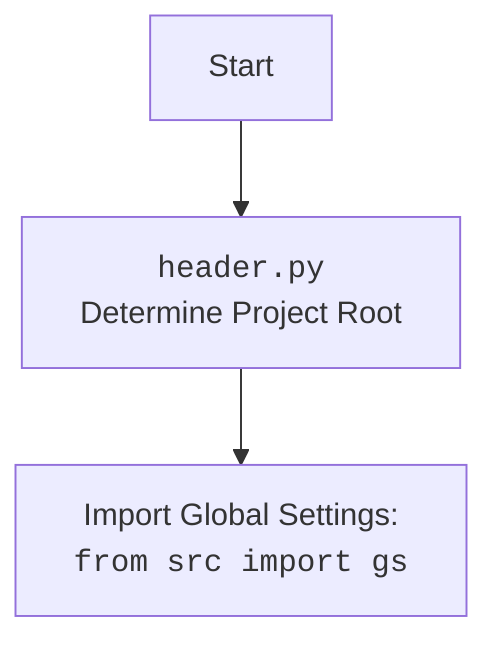

## Анализ кода `hypotez/src/suppliers/cdata/graber.py`

### 1. <алгоритм>

1.  **Инициализация**:
    *   Класс `Graber` инициализируется с помощью драйвера веб-браузера (`Driver`) и индекса языка (`lang_index`).
    *   Устанавливает префикс поставщика (`supplier_prefix`) как `'cdata'`.
    *   Вызывает конструктор родительского класса (`Graber` из `src.suppliers.graber`) с указанием префикса поставщика, драйвера и индекса языка.
    *   Инициализирует `Context.locator_for_decorator` в `None`.

2.  **Декоратор (закомментирован)**:
    *   Определяется декоратор `close_pop_up`, предназначенный для закрытия всплывающих окон перед выполнением основной логики функции.
    *   Декоратор принимает значение `value` (Any) в качестве аргумента.
    *   Внутри декоратора определяется функция `wrapper`, которая оборачивает декорируемую функцию `func`.
    *   `wrapper` пытается выполнить локатор `Context.locator.close_pop_up` для закрытия всплывающего окна.
    *   Обрабатывает исключение `ExecuteLocatorException`, если выполнение локатора не удалось, и записывает отладочное сообщение в лог.
    *   Вызывает основную функцию `func` и возвращает результат её выполнения.
    *   Декоратор возвращает функцию `wrapper`.

3.  **Класс Graber**:
    *   Наследуется от класса `Graber` (`Grbr`) из модуля `src.suppliers.graber`.
    *   Имеет атрибут класса `supplier_prefix` со значением `'cdata'`.
    *   В конструкторе инициализирует `supplier_prefix`, вызывает конструктор родительского класса и устанавливает `Context.locator_for_decorator` в `None`.

### 2. <mermaid>

```mermaid
flowchart TD
    Start[Start] --> Init[__init__]
    Init --> SetPrefix[self.supplier_prefix = 'cdata']
    Init --> SuperInit[super().__init__(...)]
    Init --> SetLocator[Context.locator_for_decorator = None]
    
    classDef default fill:#f9f,stroke:#333,stroke-width:2px
    class Start,Init,SetPrefix,SuperInit,SetLocator default
```

**Объяснение диаграммы:**

*   **Start**: Начало выполнения кода.
*   **Init**: Вызов метода `__init__` класса `Graber`.
*   **SetPrefix**: Установка атрибута `self.supplier_prefix` в значение `'cdata'`.
*   **SuperInit**: Вызов метода `__init__` родительского класса `Graber` (из `src.suppliers.graber`).
*   **SetLocator**: Установка атрибута `Context.locator_for_decorator` в значение `None`.



**Объяснение диаграммы:**

*   **Start**: Начало импорта модуля `header`.
*   **ImportHeader**: Импорт модуля `header.py`, который определяет корень проекта.
*   **ImportGlobalSettings**: Импорт глобальных настроек из модуля `src.gs`.

### 3. <объяснение>

**Импорты**:

*   `typing`: Импортируется `Any` для аннотации типов, представляющих любой тип данных.
*   `header`: Импортируется для определения местоположения корневого каталога проекта.
*   `src.suppliers.graber.Graber as Grbr, Context, close_pop_up`:
    *   `Graber as Grbr`: Импортируется родительский класс `Graber` из модуля `src.suppliers.graber` и переименовывается в `Grbr` для краткости.
    *   `Context`: Импортируется класс `Context` из того же модуля, который, вероятно, используется для хранения контекстной информации, такой как драйвер веб-браузера и локаторы.
    *   `close_pop_up`: Импортируется функция `close_pop_up` из того же модуля.
*   `src.webdriver.driver.Driver`: Импортируется класс `Driver` из модуля `src.webdriver.driver`, который, вероятно, представляет собой обертку над драйвером веб-браузера (например, Selenium WebDriver).
*   `src.logger.logger.logger`: Импортируется объект `logger` из модуля `src.logger.logger` для логирования.

**Классы**:

*   `Graber(Grbr)`:
    *   Класс `Graber` наследуется от класса `Graber` (`Grbr`) из модуля `src.suppliers.graber`.
    *   Предназначен для сбора данных о товарах с сайта `cdata.co.il`.
    *   Атрибуты:
        *   `supplier_prefix (str)`: Префикс поставщика, установлен в `'cdata'`.
    *   Методы:
        *   `__init__(self, driver: Driver, lang_index: int)`:
            *   Конструктор класса.
            *   Принимает объект `Driver` и индекс языка (`lang_index`) в качестве аргументов.
            *   Инициализирует атрибут `supplier_prefix`.
            *   Вызывает конструктор родительского класса (`Grbr.__init__`).
            *   Устанавливает `Context.locator_for_decorator` в `None`.

**Функции**:

*   `close_pop_up(value: Any = None)`:
    *   Декоратор, предназначенный для закрытия всплывающих окон перед выполнением основной логики функции.
    *   Принимает необязательный аргумент `value` типа `Any`.
    *   Возвращает функцию `wrapper`, которая оборачивает декорируемую функцию.
    *   Внутри `wrapper` пытается выполнить локатор `Context.locator.close_pop_up` для закрытия всплывающего окна.
    *   Обрабатывает исключение `ExecuteLocatorException`, если выполнение локатора не удалось, и записывает отладочное сообщение в лог.

**Переменные**:

*   `supplier_prefix (str)`: Атрибут класса `Graber`, представляющий префикс поставщика.
*   `Context.locator_for_decorator`: Атрибут класса `Context`, который может быть использован для указания локатора, который должен быть выполнен декоратором `@close_pop_up`.

**Потенциальные ошибки и области для улучшения**:

*   Декоратор `close_pop_up` закомментирован, что означает, что он не используется в текущей реализации. Если он необходим, его следует раскомментировать и настроить.
*   Обработка исключения `ExecuteLocatorException` в декораторе просто записывает отладочное сообщение в лог. Возможно, следует добавить более информативное сообщение об ошибке или выполнить другие действия для обработки исключения.
*   Использование `Context.locator_for_decorator = None` может быть не самым элегантным решением. Возможно, стоит рассмотреть другие способы передачи информации о локаторе декоратору.

**Взаимосвязи с другими частями проекта**:

*   Класс `Graber` зависит от класса `Graber` из модуля `src.suppliers.graber`, который, вероятно, содержит общую логику для сбора данных о товарах с различных сайтов.
*   Класс `Graber` использует класс `Driver` из модуля `src.webdriver.driver` для взаимодействия с веб-браузером.
*   Класс `Graber` использует модуль `src.logger.logger` для логирования.
*   Класс `Graber` использует класс `Context`, вероятно, для хранения контекстной информации, такой как драйвер веб-браузера и локаторы.