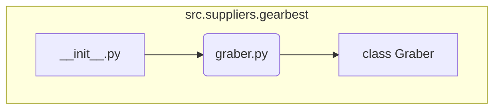

### **Анализ кода `hypotez/src/suppliers/gearbest/__init__.py`**

#### **1. <алгоритм>**:

1.  **Импорт `Graber`**: Импортирует класс `Graber` из модуля `.graber`. Этот класс, вероятно, содержит логику для сбора данных с веб-сайта Gearbest.
2.  **Инициализация модуля**: Файл `__init__.py` инициализирует пакет `src.suppliers.gearbest`, делая класс `Graber` доступным для импорта из других частей проекта.

#### **2. <mermaid>**:

**Объяснение `mermaid`**:

*   `__init__.py`: Инициализирует пакет `src.suppliers.gearbest` и делает доступным для импорта модуль `graber`.
*   `graber.py`: Содержит класс `Graber`, который, вероятно, содержит логику для сбора данных с веб-сайта Gearbest.
*   `class Graber`: Класс, отвечающий за парсинг и извлечение данных с Gearbest.

#### **3. <объяснение>**:

*   **Импорты**:
    *   `from .graber import Graber`: Импортирует класс `Graber` из модуля `graber.py`, находящегося в той же директории. Это позволяет использовать класс `Graber` в других частях проекта через пакет `src.suppliers.gearbest`.
*   **Классы**:
    *   `Graber`: Класс, который, вероятно, содержит методы для сбора и обработки данных с веб-сайта Gearbest. Подробная функциональность класса будет определена в файле `graber.py`.
*   **Функции**:
    *   В данном файле функции отсутствуют. Он используется для инициализации пакета и импорта класса `Graber`.
*   **Переменные**:
    *   В данном файле переменные отсутствуют.

**Потенциальные области для улучшения**:

*   Добавить документацию к модулю для более ясного понимания его назначения и функциональности.
*   В `graber.py` добавить документацию к классу `Graber` и его методам для описания процесса сбора данных.

**Взаимосвязи с другими частями проекта**:

*   Пакет `src.suppliers.gearbest` предоставляет функциональность для сбора данных с Gearbest. Этот пакет может использоваться другими частями проекта, такими как модули для анализа данных, сохранения данных в базу данных или предоставления API для доступа к данным.