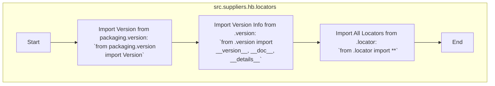

## Анализ кода `hypotez/src/suppliers/hb/locators/__init__.py`

### <алгоритм>

1. **Импорт модулей:**
   - Импортируется `Version` из `packaging.version` для работы с версиями.
   - Импортируются `__version__`, `__doc__` и `__details__` из модуля `version` в текущем пакете.
   - Импортируются все (* `**`) имена из модуля `locator` в текущем пакете.
   - **Пример**:
        - `from packaging.version import Version`: позволяет использовать `Version` для сравнения версий.
        - `from .version import __version__, __doc__, __details__`: импортирует строку версии, докстринг и дополнительные детали из файла `version.py`.
        - `from .locator import **`: импортирует все определения из файла `locator.py`, например, классы локаторов.

2. **Экспорт имен:**
   - Импортированные имена (версия, документация, детали и все из `locator`) становятся доступными для использования в других частях проекта через импорт данного пакета `src.suppliers.hb.locators`.

### <mermaid>

### <объяснение>

**Импорты:**

- `from packaging.version import Version`:
  - **Назначение:** Импортирует класс `Version` из библиотеки `packaging.version`, предназначенный для работы с версиями программного обеспечения.
  - **Взаимосвязь:** `packaging` - это внешняя библиотека, предназначенная для работы с версиями пакетов в Python. Данная библиотека широко используется для сравнения, проверки и обработки версий. В данном контексте, `Version` может быть использован для отслеживания версии локаторов или связанных компонентов.
- `from .version import __version__, __doc__, __details__`:
  - **Назначение:** Импортирует переменные `__version__` (строка с информацией о версии), `__doc__` (строка с документацией) и `__details__` (дополнительные детали) из модуля `version.py` (который находится в том же каталоге).
  - **Взаимосвязь:** Этот импорт позволяет модулю `__init__.py` иметь информацию о своей версии, документацию и прочие детали, что полезно для отслеживания, управления и документации этого пакета.
- `from .locator import **`:
  - **Назначение:** Импортирует все имена (классы, переменные, функции и т. д.) из модуля `locator.py` (который находится в том же каталоге).
  - **Взаимосвязь:** Это делает все локаторы, определенные в `locator.py`, доступными для использования через импорт пакета `src.suppliers.hb.locators`. Это типичный подход для объединения всех локаторов в одном месте для удобного использования.

**Классы:**

- В данном файле (`__init__.py`) классы не определены. Предполагается, что классы локаторов будут импортированы из `locator.py`.

**Функции:**

- В данном файле (`__init__.py`) функции не определены.
- Функция импортируемая из `locator.py`, будет являться локатором(определениями для нахождения элементов на веб-странице, либо другое).

**Переменные:**

- `__version__`, `__doc__`, `__details__`:
   - **Тип:** Строки.
   - **Использование:**  Содержат информацию о версии, документацию и детали пакета `src.suppliers.hb.locators`. Обычно устанавливаются в файле `version.py`.

**Потенциальные ошибки и области для улучшения:**

1.  **Объявление версии:** Версия объявляется в `version.py` и может быть пропущена при анализе, если не обращать внимание на импорт.
2.  **Недостаток документации:**  В начале файла присутствует много пустых строк с `"""\n...`  , это намек на документацию, но она отсутствует. Стоит добавить полноценную документацию к модулю.
3.  **`__init__.py`:** По сути, файл играет роль фасада, импортируя всё из `locator.py` и позволяя импортировать их из папки `src.suppliers.hb.locators` сразу. Это стандартная практика в Python, но стоит помнить об этом при использовании.
4. **Импорт `*`:** Использование `from .locator import **` может привести к загрязнению пространства имен, лучше перечислить необходимые элементы явно, если это возможно.

**Цепочка взаимосвязей с другими частями проекта:**

-  `src.suppliers.hb.locators` предоставляет локаторы для использования в других частях проекта, вероятно, в коде автоматизированного тестирования или парсинга данных.
-  Зависит от `packaging.version` для управления версиями (непосредственная связь с внешними библиотеками).
-  Зависит от `version.py` (внутри пакета), где хранятся данные о версии, документации и прочие детали.
-  Зависит от `locator.py` (внутри пакета), где определены сами локаторы.

**Дополнительно:**

- Структура проекта показывает, что локаторы для поставщиков (`suppliers`) организованы в подпакеты (`hb` в данном случае), что говорит о модульном подходе к управлению локаторами для различных поставщиков данных.