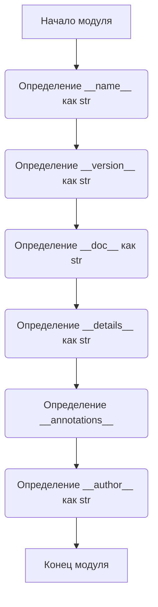

## ИНСТРУКЦИЯ:

Анализируй предоставленный код подробно и объясни его функциональность. Ответ должен включать три раздела:  

1. **<алгоритм>**: Опиши рабочий процесс в виде пошаговой блок-схемы, включая примеры для каждого логического блока, и проиллюстрируй поток данных между функциями, классами или методами.  
2. **<mermaid>**: Напиши код для диаграммы в формате `mermaid`, проанализируй и объясни все зависимости, 
    которые импортируются при создании диаграммы. 
    **ВАЖНО!** Убедитесь, что все имена переменных, используемые в диаграмме `mermaid`, 
    имеют осмысленные и описательные имена. Имена переменных вроде `A`, `B`, `C`, и т.д., не допускаются!  
    
    **Дополнительно**: Если в коде есть импорт `import header`, добавьте блок `mermaid` flowchart, объясняющий `header.py`:\
    ```mermaid
    flowchart TD
        Start --> Header[<code>header.py</code><br> Determine Project Root]
    
        Header --> import[Import Global Settings: <br><code>from src import gs</code>] 
    ```

3. **<объяснение>**: Предоставьте подробные объяснения:  
   - **Импорты**: Их назначение и взаимосвязь с другими пакетами `src.`.  
   - **Классы**: Их роль, атрибуты, методы и взаимодействие с другими компонентами проекта.  
   - **Функции**: Их аргументы, возвращаемые значения, назначение и примеры.  
   - **Переменные**: Их типы и использование.  
   - Выделите потенциальные ошибки или области для улучшения.  

Дополнительно, постройте цепочку взаимосвязей с другими частями проекта (если применимо).  

Это обеспечивает всесторонний и структурированный анализ кода.
## Формат ответа: `.md` (markdown)
**КОНЕЦ ИНСТРУКЦИИ**

## <алгоритм>
Данный код представляет собой модуль, содержащий информацию о версии и метаданные. Так как в нем нет алгоритмической логики, его блок-схема довольно проста:



**Примеры:**
*   `__name__`:  В случае запуска модуля как скрипта, значение `__name__` будет `__main__`. Если модуль импортируется, значение будет `src.suppliers.hb.locators.version`.
*   `__version__`: Строка "3.12.0.0.0.4" обозначает версию этого модуля.
*   `__doc__`: Строка документации, описывающая назначение модуля (в данном случае пустая).
*   `__details__`: Строка "Details about version for module or class" предоставляет дополнительные сведения.
*   `__annotations__`: Используется для указания типов, в данном случае без присвоения.
*   `__author__`: Строка 'hypotez' указывает автора модуля.

## <mermaid>

```mermaid
flowchart TD
    Start[Начало модуля] --> DefineModuleName[Define __name__:str]
    DefineModuleName --> DefineVersion[Define __version__:str = "3.12.0.0.0.4"]
    DefineVersion --> DefineDocString[Define __doc__:str]
    DefineDocString --> DefineDetails[Define __details__:str = "Details about version for module or class"]
    DefineDetails --> DefineAnnotations[Define __annotations__]
    DefineAnnotations --> DefineAuthor[Define __author__:str = "hypotez"]
    DefineAuthor --> End[Конец модуля]
```

**Объяснение зависимостей:**
*   В коде нет импортов, поэтому отсутствуют внешние зависимости.
*   Внутренние зависимости: используются стандартные типы данных Python (str).

## <объяснение>

**Импорты:**
*   В данном коде отсутствуют импорты, что говорит о том, что он не использует внешние библиотеки или модули. Это изолированный модуль, содержащий только метаданные о версии и авторе.

**Классы:**
*   В коде нет классов. Он состоит только из переменных, представляющих метаданные.

**Функции:**
*   В коде нет функций. Он служит для хранения информации, а не для выполнения вычислений.

**Переменные:**
*   `__name__`: Тип `str`. Содержит имя модуля. При запуске как скрипт будет `__main__`.
*   `__version__`: Тип `str`. Содержит строку версии модуля (в данном случае `"3.12.0.0.0.4"`).
*   `__doc__`: Тип `str`. Строка документации модуля. В текущем коде не содержит полезной информации.
*   `__details__`: Тип `str`. Дополнительная информация о версии или модуле (в данном случае `"Details about version for module or class"`).
*    `__annotations__`:  Предполагается для хранения информации о типах.  В данном случае, не инициализирована.
*   `__author__`: Тип `str`. Имя автора модуля (в данном случае `"hypotez"`).

**Потенциальные ошибки и области для улучшения:**
*   `__doc__` пустой. Следует добавить описание для модуля.
*   `__annotations__` не имеет значения.  Необходимо задать тип данных и указать их предназначение.
*   Используются магические строки в `__version__` и `__details__`. Было бы лучше использовать константы или `enums`.
*   Отсутствие тестов для проверки корректности этих данных.

**Цепочка взаимосвязей:**
*   Этот файл является частью пакета `src.suppliers.hb.locators` и может использоваться другими модулями этого пакета или других модулей проекта для получения информации о версии и авторе.
*   Вероятно, `__version__` используется для контроля версий и отслеживания изменений в системе.
*    `__annotations__` может использоваться для статического анализа типов, если указать типы переменных.
*   Метаданные, определенные в этом модуле, могут быть использованы, например, для логирования или при показе информации о приложении пользователю.