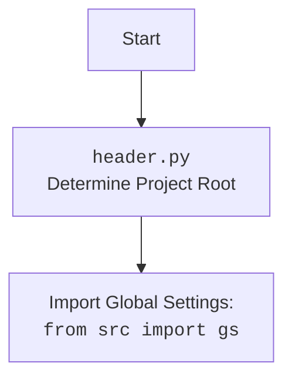

## Алгоритм

1.  **Инициализация**:
    *   Класс `Graber` инициализируется с префиксом поставщика `'visualdg'`, экземпляром `Driver` и индексом языка.
    *   Вызывается конструктор родительского класса `Graber` (из `src.suppliers.graber`) с указанными параметрами.
    *   Устанавливается `Context.locator_for_decorator = None`. Если установлено значение, оно будет выполнено в декораторе `@close_pop_up`.

2.  **Обработка полей товара**:
    *   Для каждого поля товара на странице `visualdg.co.il` вызывается функция обработки поля.
    *   Если требуется нестандартная обработка, функция перегружается в классе `Graber`.

3.  **Декоратор**:
    *   Перед отправкой запроса к веб-драйверу могут выполняться предварительные действия через декоратор.
    *   Декоратор по умолчанию находится в родительском классе.
    *   Чтобы декоратор сработал, необходимо передать значение в `Context.locator`.
    *   Пример декоратора `close_pop_up` предназначен для закрытия всплывающих окон перед выполнением основной логики функции.

```mermaid
graph TD
    A[Инициализация Graber] --> B{Установка supplier_prefix = 'visualdg'};
    B --> C[Вызов Graber.__init__];
    C --> D{Установка Context.locator_for_decorator = None};
    D --> E[Обработка полей товара];
    E --> F{Проверка необходимости нестандартной обработки};
    F -- Да --> G[Перегрузка функции];
    F -- Нет --> H[Вызов функции обработки из родительского класса];
    H --> I[Декоратор (опционально)];
    G --> I
    I --> J[Отправка запроса к веб-драйверу];
```

## mermaid

```mermaid
flowchart TD
    A[Graber Initialization] --> B{Set supplier_prefix to 'visualdg'};
    B --> C[Call Graber's parent __init__];
    C --> D{Set Context.locator_for_decorator = None};
    D --> E[Process product fields];
    E --> F{Check for custom processing};
    F -- Yes --> G[Override function];
    F -- No --> H[Call parent class processing];
    H --> I[Decorator (optional)];
    G --> I
    I --> J[Send request to web driver];
```

В этой диаграмме:

*   `A` представляет инициализацию класса `Graber`.
*   `B` указывает на установку префикса поставщика.
*   `C` показывает вызов конструктора родительского класса.
*   `D` указывает на установку `Context.locator_for_decorator` в `None`.
*   `E` представляет процесс обработки полей продукта.
*   `F` проверяет, требуется ли специальная обработка.
*   `G` указывает на переопределение функции, если требуется специальная обработка.
*   `H` указывает на вызов обработки родительского класса, если специальная обработка не требуется.
*   `I` представляет необязательный шаг декоратора.
*   `J` представляет отправку запроса веб-драйверу.



## Объяснение

#### Импорты:

*   `typing.Any`: Используется для указания типа переменной или параметра, который может быть любым типом данных.
*   `header`: Предположительно, это модуль, содержащий общие настройки или функции, используемые в проекте.
*   `src.suppliers.graber.Graber as Grbr, Context, close_pop_up`:
    *   `Graber as Grbr`: Импортирует базовый класс `Graber` из модуля `src.suppliers.graber` и переименовывает его в `Grbr` для краткости.
    *   `Context`: Класс, который, вероятно, используется для хранения контекстной информации, такой как текущий драйвер веб-браузера или другие параметры конфигурации.
    *   `close_pop_up`: Функция или декоратор, предназначенный для закрытия всплывающих окон.
*   `src.webdriver.driver.Driver`: Класс для управления веб-драйвером (например, Chrome, Firefox).
*   `src.logger.logger.logger`: Объект логгера для записи информации о работе программы.

#### Классы:

*   `Graber(Grbr)`:
    *   **Роль**: Класс `Graber` предназначен для сбора данных о товарах с веб-сайта `visualdg.co.il`.
    *   **Атрибуты**:
        *   `supplier_prefix (str)`: Префикс поставщика (в данном случае `'visualdg'`).
    *   **Методы**:
        *   `__init__(self, driver: Driver, lang_index)`: Конструктор класса. Инициализирует префикс поставщика, вызывает конструктор родительского класса и устанавливает `Context.locator_for_decorator` в `None`.

#### Функции:

*   `close_pop_up(value: Any = None)`:
    *   **Аргументы**:
        *   `value (Any, optional)`: Дополнительное значение для декоратора. По умолчанию `None`.
    *   **Возвращаемое значение**:
        *   `Callable`: Декоратор, который оборачивает функцию.
    *   **Назначение**: Создает декоратор для закрытия всплывающих окон перед выполнением основной логики функции.

#### Переменные:

*   `supplier_prefix (str)`: Префикс поставщика, используется для идентификации поставщика.
*   `Context.locator_for_decorator`: Используется для хранения локатора, который будет выполнен декоратором `@close_pop_up`.

#### Потенциальные ошибки и области для улучшения:

*   Обработка исключений в декораторе `close_pop_up` может быть улучшена для более надежного закрытия всплывающих окон.
*   Комментарии в коде можно дополнить для более ясного понимания назначения каждой функции и класса.
*   Использование `Context` для хранения глобальных настроек может привести к проблемам с состоянием, если не управлять им тщательно.

#### Взаимосвязи с другими частями проекта:

*   `Graber` наследуется от `src.suppliers.graber.Graber`, что указывает на общую структуру для всех граберов поставщиков.
*   Использует `src.webdriver.driver.Driver` для взаимодействия с веб-браузером, что позволяет выполнять навигацию и извлечение данных со страниц.
*   `src.logger.logger.logger` используется для логирования, что помогает в отладке и мониторинге работы грабера.

```mermaid
flowchart TD
    subgraph src.suppliers.visualdg
        Graber[Graber]
    end

    subgraph src.suppliers
        GraberBase[graber.Graber]
    end

    subgraph src.webdriver
        Driver[driver.Driver]
    end

    subgraph src.logger
        Logger[logger.logger]
    end

    Graber --> GraberBase
    Graber --> Driver
    Graber --> Logger