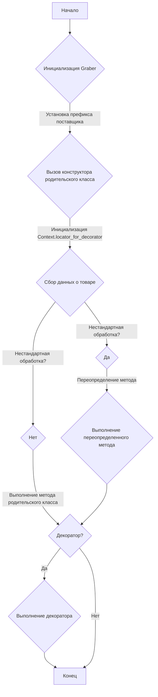
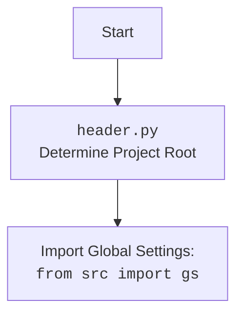

### **Анализ кода `hypotez/src/suppliers/wallmart/graber.py`**

#### **1. <алгоритм>**:

1.  **Инициализация**:
    *   Класс `Graber` инициализируется с использованием драйвера веб-браузера и индекса языка.
    *   Устанавливается префикс поставщика как `'wallmart'`.
    *   Вызывается конструктор родительского класса `Graber` (из `src.suppliers.graber`).
    *   Инициализируется `Context.locator_for_decorator` значением `None`.

2.  **Сбор данных**:
    *   Используются методы родительского класса `Graber` для сбора значений полей товара.
    *   Если требуется нестандартная обработка поля, метод переопределяется в классе `Graber`.

3.  **Декоратор (опционально)**:
    *   Перед отправкой запроса к веб-драйверу может быть выполнен декоратор.
    *   Декоратор по умолчанию находится в родительском классе.
    *   Для срабатывания декоратора необходимо передать значение в `Context.locator`.
    *   Возможно переопределение декоратора.

Пример блок-схемы:



#### **2. <mermaid>**:

```mermaid
flowchart TD
    A[Start] --> B(Graber Initialization);
    B --> C{super().__init__};
    C --> D{Context.locator_for_decorator = None};
    D --> E{Data Collection};
    E --> F{Custom Processing?};
    F -- Yes --> G[Overridden Method];
    F -- No --> H[Parent Method];
    G --> I[End];
    H --> I;
```



**Объяснение зависимостей (mermaid):**

*   `header`: Модуль `header` используется для определения корневой директории проекта. Это позволяет правильно разрешать пути к другим модулям и ресурсам.  Импортирует глобальные настройки из `src import gs`.
*   `src.suppliers.graber`:  `Graber as Grbr` - это базовый класс, который предоставляет общую логику для сбора данных о товарах. Класс `Graber` наследуется от этого базового класса и переопределяет некоторые методы для специфической обработки данных для `wallmart`.
*   `src.webdriver.driver`:  `Driver` - это класс, который предоставляет интерфейс для управления веб-браузером. Он используется для загрузки страниц, поиска элементов и взаимодействия с ними.
*   `src.logger.logger`:  `logger` - это модуль, который предоставляет функциональность для логирования событий. Он используется для записи информации об ошибках, предупреждениях и других важных событиях.

#### **3. <объяснение>**:

**Импорты**:

*   `typing.Any`: Используется для обозначения типа переменной, которая может принимать любое значение.
*   `header`:  Предположительно, содержит общие настройки и функции, используемые в проекте.
*   `src.suppliers.graber.Graber as Grbr`: Импортирует базовый класс `Graber` из модуля `src.suppliers.graber` и переименовывает его в `Grbr`. Этот класс содержит общую логику для сбора данных о товарах с различных сайтов.
*   `src.suppliers.graber.Context`: Импортирует класс `Context` из модуля `src.suppliers.graber`. Этот класс используется для хранения контекста выполнения, такого как текущий драйвер веб-браузера и локаторы для поиска элементов на странице.
*   `src.suppliers.graber.close_pop_up`: Импортирует функцию `close_pop_up` из модуля `src.suppliers.graber`. Эта функция используется для закрытия всплывающих окон на странице.
*   `src.webdriver.driver.Driver`: Импортирует класс `Driver` из модуля `src.webdriver.driver`. Этот класс используется для управления веб-браузером.
*   `src.logger.logger.logger`: Импортирует объект `logger` из модуля `src.logger.logger`. Этот объект используется для логирования событий.

**Классы**:

*   `Graber`:
    *   Роль: Класс для сбора данных о товарах с сайта `wallmart.com`.
    *   Атрибуты:
        *   `supplier_prefix` (str): Префикс поставщика, установлен в `'wallmart'`.
    *   Методы:
        *   `__init__(self, driver: Driver, lang_index: int)`: Конструктор класса. Инициализирует префикс поставщика, вызывает конструктор родительского класса и устанавливает `Context.locator_for_decorator` в `None`.

**Функции**:

*   `close_pop_up(value: Any = None)`:
    *   Аргументы:
        *   `value` (Any, optional): Дополнительное значение для декоратора. По умолчанию `None`.
    *   Возвращаемое значение:
        *   `Callable`: Декоратор, оборачивающий функцию.
    *   Назначение: Создает декоратор для закрытия всплывающих окон перед выполнением основной логики функции.
    *   Пример использования:

```python
@close_pop_up()
async def some_function():
    # some code
    pass
```

**Переменные**:

*   `supplier_prefix` (str): Префикс поставщика, используется для идентификации поставщика.
*   `Context.locator_for_decorator` (Any): Используется для хранения локатора, который будет выполнен декоратором `@close_pop_up`.

**Потенциальные ошибки и области для улучшения**:

*   Необходимо убедиться, что все методы родительского класса `Graber` правильно обрабатывают данные для сайта `wallmart.com`.
*   Следует добавить обработку исключений для случаев, когда не удается найти элементы на странице.
*   Можно добавить возможность настройки декоратора `@close_pop_up` через параметры конфигурации.

**Взаимосвязи с другими частями проекта**:

*   Класс `Graber` использует классы `Driver` и `Context` из других модулей проекта.
*   Модуль `header` используется для определения корневой директории проекта.
*   Логирование осуществляется через модуль `src.logger.logger`.