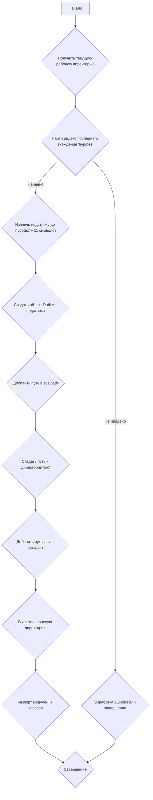

## АНАЛИЗ КОДА: `hypotez/src/templates/_examples/header.py`

### 1. <алгоритм>

**Блок-схема:**



**Примеры для каждого блока:**

1.  **A (Начало)**:  Начало выполнения скрипта.
2.  **B (Получить текущую рабочую директорию)**: `os.getcwd()` может вернуть, например, `'/home/user/projects/hypotez/src/templates/_examples'`.
3.  **C (Найти индекс последнего вхождения 'hypotez')**: `os.getcwd().rfind('hypotez')` в примере вернет `20`.
4.  **D (Извлечь подстроку до 'hypotez' + 11 символов)**: `os.getcwd()[:20+11]` вернет `'/home/user/projects/hypotez'`.
5.  **E (Обработка ошибки или завершение)**: Если 'hypotez' не найдено, этот блок может выдать ошибку или завершить работу.
6.  **F (Создать объект Path из подстроки)**: `Path('/home/user/projects/hypotez')` создаст объект Path.
7.  **G (Добавить путь в sys.path)**: `sys.path.append('/home/user/projects/hypotez')` добавит путь в список поиска модулей.
8.  **H (Создать путь к директории 'src')**: `Path('/home/user/projects/hypotez', 'src')` создаст путь `/home/user/projects/hypotez/src`.
9.  **I (Добавить путь 'src' в sys.path)**: `sys.path.append('/home/user/projects/hypotez')` -  тут происходит ошибка, так как повторно добавляется корень проекта.
10. **J (Вывести корневую директорию)**: `print('/home/user/projects/hypotez')` выведет путь к корневой директории проекта.
11. **K (Импорт модулей и классов)**: Импортируются модули `pathlib`, `json`, `re`, и классы из пакетов `src`.
12. **L (Завершение)**: Завершение скрипта.

### 2. <mermaid>

```mermaid
flowchart TD
    Start --> GetCurrentDir[Получить текущую рабочую директорию <br> <code>os.getcwd()</code>];
    GetCurrentDir --> FindHypotezIndex[Найти индекс 'hypotez' <br> <code>os.getcwd().rfind('hypotez')</code>];
    FindHypotezIndex -- Найдено --> ExtractRootPath[Извлечь путь до 'hypotez' + 11 <br> <code>os.getcwd()[:index + 11]</code>];
    FindHypotezIndex -- Не найдено --> ErrorHandler[Обработка ошибки / Завершение];
    ExtractRootPath --> CreatePathObject[Создать объект Path <br> <code>Path(...)</code>];
     CreatePathObject --> AddRootToSysPath[Добавить корень в <code>sys.path</code>];
     AddRootToSysPath --> CreateSrcPath[Создать путь к <code>src</code> <br> <code>Path(root, 'src')</code>];
    CreateSrcPath --> AddSrcToSysPath[Добавить <code>src</code> в <code>sys.path</code>];
    AddSrcToSysPath --> PrintRootPath[Вывести путь к корню проекта <br> <code>print(dir_root)</code>];

     PrintRootPath --> ImportModules[Импорт модулей: <br><code>pathlib</code>, <code>json</code>, <code>re</code>,<br> <code>src.gs</code>, <code>src.suppliers.Supplier</code>,<br><code>src.product.Product</code>, <code>src.product.ProductFields</code>,<br><code>src.product.ProductFieldsLocators</code>,<code>src.category.Category</code>,<br><code>src.utils.jjson</code>,<code>src.logger.logger</code> ]
     ImportModules --> End[Завершение];
     ErrorHandler --> End;
```

**Анализ зависимостей `mermaid`:**

1.  `os.getcwd()`: Получает текущую рабочую директорию в виде строки.
2.  `os.getcwd().rfind('hypotez')`: Ищет индекс последнего вхождения строки `'hypotez'` в текущей рабочей директории.
3.  `os.getcwd()[:index + 11]`: Извлекает подстроку из текущей рабочей директории до индекса `'hypotez'` + 11 символов.
4.  `Path(...)`: Создает объект `Path` из строки, представляющей путь к директории.
5.  `sys.path.append(...)`: Добавляет путь к списку путей, где Python ищет модули.
6.  `print(dir_root)`: Выводит путь к корневой директории проекта.
7.  Импорты:
    *   `pathlib`: Работа с путями в файловой системе.
    *   `json`: Работа с JSON-данными.
    *   `re`: Работа с регулярными выражениями.
    *   `src.gs`:  Глобальные настройки проекта.
    *   `src.suppliers.Supplier`: Класс, представляющий поставщика.
    *    `src.product.Product`: Класс для работы с продуктами.
    *    `src.product.ProductFields`:  Класс, определяющий поля продукта.
    *   `src.product.ProductFieldsLocators`: Класс для локаторов полей продукта.
    *   `src.category.Category`: Класс, представляющий категорию продукта.
    *   `src.utils.jjson`: Модуль с функциями для работы с JSON.
    *   `src.logger.logger`: Модуль для логирования.

### 3. <объяснение>

**Импорты:**

*   `import sys`: Предоставляет доступ к системным переменным и функциям. Используется для изменения `sys.path`, чтобы Python мог находить модули из других директорий проекта.
*   `import os`: Предоставляет функции для взаимодействия с операционной системой, такие как получение текущей рабочей директории (`os.getcwd()`).
*   `from pathlib import Path`: Предоставляет класс `Path` для работы с путями в файловой системе в объектно-ориентированном стиле.
*   `import json`: Используется для работы с JSON-данными (сериализация и десериализация).
*  `import re`: Используется для работы с регулярными выражениями.
*   `from src import gs`: Импортирует модуль `gs` (глобальные настройки) из пакета `src`, позволяя использовать общие настройки проекта.
*   `from src.suppliers import Supplier`: Импортирует класс `Supplier` из модуля `src.suppliers`, предполагая работу с данными поставщиков.
*   `from src.product import Product, ProductFields, ProductFieldsLocators`: Импортирует классы `Product`, `ProductFields` и `ProductFieldsLocators` из модуля `src.product`, используемые для представления и работы с данными о продуктах.
*   `from src.category import Category`: Импортирует класс `Category` из модуля `src.category`, предназначенный для работы с категориями продуктов.
*   `from src.utils.jjson import j_dumps, j_loads, pprint, save_text_file`: Импортирует функции `j_dumps`, `j_loads`, `pprint` и `save_text_file` для работы с JSON данными и форматированием, а так же сохранения текстовых файлов.
*   `from src.logger.logger import logger, StringNormalizer, ProductFieldsValidator`: Импортирует объект `logger` для ведения логов, класс `StringNormalizer` для нормализации строк и `ProductFieldsValidator` для валидации полей продукта.

**Классы:**
* `Supplier` - Представляет поставщика в проекте.
* `Product` -  Представляет продукт со всеми его характеристиками.
* `ProductFields` - Определяет структуру и поля продукта.
* `ProductFieldsLocators` - Содержит локаторы для полей продукта (например, для парсинга веб-страниц).
* `Category` - Представляет категорию продукта.
* `StringNormalizer` - Предназначен для нормализации строк.
* `ProductFieldsValidator` -  Класс для проверки корректности полей продукта.

**Функции:**

*   `os.getcwd()`:  Возвращает текущую рабочую директорию в виде строки.
*   `os.getcwd().rfind('hypotez')`: Находит индекс последнего вхождения строки `'hypotez'` в текущей рабочей директории.
*  `sys.path.append(path)`: Добавляет путь `path` к списку директорий поиска модулей Python.
* `str(dir_root)`: Преобразует объект `Path` в строку.
*  `Path(os.getcwd()[:os.getcwd().rfind('hypotez')+11])`: Создает объект `Path` из полученного пути.
* `print(dir_root)`: Выводит путь к корневой директории проекта в консоль.
*   `j_dumps`, `j_loads`, `pprint`, `save_text_file`: Функции для работы с JSON данными, форматированием и сохранения текстовых файлов.
*   `logger`: Объект для ведения логов.

**Переменные:**

*   `dir_root`: Объект `Path`, представляющий корневую директорию проекта.
*   `dir_src`: Объект `Path`, представляющий директорию `src` в проекте.

**Потенциальные ошибки и области для улучшения:**

*   **Повторное добавление корневой директории в `sys.path`:**  Путь к корню проекта добавляется в `sys.path` дважды, что не имеет смысла.  Второй раз  `sys.path.append (str (dir_root) )` нужно удалить.  Это может вызвать путаницу и замедлить поиск модулей.
*   **Обработка ошибки `rfind`**:  Не предусмотрена обработка случая, когда подстрока `'hypotez'` не найдена в текущей рабочей директории.  Необходимо добавить проверку на `!= -1` и обработать исключение.
*   **Жестко заданная строка `'hypotez'`**: Код полагается на жестко заданную строку `'hypotez'` для определения корневой директории. Это может стать проблемой, если имя директории изменится.  Стоит использовать переменные окружения или конфигурационные файлы для задания корневой директории.
*   **Импорт нескольких классов из модуля**:  При импорте классов `Product`, `ProductFields`, `ProductFieldsLocators` из одного модуля стоит использовать импорт по типу `from src.product import Product, ProductFields, ProductFieldsLocators`, а не импортировать каждый класс по отдельности.
* **Неиспользуемые импорты**:  В коде есть `...`, что говорит о том, что не все импорты показаны. Нужно убедиться что, что все импортированные модули используются.

**Взаимосвязи с другими частями проекта:**
*   Файл `header.py` является точкой входа и начальной точкой для работы с  проектом `hypotez`.
*   Он настраивает `sys.path`, чтобы другие модули проекта могли быть импортированы.
*   Он определяет путь к корню проекта, что важно для доступа к другим ресурсам проекта.
*   Он импортирует необходимые классы и модули из пакета `src`, которые предоставляют функциональность для работы с продуктами, поставщиками, категориями и другими сущностями проекта.
*   Файл `header.py` полагается на структуру директорий проекта, в частности, на наличие папок `src`, а также на наличие `hypotez` в пути.

В целом, код выполняет важную роль в настройке окружения проекта. Однако,  необходимо внести некоторые изменения для улучшения его надежности и читаемости.