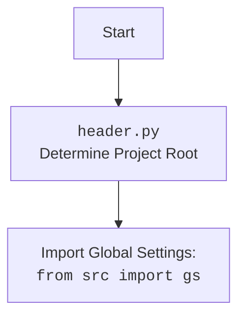

## <алгоритм>

1.  **`get_translations_from_presta_translations_table(product_reference, credentials, i18n)`**
    *   **Вход:** `product_reference` (строка, например, 'REF123'), `credentials` (словарь с данными для подключения к БД), `i18n` (строка, например, 'en_EN', по умолчанию `None`).
    *   **Действие:**
        *   Создается экземпляр `ProductTranslationsManager` с использованием переданных `credentials`.
        *   Формируется словарь `search_filter` для поиска записи в таблице переводов по `product_reference`.
        *   Вызывается метод `select_record` объекта `translations_manager` с `search_filter` для получения записей.
    *   **Выход:** `product_translations` (список словарей, где каждый словарь – запись перевода для продукта). Если записей нет, возвращается пустой список.

    *Пример:*

    ```
    product_reference = 'REF123'
    credentials = {'host': 'localhost', 'user': 'user', 'password': 'password', 'database': 'db'}
    i18n = 'en_EN'
    # вызов get_translations_from_presta_translations_table(product_reference, credentials, i18n)
    # Возвращается список переводов для товара с референсом 'REF123'
    ```

2.  **`insert_new_translation_to_presta_translations_table(record, credentials)`**
    *   **Вход:** `record` (словарь с данными для вставки), `credentials` (словарь с данными для подключения к БД).
    *   **Действие:**
        *   Создается экземпляр `ProductTranslationsManager` с использованием переданных `credentials`.
        *   Вызывается метод `insert_record` объекта `translations_manager` с `record` для вставки новой записи.
    *   **Выход:** Нет явного возврата (запись вставляется в базу данных).

    *Пример:*

    ```
    record = {'product_reference': 'REF123', 'field_name': 'name', 'locale': 'ru_RU', 'translation': 'Продукт 123'}
    credentials = {'host': 'localhost', 'user': 'user', 'password': 'password', 'database': 'db'}
    # вызов insert_new_translation_to_presta_translations_table(record, credentials)
    # запись будет вставлена в БД
    ```

3.  **`translate_record(record, from_locale, to_locale)`**
    *   **Вход:** `record` (словарь с данными для перевода), `from_locale` (строка, например, 'en'), `to_locale` (строка, например, 'ru').
    *   **Действие:**
        *   Вызывается функция `translate` (предположительно из `src.ai`), которой передаются данные для перевода `record`, исходная локаль `from_locale` и целевая локаль `to_locale`.
        *   (Заглушка) Добавляется комментарий "Добавить обработку переведенной записи", что намекает на необходимость дополнительной логики после перевода.
    *   **Выход:** `translated_record` (словарь с переведенными значениями).

    *Пример:*

    ```
    record = {'name': 'Product 123', 'description': 'Description of product'}
    from_locale = 'en'
    to_locale = 'ru'
    # вызов translate_record(record, from_locale, to_locale)
    # Возвращается словарь с переведенными полями на русский
    ```

## <mermaid>

```mermaid
flowchart TD
    Start[Start] --> GetTranslations[get_translations_from_presta_translations_table]
    GetTranslations --> ProductTranslationsManagerCreation1[Create ProductTranslationsManager]
    ProductTranslationsManagerCreation1 --> SearchFilter[Create search filter with product_reference]
    SearchFilter --> SelectRecord1[Call translations_manager.select_record()]
    SelectRecord1 --> ReturnTranslations[Return product_translations]

    Start --> InsertTranslation[insert_new_translation_to_presta_translations_table]
     InsertTranslation --> ProductTranslationsManagerCreation2[Create ProductTranslationsManager]
    ProductTranslationsManagerCreation2 --> InsertRecordCall[Call translations_manager.insert_record()]

    Start --> TranslateRecord[translate_record]
    TranslateRecord --> TranslateCall[Call translate(record, from_locale, to_locale) from src.ai]
     TranslateCall --> PostProcess[Add post-processing logic for translated record]
    PostProcess --> ReturnTranslatedRecord[Return translated_record]

    classDef classFill fill:#f9f,stroke:#333,stroke-width:2px
    class GetTranslations,InsertTranslation,TranslateRecord classFill
    
```



## <объяснение>

### Импорты:

*   `from pathlib import Path`: Импортирует класс `Path` для работы с путями к файлам и директориям в операционной системе.
*   `from typing import List, Dict`: Импортирует типы `List` и `Dict` для аннотации типов данных, что улучшает читаемость кода и позволяет использовать статические анализаторы.
*   `from src import gs`: Импортирует глобальные настройки проекта (предположительно) из модуля `src.gs`. Модуль, вероятно, содержит конфигурационные параметры, которые используются в разных частях проекта.
*   `from src.utils.printer import pprint`: Импортирует функцию `pprint` для форматированного вывода данных, что полезно для отладки.
*    `from src.product.product_fields.product_fields import record`: Импортирует `record` (вероятно класс или структура данных) из модуля `src.product.product_fields.product_fields`, который используется для представления полей продукта.
*   `from src.db import ProductTranslationsManager`: Импортирует класс `ProductTranslationsManager` из `src.db`, который отвечает за управление переводами в базе данных.
*   `from src.ai import translate`: Импортирует функцию `translate` из `src.ai`, которая реализует логику перевода текста.
*   `from src.endpoints.PrestaShop import PrestaShop`: Импортирует класс `PrestaShop` из `src.endpoints.PrestaShop` для взаимодействия с API PrestaShop.

### Функции:

1.  **`get_translations_from_presta_translations_table(product_reference, credentials, i18n)`**
    *   **Аргументы:**
        *   `product_reference` (str): Уникальный идентификатор продукта.
        *   `credentials` (dict): Словарь с данными для подключения к базе данных.
        *   `i18n` (str, опционально): Языковая локаль (например, 'en_EN').
    *   **Возвращаемое значение:** `product_translations` (list): Список словарей, содержащих переводы для продукта, или пустой список, если переводы не найдены.
    *   **Назначение:** Получает переводы полей товара из таблицы переводов PrestaShop.
    *   **Пример:** Вызывает `ProductTranslationsManager` для получения переводов для продукта с `product_reference = 'REF123'`.

2.  **`insert_new_translation_to_presta_translations_table(record, credentials)`**
    *   **Аргументы:**
        *   `record` (dict): Словарь с данными для новой записи перевода.
        *   `credentials` (dict): Словарь с данными для подключения к базе данных.
    *   **Возвращаемое значение:** None (запись вставляется в базу данных).
    *   **Назначение:** Вставляет новую запись перевода в таблицу переводов PrestaShop.
    *   **Пример:** Вызывает `ProductTranslationsManager` для вставки перевода `record = {'product_reference': 'REF123', 'field_name': 'name', 'locale': 'ru_RU', 'translation': 'Продукт 123'}`.

3.  **`translate_record(record, from_locale, to_locale)`**
    *   **Аргументы:**
        *   `record` (dict): Словарь с данными для перевода.
        *   `from_locale` (str): Исходная локаль (например, 'en').
        *   `to_locale` (str): Целевая локаль (например, 'ru').
    *   **Возвращаемое значение:** `translated_record` (dict): Словарь с переведенными полями.
    *   **Назначение:** Переводит значения полей товара с одной локали на другую.
    *   **Пример:** Переводит `record = {'name': 'Product 123', 'description': 'Description of product'}` с английского (`from_locale = 'en'`) на русский (`to_locale = 'ru'`).

### Переменные:

*   `product_reference`: Строка, представляющая уникальный идентификатор товара.
*   `credentials`: Словарь, содержащий учетные данные для доступа к базе данных.
*   `i18n`: Строка, представляющая языковую локаль.
*   `search_filter`: Словарь, используемый для фильтрации записей в базе данных.
*   `product_translations`: Список словарей, содержащих переводы.
*   `record`: Словарь, представляющий запись в таблице переводов, или данные для перевода.
*   `from_locale`: Строка, представляющая исходную локаль для перевода.
*   `to_locale`: Строка, представляющая целевую локаль для перевода.
*   `translated_record`: Словарь, содержащий переведенные данные.

### Потенциальные ошибки и области для улучшения:

1.  **Обработка ошибок:** В коде отсутствуют блоки `try...except` для обработки возможных исключений при взаимодействии с базой данных или при выполнении перевода.
2.  **Обработка результата перевода**: Функция `translate_record` после вызова `translate()` имеет комментарий "Добавить обработку переведенной записи", что указывает на необходимость дополнительной обработки переведенных данных.
3.  **Использование `i18n`**: Параметр `i18n` передается в `get_translations_from_presta_translations_table` но фактически не используется внутри функции, что делает его бесполезным.
4.  **Неполнота документации:** Отсутствует детальное описание формата `record` для функций `insert_new_translation_to_presta_translations_table` и `translate_record`.
5.  **Отсутствие валидации**: Не производится валидация входных данных (`credentials`, `record` и т.д.), что может привести к ошибкам.

### Взаимосвязь с другими частями проекта:

*   **`src.gs`**: Получение глобальных настроек проекта.
*   **`src.utils.printer`**: Форматированный вывод для отладки.
*   **`src.product.product_fields.product_fields`**: Работа с полями продукта.
*   **`src.db.ProductTranslationsManager`**: Взаимодействие с базой данных для управления переводами.
*   **`src.ai.translate`**: Использование модели для перевода текста.
*   **`src.endpoints.PrestaShop`**: (Предположительно) взаимодействие с PrestaShop.

Модуль является частью процесса перевода данных о продукте, связывая БД с AI и PrestaShop.