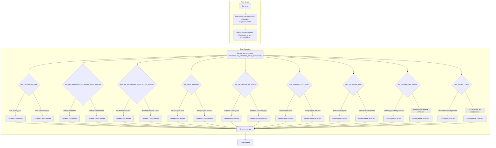

## ИНСТРУКЦИЯ:

Анализируй предоставленный код подробно и объясни его функциональность. Ответ должен включать три раздела:  

1. **<алгоритм>**: Опиши рабочий процесс в виде пошаговой блок-схемы, включая примеры для каждого логического блока, и проиллюстрируй поток данных между функциями, классами или методами.  
2. **<mermaid>**: Напиши код для диаграммы в формате `mermaid`, проанализируй и объясни все зависимости, 
    которые импортируются при создании диаграммы. 
    **ВАЖНО!** Убедитесь, что все имена переменных, используемые в диаграмме `mermaid`, 
    имеют осмысленные и описательные имена. Имена переменных вроде `A`, `B`, `C`, и т.д., не допускаются!  
    
    **Дополнительно**: Если в коде есть импорт `import header`, добавьте блок `mermaid` flowchart, объясняющий `header.py`:\
    ```mermaid
    flowchart TD
        Start --> Header[<code>header.py</code><br> Determine Project Root]
    
        Header --> import[Import Global Settings: <br><code>from src import gs</code>] 
    ```

3. **<объяснение>**: Предоставьте подробные объяснения:  
   - **Импорты**: Их назначение и взаимосвязь с другими пакетами `src.`.  
   - **Классы**: Их роль, атрибуты, методы и взаимодействие с другими компонентами проекта.  
   - **Функции**: Их аргументы, возвращаемые значения, назначение и примеры.  
   - **Переменные**: Их типы и использование.  
   - Выделите потенциальные ошибки или области для улучшения.  

Дополнительно, постройте цепочку взаимосвязей с другими частями проекта (если применимо).  

Это обеспечивает всесторонний и структурированный анализ кода.
## Формат ответа: `.md` (markdown)
**КОНЕЦ ИНСТРУКЦИИ**

## <алгоритм>

1.  **Начало**: Тестировщик начинает процесс тестирования с изучения документации.
    *   **Пример**: Чтение этого руководства.

2.  **Установка зависимостей**: Тестировщик устанавливает необходимые библиотеки, используя `pip`.
    *   **Пример**: Выполнение `pip install -r requirements.txt`.

3.  **Настройка WebDriver**: Тестировщик конфигурирует путь к `chromedriver` для управления браузером.
    *   **Пример**: Изменение `executable_path` в коде `service = Service(executable_path="/path/to/chromedriver")`.

4.  **Запуск тестов**: Тестировщик запускает тесты с помощью `pytest`.
    *   **Пример**: Выполнение `pytest src/webdriver/_pytest/test_driver_executor.py`.

5.  **Анализ `test_navigate_to_page`**:
    *   **Действие**: WebDriver переходит на указанную страницу.
    *   **Проверка**: URL текущей страницы соответствует ожидаемому.
    *   **Пример**: Проверка, что после перехода на страницу `"http://example.com"`, URL страницы равен `"http://example.com"`.

6.  **Анализ `test_get_webelement_by_locator_single_element`**:
    *   **Действие**: Метод `get_webelement_by_locator` пытается найти элемент.
    *   **Проверка**: Возвращаемый элемент является экземпляром `WebElement` и содержит ожидаемый текст.
    *   **Пример**: Проверка, что найденный элемент по селектору `h1` содержит текст `"Example Domain"`.

7.  **Анализ `test_get_webelement_by_locator_no_element`**:
    *   **Действие**: Метод `get_webelement_by_locator` пытается найти несуществующий элемент.
    *   **Проверка**: Метод возвращает `False`.
    *   **Пример**: Проверка, что при поиске элемента по несуществующему селектору метод возвращает `False`.

8.  **Анализ `test_send_message`**:
    *   **Действие**: Метод `send_message` отправляет сообщение элементу.
    *   **Проверка**: Метод возвращает `True`.
    *   **Пример**: Проверка, что после отправки сообщения `"test"` элементу, метод возвращает `True`.

9.  **Анализ `test_get_attribute_by_locator`**:
    *   **Действие**: Метод `get_attribute_by_locator` получает атрибут элемента.
    *   **Проверка**: Возвращаемый атрибут соответствует ожидаемому значению.
    *   **Пример**: Проверка, что атрибут `href` элемента `a` равен `"https://www.iana.org/domains/example"`.

10. **Анализ `test_execute_locator_event`**:
    *   **Действие**: Метод `execute_locator` выполняет событие на элементе.
    *   **Проверка**: Метод возвращает `True`.
    *   **Пример**: Проверка, что после выполнения события клика на элементе, метод возвращает `True`.

11. **Анализ `test_get_locator_keys`**:
    *   **Действие**: Метод `get_locator_keys` возвращает ключи локатора.
    *   **Проверка**: Возвращаемые ключи соответствуют ожидаемому набору.
    *   **Пример**: Проверка, что ключи локатора включают `attribute`, `by`, `selector` и т.д.

12. **Анализ `test_navigate_and_interact`**:
    *   **Действие**: WebDriver переходит на страницу Википедии, отправляет запрос в поле поиска, кликает на кнопку поиска и проверяет результаты.
    *   **Проверка**: Действия выполняются корректно, и результаты поиска соответствуют ожидаемым.
    *   **Пример**: Навигация на Википедию, ввод `"Selenium"` в поле поиска, клик на кнопку поиска и проверка, что страница результатов загрузилась.

13. **Анализ `test_invalid_locator`**:
    *   **Действие**: Метод пытается выполнить операцию с некорректным локатором.
    *   **Проверка**: Выбрасывается исключение `ExecuteLocatorException`.
    *   **Пример**: Попытка взаимодействия с элементом по некорректному локатору и проверка, что выбрасывается исключение.

14. **Формирование отчета**: `pytest` создает отчет о результатах тестирования.
    *   **Пример**: Просмотр текстового отчета в консоли или создание HTML-отчета.

15. **Завершение**: Тестировщик анализирует результаты и при необходимости исправляет ошибки.
    *   **Пример**: Исправление кода в случае неудачного теста.

## <mermaid>



## <объяснение>

### Общее описание
Этот документ представляет собой руководство для тестировщиков по запуску и выполнению тестов для классов `Driver` и `ExecuteLocator`, которые предположительно расположены в файле `test_driver_executor.py`. Основная цель этих тестов — проверка корректности работы методов указанных классов и их взаимодействия при различных условиях.

### Импорты
В предоставленном коде нет импортов. Однако в тексте упоминаются такие библиотеки, как `pytest` и `selenium`. Они необходимы для запуска тестов и управления браузером соответственно.

### Классы
**Driver** (неявно упоминается) — класс, который предоставляет методы для управления браузером, навигации по страницам, поиска элементов.

**ExecuteLocator** (неявно упоминается) — класс, который, вероятно, отвечает за выполнение операций над элементами на странице на основе локаторов (описаний местоположения элементов).

### Функции
Тестовые функции:

- **`test_navigate_to_page`**:
    -   **Назначение**: Проверяет, что WebDriver корректно загружает страницу.
    -   **Аргументы**: Нет явных аргументов (зависит от pytest fixtures).
    -   **Возвращаемое значение**: Нет явного возвращаемого значения; тест проходит, если URL соответствует ожидаемому.
    -   **Пример**: Загрузка страницы `"http://example.com"` и проверка, что URL текущей страницы равен `"http://example.com"`.
- **`test_get_webelement_by_locator_single_element`**:
    -   **Назначение**: Проверяет, что `get_webelement_by_locator` корректно находит элемент.
    -   **Аргументы**: Нет явных аргументов (зависит от pytest fixtures).
    -   **Возвращаемое значение**: Нет явного возвращаемого значения; тест проходит, если элемент найден и текст соответствует.
    -   **Пример**: Поиск элемента `h1` на странице и проверка, что его текст равен `"Example Domain"`.
- **`test_get_webelement_by_locator_no_element`**:
    -   **Назначение**: Проверяет, что `get_webelement_by_locator` возвращает `False`, если элемент не найден.
    -   **Аргументы**: Нет явных аргументов (зависит от pytest fixtures).
    -   **Возвращаемое значение**: Нет явного возвращаемого значения; тест проходит, если возвращается `False`.
    -   **Пример**: Поиск несуществующего элемента и проверка, что метод возвращает `False`.
- **`test_send_message`**:
    -   **Назначение**: Проверяет, что метод `send_message` корректно отправляет сообщение элементу.
    -   **Аргументы**: Нет явных аргументов (зависит от pytest fixtures).
    -   **Возвращаемое значение**: Нет явного возвращаемого значения; тест проходит, если возвращается `True`.
    -    **Пример**: Отправка сообщения `"test"` элементу, и проверка, что метод возвращает `True`.
- **`test_get_attribute_by_locator`**:
    -   **Назначение**: Проверяет, что `get_attribute_by_locator` возвращает атрибут элемента.
    -   **Аргументы**: Нет явных аргументов (зависит от pytest fixtures).
    -   **Возвращаемое значение**: Нет явного возвращаемого значения; тест проходит, если атрибут соответствует.
    -   **Пример**: Получение атрибута `href` элемента `a` и проверка, что он равен `"https://www.iana.org/domains/example"`.
- **`test_execute_locator_event`**:
    -   **Назначение**: Проверяет, что `execute_locator` выполняет событие на элементе.
    -   **Аргументы**: Нет явных аргументов (зависит от pytest fixtures).
    -   **Возвращаемое значение**: Нет явного возвращаемого значения; тест проходит, если возвращается `True`.
    -   **Пример**: Выполнение клика на элементе и проверка, что метод возвращает `True`.
- **`test_get_locator_keys`**:
    -   **Назначение**: Проверяет, что `get_locator_keys` возвращает правильные ключи локатора.
    -   **Аргументы**: Нет явных аргументов (зависит от pytest fixtures).
    -   **Возвращаемое значение**: Нет явного возвращаемого значения; тест проходит, если ключи соответствуют ожидаемым.
    -   **Пример**: Проверка, что ключи включают `attribute`, `by`, `selector` и т.д.
- **`test_navigate_and_interact`**:
    -   **Назначение**: Проверяет последовательность навигации и взаимодействия с элементами.
    -   **Аргументы**: Нет явных аргументов (зависит от pytest fixtures).
    -   **Возвращаемое значение**: Нет явного возвращаемого значения; тест проходит, если все этапы выполняются корректно.
    -   **Пример**: Навигация на Википедию, ввод текста в поле поиска, клик на кнопку и проверка результатов.
- **`test_invalid_locator`**:
    -   **Назначение**: Проверяет обработку некорректных локаторов.
    -   **Аргументы**: Нет явных аргументов (зависит от pytest fixtures).
    -   **Возвращаемое значение**: Нет явного возвращаемого значения; тест проходит, если выброшено исключение `ExecuteLocatorException`.
    -   **Пример**: Попытка использовать некорректный локатор и проверка, что выбрасывается исключение.

### Переменные
В основном, в документе описываются переменные, которые могут быть использованы внутри тестовых функций (например, локаторы, URL-ы, текст для проверки). Типы этих переменных будут зависеть от реализации тестов в `test_driver_executor.py`.

### Потенциальные ошибки и области для улучшения
- **Недостаточная детализация кода**: Руководство не показывает фактический код тестов или классов `Driver` и `ExecuteLocator`. Это усложняет понимание того, как именно выполняются проверки.
- **Зависимость от pytest fixtures**: Тесты используют `pytest fixtures`, что не показано в руководстве, и тем самым может запутать пользователей без знаний `pytest`.
- **Отсутствие примеров локаторов**: Руководство не содержит примеров локаторов, что делает сложным понимание, как именно они используются.

### Цепочка взаимосвязей с другими частями проекта
1.  **`src.webdriver`**: Папка, в которой располагаются классы `Driver` и `ExecuteLocator`.
2.  **`src.webdriver._pytest`**: Папка с тестовыми скриптами (`test_driver_executor.py`).
3. **`requirements.txt`**: Файл с зависимостями (например, `pytest`, `selenium`).
4.  **`pytest`**: Инструмент для запуска и управления тестами.
5.  **`selenium`**: Библиотека для управления браузером.
6.  **`chromedriver`**: Драйвер для браузера Chrome, необходимый для `selenium`.

**Взаимосвязи**: Тестовый скрипт (`test_driver_executor.py`) использует классы из `src.webdriver`, запуская тесты с помощью `pytest`, которые используют `selenium` и `chromedriver` для управления браузером.

Это подробное объяснение предоставляет понимание структуры и функциональности тестов и их взаимодействия с другими компонентами проекта.