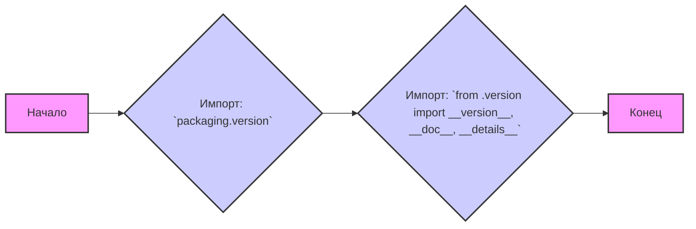

## АНАЛИЗ КОДА: `hypotez/src/webdriver/edge/_examples/__init__.py`

### 1. <алгоритм>

**Блок-схема:**

**Примеры для блоков:**
* **`A` (Начало):** Начало выполнения файла `__init__.py`.
* **`B` (Импорт `packaging.version`):** Импортируется модуль `Version` из пакета `packaging.version`, который предназначен для работы с версиями пакетов. Например: `Version('1.2.3')` создаст объект версии.
* **`C` (Импорт из `.version`):** Импортируются переменные `__version__`, `__doc__`, и `__details__` из модуля `version.py`, находящегося в той же директории. Эти переменные предположительно содержат информацию о версии, документации и деталях пакета.
* **`D` (Конец):** Завершение выполнения файла.

### 2. <mermaid>

**Объяснение зависимостей:**
- **`packaging.version`**: Этот пакет используется для работы с версиями программного обеспечения. В данном коде импортируется класс `Version`, который используется для сравнения и манипуляций версиями.
- **`.version`**: Это модуль, находящийся в той же директории, что и `__init__.py`. Он содержит переменные, которые предоставляют информацию о версии текущего пакета. `__version__` хранит строку с версией, `__doc__` - документацию, `__details__` - дополнительные детали.
  
### 3. <объяснение>

**Импорты:**

*   `from packaging.version import Version`: 
    *   **Назначение**: Импортирует класс `Version` из пакета `packaging.version`. Этот пакет необходим для обработки и сравнения версий программного обеспечения.
    *   **Взаимосвязь с пакетами `src`**: `packaging.version` не является частью проекта `src` напрямую, а является внешней зависимостью. Он используется для того, чтобы можно было корректно управлять версиями пакета.
*   `from .version import __version__, __doc__, __details__`:
    *   **Назначение**: Импортирует переменные `__version__`, `__doc__` и `__details__` из файла `version.py`, находящегося в той же директории.
    *   **Взаимосвязь с пакетами `src`**: Файл `.version` является частью текущего пакета (`src.webdriver.edge._examples`) и предоставляет информацию о его версии, документации и дополнительных деталях.

**Классы:**

* В данном коде нет определения классов.

**Функции:**

* В данном коде нет определения функций.

**Переменные:**

*   `__version__`: Строка, представляющая версию пакета. Импортируется из файла `version.py`. Тип: `str`.
*   `__doc__`: Строка, представляющая документацию пакета. Импортируется из файла `version.py`. Тип: `str`.
*   `__details__`: Строка, содержащая дополнительные детали о пакете. Импортируется из файла `version.py`. Тип: `str`.

**Потенциальные ошибки и области для улучшения:**

*   В коде отсутствуют определения классов и функций, что делает его очень простым. 
*   Множество повторяющихся комментариев `""" ... """` не несут никакой смысловой нагрузки и должны быть удалены.
*  Отсутствие какой-либо функциональности, кроме импорта переменных, в файле `__init__.py` вызывает вопрос о его реальном предназначении, может быть стоит добавить хотя бы функцию или класс, который был бы полезен для работы с примерами.

**Цепочка взаимосвязей с другими частями проекта:**
*   Данный файл является частью пакета `src.webdriver.edge._examples`, что можно увидеть из пути к файлу. 
*   Переменные, импортированные из `.version`, предположительно используются другими частями проекта для определения версии текущего пакета.
*   Класс `Version` из `packaging.version` может быть использован для проверки совместимости различных частей проекта с помощью сравнения версий.

В целом, данный код является довольно простым и выполняет в основном инициализацию переменных для текущего пакета и импорт внешнего пакета для работы с версиями.