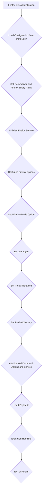
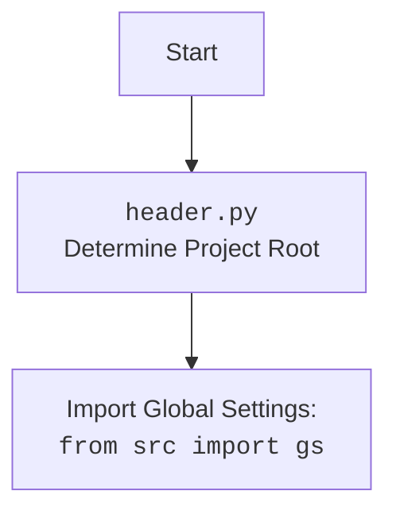

# Проект `hypotez`
# Роль `code explainer`

## АНАЛИЗ КОДА: `hypotez/src/webdriver/firefox/firefox.py`

### 1. <алгоритм>

Этот код определяет класс `Firefox`, который расширяет возможности стандартного `webdriver.Firefox` из Selenium, добавляя функциональность для настройки профиля, установки пользовательского агента, прокси и запуска в различных режимах отображения.

**Блок-схема рабочего процесса:**

1.  **Инициализация класса `Firefox`**:

    *   Принимает параметры конфигурации, такие как имя профиля, версии `geckodriver` и `firefox`, `user_agent`, путь к файлу прокси, дополнительные опции и режим окна.

    *   Загружает конфигурацию из `firefox.json` с использованием `j_loads_ns`.

    *   Определяет пути к `geckodriver` и бинарному файлу `firefox`.

    *   Инициализирует `Service` с путем к `geckodriver`.

    *   Создает объект `Options` для настройки Firefox.
2.  **Настройка опций Firefox**:

    *   Добавляет опции из файла конфигурации.

        ```python
        if hasattr(config, 'options') and config.options:
            for option in config.options:
                options_obj.add_argument(option)
        ```

        *Пример*: Если `config.options` содержит `['--headless', '--disable-gpu']`, то эти опции будут добавлены в `options_obj`.

    *   Устанавливает режим окна, если он указан.

        ```python
        if window_mode:
            options_obj.add_argument(f'--{window_mode}')
        ```

        *Пример*: Если `window_mode` равно `'kiosk'`, то будет добавлена опция `'--kiosk'`.

    *   Добавляет дополнительные опции, переданные при инициализации.
    *   Устанавливает пользовательский `user_agent`.

        ```python
        user_agent = user_agent or UserAgent().random
        options_obj.set_preference('general.useragent.override', user_agent)
        ```

        *Пример*: Если `user_agent` не указан, используется случайный `user_agent` из библиотеки `fake_useragent`.
3.  **Настройка прокси (если включено)**:

    *   Вызывает метод `set_proxy` для настройки прокси.

        ```python
        if hasattr(config, 'proxy_enabled') and config.proxy_enabled:
            self.set_proxy(options_obj)
        ```
4.  **Настройка директории профиля**:

    *   Определяет директорию профиля на основе конфигурации и имени профиля.

        ```python
        profile_directory = config.profile_directory.os if config.profile_directory.default == 'os' else str(Path(gs.path.src, config.profile_directory.internal))

        if profile_name:
            profile_directory = str(Path(profile_directory).parent / profile_name)
        if '%LOCALAPPDATA%' in profile_directory:
             profile_directory = Path(profile_directory.replace('%LOCALAPPDATA%', os.environ.get('LOCALAPPDATA')))
        ```

        *Пример*: Если `profile_name` равно `'custom_profile'`, то директория профиля будет создана в поддиректории `custom_profile`.
5.  **Инициализация WebDriver**:

    *   Инициализирует `WebDriver` с использованием настроенного сервиса и опций.

        ```python
        super().__init__(service=service, options=options_obj)
        ```
6.  **Инициализация payload**:
    *   Вызывает метод `_payload` для загрузки исполнителей локаторов и JavaScript.

        ```python
        self._payload()
        ```
7.  **Обработка исключений**:

    *   Обрабатывает исключения, которые могут возникнуть при запуске `WebDriver`.

        ```python
        except WebDriverException as ex:
            logger.critical("""
                ---------------------------------
                    Ошибка запуска WebDriver
                    Возможные причины:
                    - Обновление Firefox
                    - Отсутствие Firefox на ОС
                ----------------------------------""", ex)
            ...
            sys.exit(1)
        except Exception as ex:
            logger.critical('Ошибка Firefox WebDriver:', ex)
            return
        ```
8.  **Метод `set_proxy`**:

    *   Получает словарь прокси из `get_proxies_dict`.
    *   Выбирает случайный рабочий прокси из списка.

        ```python
        proxies_dict = get_proxies_dict()
        all_proxies = proxies_dict.get('socks4', []) + proxies_dict.get('socks5', [])
        working_proxy = None
        for proxy in random.sample(all_proxies, len(all_proxies)):
            if check_proxy(proxy):
                working_proxy = proxy
                break
        ```
    *   Устанавливает настройки прокси в опциях Firefox в зависимости от протокола (`http`, `socks4`, `socks5`).

        ```python
        if working_proxy:
            proxy = working_proxy
            protocol = proxy.get('protocol')
            if protocol == 'http':
                options.set_preference('network.proxy.type', 1)
                options.set_preference('network.proxy.http', proxy['host'])
                options.set_preference('network.proxy.http_port', int(proxy['port']))
                options.set_preference('network.proxy.ssl', proxy['host'])
                options.set_preference('network.proxy.ssl_port', int(proxy['port']))
                logger.info(f"Настройка HTTP Proxy: http://{proxy['host']}:{proxy['port']}")
        ```
9.  **Метод `_payload`**:

    *   Загружает исполнителей локаторов и JavaScript сценариев.
    *   Инициализирует класс `JavaScript` и присваивает его методы атрибутам экземпляра класса `Firefox`.
    *   Инициализирует класс `ExecuteLocator` и присваивает его методы атрибутам экземпляра класса `Firefox`.

**Поток данных:**

*   Конфигурация загружается из `firefox.json` с использованием `j_loads_ns`.
*   Данные прокси получаются из `get_proxies_dict`.
*   Пользовательский `user_agent` генерируется с использованием `UserAgent` из библиотеки `fake_useragent`.

### 2. <mermaid>



**Объяснение зависимостей в диаграмме:**

*   **A (Firefox Class Initialization)**: Начальная точка, представляющая инициализацию класса `Firefox`.
*   **B (Load Configuration from firefox.json)**: Загружает конфигурацию из файла `firefox.json`, определяя различные параметры, такие как пути к исполняемым файлам, опции и настройки прокси. Использует `j_loads_ns` для загрузки конфигурации.
*   **C (Set Geckodriver and Firefox Binary Paths)**: Устанавливает пути к исполняемым файлам `geckodriver` и `firefox` на основе загруженной конфигурации.
*   **D (Initialize Firefox Service)**: Инициализирует сервис Firefox с путем к `geckodriver`.
*   **E (Configure Firefox Options)**: Настраивает различные опции Firefox, такие как опции из файла конфигурации, дополнительные опции, переданные при инициализации.
*   **F (Set Window Mode Option)**: Устанавливает режим окна браузера (например, kiosk, full_window).
*   **G (Set User Agent)**: Устанавливает пользовательский `user_agent` для браузера.
*   **H (Set Proxy if Enabled)**: Настраивает прокси, если он включен в конфигурации.
*   **I (Set Profile Directory)**: Устанавливает директорию профиля Firefox.
*   **J (Initialize WebDriver with Options and Service)**: Инициализирует `WebDriver` с настроенными опциями и сервисом.
*   **K (Load Payloads)**: Загружает исполнителей локаторов и JavaScript сценариев.
*   **L (Exception Handling)**: Обрабатывает исключения, которые могут возникнуть в процессе инициализации.
*   **M (Exit or Return)**: Завершает выполнение программы или возвращает управление.



### 3. <объяснение>

#### Импорты:

*   `os`, `sys`: Обеспечивают взаимодействие с операционной системой.
*   `random`: Используется для случайного выбора прокси из списка.
*   `pathlib.Path`: Используется для работы с путями к файлам и директориям.
*   `typing.Optional`, `typing.List`: Используются для аннотации типов.
*   `selenium.webdriver.Firefox`: Базовый класс `WebDriver` для Firefox.
*   `selenium.webdriver.firefox.options.Options`: Класс для настройки опций Firefox.
*   `selenium.webdriver.firefox.service.Service`: Класс для управления сервисом `geckodriver`.
*   `selenium.webdriver.firefox.firefox_profile.FirefoxProfile`: Класс для управления профилем Firefox.
*   `selenium.common.exceptions.WebDriverException`: Класс исключений, связанных с `WebDriver`.
*   `src.gs`: Глобальные настройки проекта.
*   `src.webdriver.executor.ExecuteLocator`: Класс для выполнения локаторов.
*   `src.webdriver.js.JavaScript`: Класс для выполнения JavaScript.
*   `src.webdriver.proxy`: Модуль для работы с прокси.
*   `src.utils.jjson.j_loads_ns`: Функция для загрузки JSON-файлов с поддержкой namespace.
*   `src.logger.logger.logger`: Модуль для логирования.
*   `fake_useragent.UserAgent`: Класс для генерации случайных `user_agent`.
*   `header`: Модуль для определения корневой директории проекта.

#### Классы:

*   `Firefox(WebDriver)`:
    *   **Роль**: Расширяет функциональность `webdriver.Firefox`, добавляя возможность настройки профиля, установки пользовательского агента, прокси и запуска в различных режимах отображения.
    *   **Атрибуты**:
        *   `driver_name: str = 'firefox'`: Имя драйвера.
        *   `service: 'Service'`: Сервис `geckodriver`.
    *   **Методы**:
        *   `__init__(self, profile_name: Optional[str] = None, geckodriver_version: Optional[str] = None, firefox_version: Optional[str] = None, user_agent: Optional[str] = None, proxy_file_path: Optional[str] = None, options: Optional[List[str] = None, window_mode: Optional[str] = None, *args, **kwargs) -> None`: Инициализирует экземпляр класса `Firefox`, настраивает опции, профиль и прокси.
        *   `set_proxy(self, options: Options) -> None`: Настраивает прокси из словаря, возвращаемого `get_proxies_dict`.
        *   `_payload(self) -> None`: Загружает исполнителей для локаторов и JavaScript сценариев.

#### Функции:

*   `j_loads_ns(file_path: Path) -> Any`: Загружает JSON-файл с поддержкой namespace.
    *   **Аргументы**:
        *   `file_path (Path)`: Путь к JSON-файлу.
    *   **Возвращаемое значение**:
        *   `Any`: Загруженные данные.
    *   **Назначение**: Загружает JSON-файл, позволяя обращаться к элементам конфигурации через атрибуты.
    *   *Пример*:

        ```python
        config = j_loads_ns(Path(gs.path.src, 'webdriver', 'firefox', 'firefox.json'))
        print(config.executable_path.geckodriver)
        ```
*   `get_proxies_dict() -> dict`: Получает словарь прокси.
    *   **Аргументы**: Нет.
    *   **Возвращаемое значение**:
        *   `dict`: Словарь прокси.
    *   **Назначение**: Получает словарь прокси из файла или другого источника.
*   `check_proxy(proxy: dict) -> bool`: Проверяет прокси.
    *   **Аргументы**:
        *   `proxy (dict)`: Словарь с данными прокси.
    *   **Возвращаемое значение**:
        *   `bool`: `True`, если прокси работает, иначе `False`.
    *   **Назначение**: Проверяет, доступен ли прокси.

#### Переменные:

*   `profile: Optional[FirefoxProfile]`: Профиль Firefox.
*   `options_obj: Optional[Options]`: Опции Firefox.
*   `geckodriver_path: str`: Путь к `geckodriver`.
*   `firefox_binary_path: str`: Путь к бинарному файлу `firefox`.
*   `service: Service`: Сервис `geckodriver`.
*   `config: dict`: Конфигурация из `firefox.json`.

#### Потенциальные ошибки и области для улучшения:

*   Обработка исключений при инициализации `WebDriver` может быть улучшена путем предоставления более конкретных инструкций по устранению неполадок.
*   Логика выбора прокси может быть улучшена для более эффективного выбора рабочего прокси.
*   Временное решение `profile = FirefoxProfile(profile_directory=profile_directory) <- @debug не грузится профиль` следует изучить и исправить.

#### Взаимосвязи с другими частями проекта:

*   Использует `src.gs` для получения глобальных настроек проекта.
*   Использует `src.webdriver.executor.ExecuteLocator` и `src.webdriver.js.JavaScript` для выполнения локаторов и JavaScript сценариев.
*   Использует `src.webdriver.proxy` для работы с прокси.
*   Использует `src.utils.jjson.j_loads_ns` для загрузки JSON-файлов с поддержкой namespace.
*   Использует `src.logger.logger.logger` для логирования.

Этот модуль является частью системы автоматизированного тестирования `hypotez` и отвечает за настройку и запуск браузера Firefox с заданными параметрами. Он тесно связан с другими модулями, такими как `executor`, `js` и `proxy`, для обеспечения полной функциональности автоматизированного тестирования.