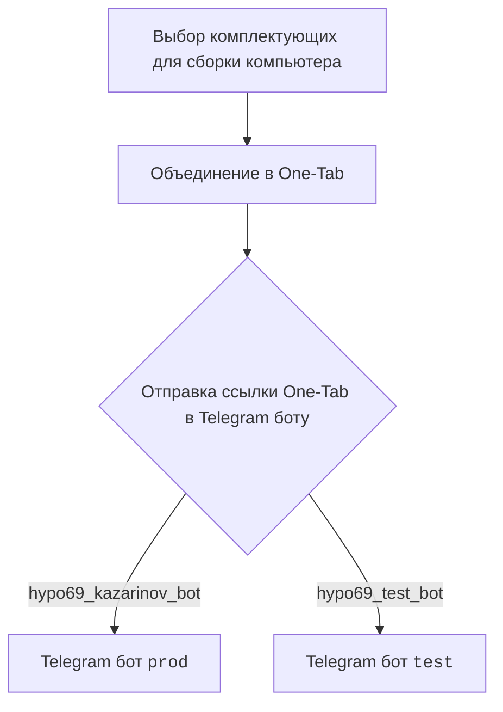
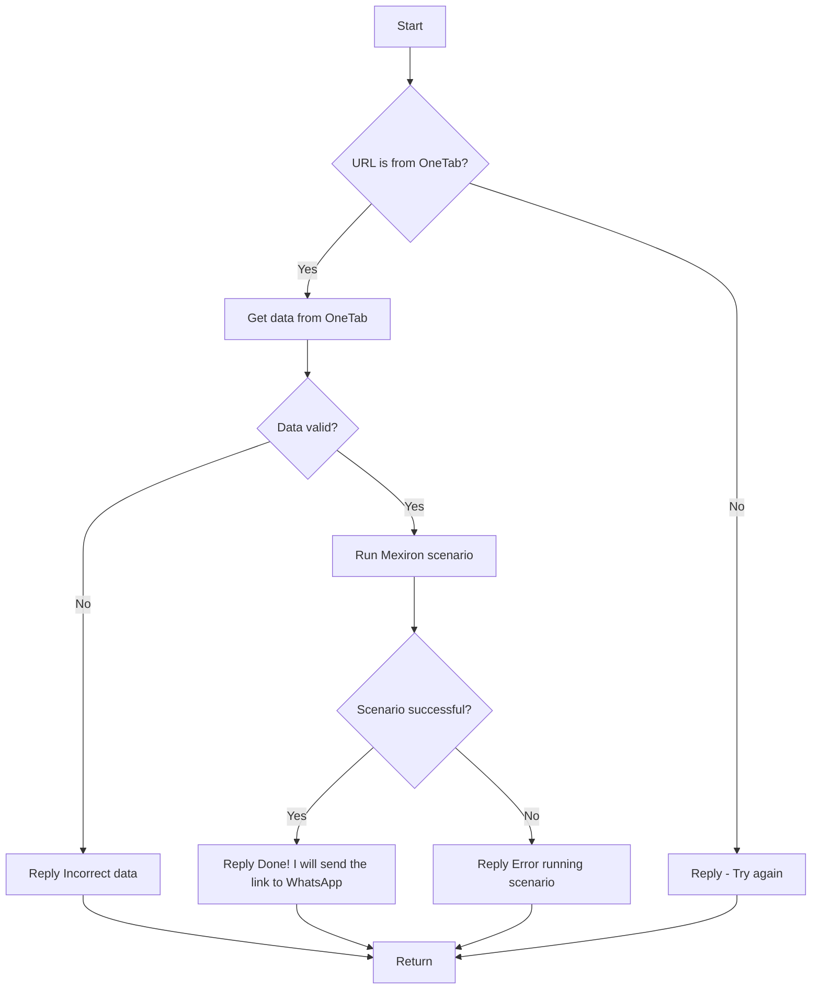

# Модуль `src.endpoints.kazarinov`

## Обзор

Модуль отвечает за обработку запросов от Telegram-ботов `hypo69_kazarinov_bot` и `hypo69_test_bot`, связанных с генерацией PDF-файлов на основе данных из One-Tab и последующей их отправкой пользователю.

## Оглавление

- [Обзор](#обзор)
- [KazarinovTelegramBot](#kazarinovtelegrambot)
- [BotHandler](#bothandler)
- [Client Side (Kazarinov)](#client-side-kazarinov)
- [Code Side](#code-side)
- [Next](#next)

## KazarinovTelegramBot

Ссылки на используемые ресурсы:
- https://one-tab.co.il
- https://morlevi.co.il
- https://grandavance.co.il
- https://ivory.co.il
- https://ksp.co.il

## BotHandler

Обработчик бота, который принимает сообщения от Telegram-ботов и обрабатывает их.

## Client Side (Kazarinov)

**Описание**: Схема взаимодействия клиента с ботами.

## Code Side

**Описание**: Схема обработки запроса на стороне кода.

## Next
- [Kazarinov bot](https://github.com/hypo69/hypo/blob/master/src/endpoints/kazarinov/kazarinov_bot.md)
- [Scenario Execution](https://github.com/hypo69/hypo/blob/master/src/endpoints/kazarinov/scenarios/README.MD)