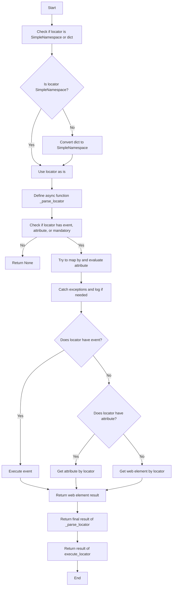
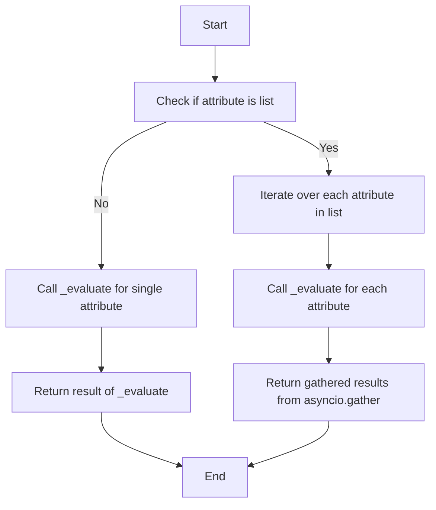
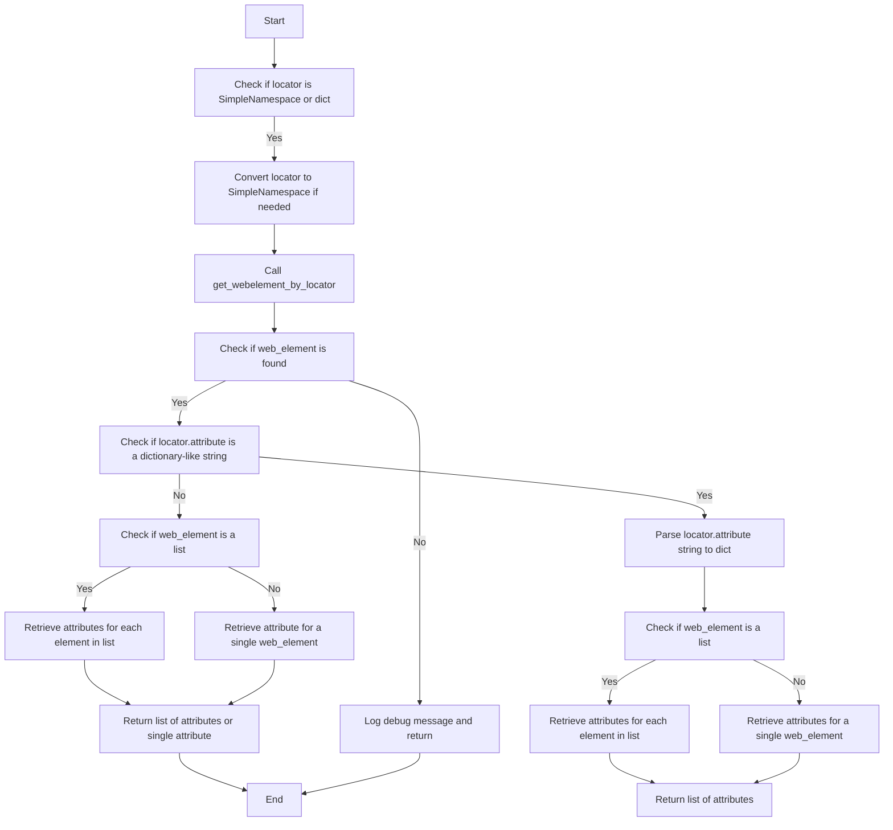

# src.webdriver.executor

## Обзор

Модуль `executor` предназначен для выполнения действий с веб-элементами на основе предоставленных конфигураций, известных как "локаторы". Эти конфигурации (или "локаторы") представляют собой словари, содержащие информацию о том, как находить и взаимодействовать с элементами на веб-странице. Модуль предоставляет следующие функции:

1.  **Разбор и обработка локаторов**: Преобразует словари с конфигурациями в объекты `SimpleNamespace`, что обеспечивает гибкую работу с данными локатора.

2.  **Взаимодействие с веб-элементами**: В зависимости от предоставленных данных модуль может выполнять различные действия, такие как клики, отправка сообщений, выполнение событий и получение атрибутов веб-элементов.

3.  **Обработка ошибок**: Модуль поддерживает продолжение выполнения в случае ошибки, что позволяет обрабатывать веб-страницы, которые могут иметь нестабильные элементы или требовать особого подхода.

4.  **Поддержка различных типов локаторов**: Обрабатывает как одиночные, так и множественные локаторы, позволяя идентифицировать и взаимодействовать с одним или несколькими веб-элементами одновременно.

Модуль обеспечивает гибкость и универсальность при работе с веб-элементами, позволяя автоматизировать сложные сценарии веб-взаимодействия.

## Содержание

- [Классы](#Классы)
    - [`ExecuteLocator`](#ExecuteLocator)
- [Функции](#Функции)
    - [`execute_locator`](#execute_locator)
    - [`evaluate_locator`](#evaluate_locator)
    - [`get_attribute_by_locator`](#get_attribute_by_locator)
    - [`get_webelement_by_locator`](#get_webelement_by_locator)
    - [`get_webelement_as_screenshot`](#get_webelement_as_screenshot)
    - [`execute_event`](#execute_event)
    - [`send_message`](#send_message)

## Классы

### `ExecuteLocator`

**Описание**: Обработчик локаторов для веб-элементов с использованием Selenium.

**Методы**:
- `__post_init__`: Инициализирует объект `ActionChains` при наличии драйвера.
- `execute_locator`: Выполняет действия с веб-элементом на основе предоставленного локатора.
- `evaluate_locator`: Оценивает и обрабатывает атрибуты локатора.
- `get_attribute_by_locator`: Извлекает атрибуты из элемента или списка элементов, найденных по заданному локатору.
- `get_webelement_by_locator`: Извлекает веб-элемент или список элементов по указанному локатору.
- `get_webelement_as_screenshot`: Делает снимок экрана найденного веб-элемента.
- `execute_event`: Выполняет события, связанные с локатором.
- `send_message`: Отправляет сообщение веб-элементу.

**Параметры**:

- `driver` (Optional[object], optional): Веб-драйвер Selenium. По умолчанию `None`.
- `actions` (ActionChains): Объект для выполнения цепочек действий. Инициализируется в `__post_init__`.
- `by_mapping` (dict): Словарь для преобразования строковых обозначений методов поиска в `By` Enum. По умолчанию используется предопределенный словарь.
- `mode` (str): Режим работы ('debug' или другой). По умолчанию 'debug'.

## Функции

### `execute_locator`

**Описание**: Выполняет действия с веб-элементом на основе предоставленного локатора.

**Параметры**:
- `locator` (dict | SimpleNamespace): Данные локатора (словарь или `SimpleNamespace`).
- `timeout` (Optional[float], optional): Время ожидания для поиска элемента. По умолчанию `0`.
- `timeout_for_event` (Optional[str], optional): Условие ожидания ('presence_of_element_located', 'element_to_be_clickable'). По умолчанию `'presence_of_element_located'`.
- `message` (Optional[str], optional): Сообщение для отправки. По умолчанию `None`.
- `typing_speed` (Optional[float], optional): Скорость печати при отправке сообщения. По умолчанию `0`.
- `continue_on_error` (Optional[bool], optional): Продолжать выполнение при ошибке. По умолчанию `True`.

**Возвращает**:
- `str | list | dict | WebElement | bool`: Результат выполнения в зависимости от инструкций локатора.

**Схема выполнения**:



### `evaluate_locator`

**Описание**: Оценивает и обрабатывает атрибуты локатора.

**Параметры**:
- `attribute` (str | List[str] | dict): Атрибуты для оценки.

**Возвращает**:
- `Optional[str | List[str] | dict]`: Оцененные атрибуты.

**Схема выполнения**:



### `get_attribute_by_locator`

**Описание**: Извлекает атрибуты из элемента или списка элементов, найденных по заданному локатору.

**Параметры**:
- `locator` (dict | SimpleNamespace): Локатор в виде словаря или `SimpleNamespace`.
- `timeout` (Optional[float], optional): Максимальное время ожидания появления элемента. По умолчанию `0`.
- `timeout_for_event` (str, optional): Тип условия ожидания. По умолчанию `'presence_of_element_located'`.
- `message` (Optional[str], optional): Сообщение для отправки. По умолчанию `None`.
- `typing_speed` (float, optional): Скорость набора текста для событий send_keys. По умолчанию `0`.
- `continue_on_error` (bool, optional): Продолжать ли выполнение в случае ошибки. По умолчанию `True`.

**Возвращает**:
- `WebElement | list[WebElement] | None`: Значение атрибута(ов) или словарь с атрибутами.

**Схема выполнения**:



### `get_webelement_by_locator`

**Описание**: Извлекает веб-элемент или список элементов по указанному локатору.

**Параметры**:
- `locator` (dict | SimpleNamespace): Локатор в виде словаря или `SimpleNamespace`.
- `timeout` (Optional[float], optional): Время ожидания для поиска элемента. По умолчанию `0`.
- `timeout_for_event` (Optional[str], optional): Условие ожидания ('presence_of_element_located', 'visibility_of_all_elements_located'). По умолчанию `'presence_of_element_located'`.

**Возвращает**:
- `WebElement | List[WebElement] | None`: Найденный веб-элемент, список элементов или `None`.

### `get_webelement_as_screenshot`

**Описание**: Делает снимок экрана найденного веб-элемента.

**Параметры**:
- `locator` (dict | SimpleNamespace): Локатор в виде словаря или `SimpleNamespace`.
- `timeout` (float, optional): Максимальное время ожидания появления элемента. По умолчанию `5`.
- `timeout_for_event` (str, optional): Тип условия ожидания. По умолчанию `'presence_of_element_located'`.
- `message` (Optional[str], optional): Сообщение для отправки. По умолчанию `None`.
- `typing_speed` (float, optional): Скорость набора текста для событий send_keys. По умолчанию `0`.
- `continue_on_error` (bool, optional): Продолжать ли выполнение в случае ошибки. По умолчанию `True`.
- `webelement` (Optional[WebElement], optional): Предварительно полученный веб-элемент. По умолчанию `None`.

**Возвращает**:
- `BinaryIO | None`: Бинарный поток снимка экрана или `None`, если не удалось сделать снимок.

### `execute_event`

**Описание**: Выполняет события, связанные с локатором.

**Параметры**:
- `locator` (SimpleNamespace | dict): Локатор, определяющий элемент и событие для выполнения.
- `timeout` (float, optional): Время ожидания для поиска элемента. По умолчанию `5`.
- `timeout_for_event` (str, optional): Время ожидания события. По умолчанию `'presence_of_element_located'`.
- `message` (Optional[str], optional): Сообщение для отправки. По умолчанию `None`.
- `typing_speed` (float, optional): Скорость печати для событий send_keys. По умолчанию `0`.
- `continue_on_error` (bool, optional): Продолжать ли выполнение в случае ошибки. По умолчанию `True`.

**Возвращает**:
- `str | list[str] | bytes | list[bytes] | bool`: Результат выполнения события, `True` в случае успеха, `False` в случае неудачи.

### `send_message`

**Описание**: Отправляет сообщение веб-элементу.

**Параметры**:
- `locator` (SimpleNamespace | dict): Локатор в виде словаря или `SimpleNamespace`.
- `timeout` (float, optional): Время ожидания для поиска элемента. По умолчанию `5`.
- `timeout_for_event` (str, optional): Условие ожидания. По умолчанию `'presence_of_element_located'`.
- `message` (Optional[str], optional): Сообщение для отправки. По умолчанию `None`.
- `typing_speed` (float, optional): Скорость набора текста в секундах. По умолчанию `0`.
- `continue_on_error` (bool, optional): Продолжать ли выполнение в случае ошибки. По умолчанию `True`.

**Возвращает**:
- `bool`: `True` если сообщение отправлено успешно, `False` в противном случае.

**Пример**:
```python
    >>> driver = Driver()
    >>> driver.send_message(locator={"id": "messageBox"}, message="Hello World", typing_speed=0.1)
    True
```