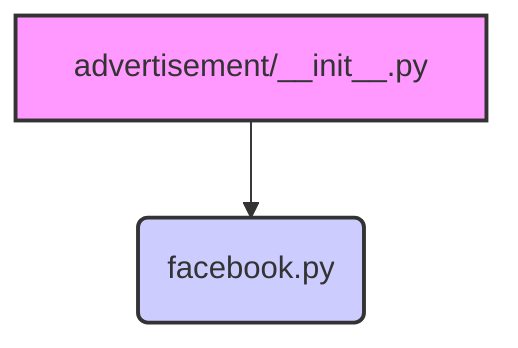

### **Анализ кода `hypotez/src/endpoints/advertisement/__init__.py`**

#### **1. <алгоритм>**:

1.  **Импорт модуля `Facebook`**: Модуль `Facebook` импортируется из текущей директории. Этот модуль, вероятно, содержит классы и функции для взаимодействия с API Facebook для целей рекламы.
2.  **Инициализация пакета**: Файл `__init__.py` указывает, что директория `advertisement` является пакетом Python. Импорт `Facebook` делает его доступным для использования через пакет `advertisement`.

#### **2. <mermaid>**:

**Объяснение зависимостей:**

*   `advertisement/__init__.py`: Инициализирует пакет `advertisement` и импортирует модуль `facebook.py`.
*   `facebook.py`: Содержит логику для взаимодействия с API Facebook.

#### **3. <объяснение>**:

*   **Импорты**:
    *   `from .facebook import Facebook`: Импортирует модуль `Facebook` из подпакета `advertisement`. Это позволяет использовать функциональность, связанную с Facebook, через пакет `advertisement`.
*   **Классы**:
    *   Предположительно, в модуле `Facebook` определены классы для работы с API Facebook.
*   **Функции**:
    *   Файл `__init__.py` не содержит функций. Его основная задача - инициализация пакета и импорт необходимых модулей.
*   **Переменные**:
    *   В данном файле нет явно определенных переменных.

**Потенциальные улучшения:**

*   Добавить документацию к модулю `__init__.py` с описанием назначения пакета `advertisement` и его компонентов.
*   Указать, какие именно классы или функции импортируются из модуля `Facebook`, чтобы улучшить понимание структуры пакета.

**Взаимосвязи с другими частями проекта:**

*   Этот пакет, вероятно, используется для управления рекламными кампаниями в Facebook. Другие части проекта могут использовать этот пакет для создания, обновления или анализа рекламных объявлений.