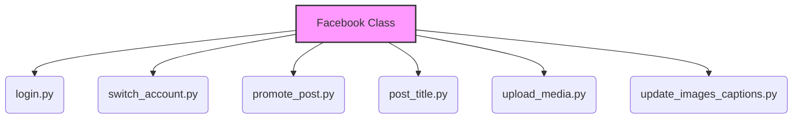

ОК. Приступаю к анализу кода.

```markdown
## Анализ кода `hypotez/src/endpoints/advertisement/facebook/facebook.py`

### 1. <алгоритм>

**Обзор:**

Модуль `facebook.py` предназначен для автоматизации взаимодействия с Facebook через веб-драйвер. Он включает в себя функции для входа в систему, публикации сообщений и загрузки медиафайлов.

**Блок-схема:**

```mermaid
graph LR
    A[Начало] --> B{Инициализация класса Facebook};
    B --> C{Вход в Facebook?};
    C -- Да --> D[Вызов сценария входа login()];
    C -- Нет --> E[Пропуск входа];
    E --> F{Продвижение поста?};
    F -- Да --> G[Вызов сценария promote_post()];
    F -- Нет --> H[Пропуск продвижения поста];
    H --> I{Продвижение события?};
    I -- Да --> J[Вызов сценария promote_event()];
    I -- Нет --> K[Завершение];
    G --> K;
    J --> K;
    D --> F;
```

**Пошаговое описание:**

1.  **Инициализация класса `Facebook`**:
    *   Создается экземпляр класса `Facebook` с передачей драйвера веб-браузера (`driver`), имени промоутера (`promoter`) и списка путей к файлам групп (`group_file_paths`).
    *   Выполняется проверка: находится ли веб-драйвер на странице Facebook.
    *   Если нет, вызывается сценарий входа `login()`.

2.  **Вход в Facebook**:
    *   Функция `login()` вызывается для выполнения процесса входа в Facebook через веб-драйвер.

3.  **Продвижение поста**:
    *   Функция `promote_post(item)` вызывается для отправки сообщения и продвижения поста на Facebook.
    *   `item` - это `SimpleNamespace`, содержащий данные для публикации.
    *   Текст сообщения может содержать символы `;`, которые заменяются на `SHIFT+ENTER`.

4.  **Продвижение события**:
    *   Функция `promote_event(event)` вызывается для продвижения события на Facebook.
    *   `event` - это `SimpleNamespace`, содержащий данные о событии.

### 2. <mermaid>



**Объяснение зависимостей:**

*   `Facebook Class`: Центральный класс, управляющий взаимодействием с Facebook.
*   `login.py`: Сценарий для выполнения входа в Facebook.
*   `switch_account.py`: Сценарий для переключения между аккаунтами Facebook.
*   `promote_post.py`: Сценарий для продвижения поста на Facebook.
*   `post_title.py`: Сценарий для управления заголовками постов.
*   `upload_media.py`: Сценарий для загрузки медиафайлов на Facebook.
*   `update_images_captions.py`: Сценарий для обновления подписей к изображениям.

### 3. <объяснение>

**Импорты:**

*   `os`, `sys`: Стандартные модули Python для работы с операционной системой и системными параметрами.
*   `pathlib.Path`: Класс для представления путей к файлам и каталогам.
*   `typing.Dict`, `typing.List`: Используются для аннотации типов.
*   `src.gs`: Глобальные настройки проекта.
*   `src.utils.jjson.j_loads`, `src.utils.jjson.j_dumps`: Функции для работы с JSON, предположительно, с дополнительной обработкой ошибок или логированием.
*   `src.utils.printer.pprint`: Функция для "pretty printing" данных, используется для отладки.
*   `src.logger.logger.logger`: Объект логгера для записи информации о работе программы.
*   `.scenarios.login.login`: Функция для выполнения сценария входа в Facebook.
*   `.scenarios.switch_account`:  Функция для переключения аккаунта.
*   `.scenarios.promote_post`: Функция для продвижения поста.
*   `.scenarios.upload_media`: Функция для загрузки медиа.
*   `.scenarios.update_images_captions`: Функция для обновления подписей к изображениям.

**Класс `Facebook`:**

*   **Роль:** Управляет взаимодействием с Facebook через веб-драйвер.
*   **Атрибуты:**
    *   `d`: Инстанс веб-драйвера (тип `'Driver'`).
    *   `start_page`: URL страницы Facebook, с которой начинается работа.
    *   `promoter`: Имя промоутера.
*   **Методы:**
    *   `__init__(self, driver: 'Driver', promoter: str, group_file_paths: list[str], *args, **kwards)`: Инициализирует класс, принимает инстанс драйвера, имя промоутера и список путей к файлам групп.
    *   `login(self) -> bool`: Выполняет сценарий входа в Facebook.
    *   `promote_post(self, item: SimpleNamespace) -> bool`: Отправляет сообщение и продвигает пост на Facebook.
    *   `promote_event(self, event: SimpleNamespace)`: Продвигает событие на Facebook.

**Функции:**

*   `login(self) -> bool`:
    *   **Аргументы:** `self` (инстанс класса `Facebook`).
    *   **Возвращаемое значение:** `True`, если вход выполнен успешно, иначе `False`.
    *   **Назначение:** Выполняет сценарий входа в Facebook.
*   `promote_post(self, item: SimpleNamespace) -> bool`:
    *   **Аргументы:**
        *   `self` (инстанс класса `Facebook`).
        *   `item` (`SimpleNamespace`): Объект, содержащий данные для публикации.
    *   **Возвращаемое значение:** `True`, если пост успешно продвинут, иначе `False`.
    *   **Назначение:** Отправляет сообщение и продвигает пост на Facebook.
*   `promote_event(self, event: SimpleNamespace)`:
    *   **Аргументы:**
        *   `self` (инстанс класса `Facebook`).
        *   `event` (`SimpleNamespace`): Объект, содержащий данные о событии.
    *   **Возвращаемое значение:** Отсутствует (None).
    *   **Назначение:** Продвигает событие на Facebook.

**Переменные:**

*   `d`: Инстанс веб-драйвера.
*   `start_page`: URL страницы Facebook.
*   `promoter`: Имя промоутера.

**Потенциальные ошибки и области для улучшения:**

*   Отсутствует обработка ошибок в методах `promote_post` и `promote_event`.
*   Не реализована проверка успешности выполнения сценариев `switch_account`, `promote_post`, `upload_media`, `update_images_captions`.
*   Использование строковой аннотации типа `'Driver'` для `self.d` может привести к проблемам, если класс `Driver` не определен в текущем модуле или не импортирован. Рекомендуется использовать `from typing import TYPE_CHECKING` и `if TYPE_CHECKING: from your_module import Driver`, чтобы избежать циклических импортов.

**Взаимосвязи с другими частями проекта:**

*   Использует `src.gs` для получения глобальных настроек.
*   Использует `src.utils.jjson` для работы с JSON.
*   Использует `src.utils.printer` для отладочной печати.
*   Использует `src.logger.logger` для логирования.
*   Зависит от модулей в директории `.scenarios` для выполнения конкретных действий на Facebook.
```