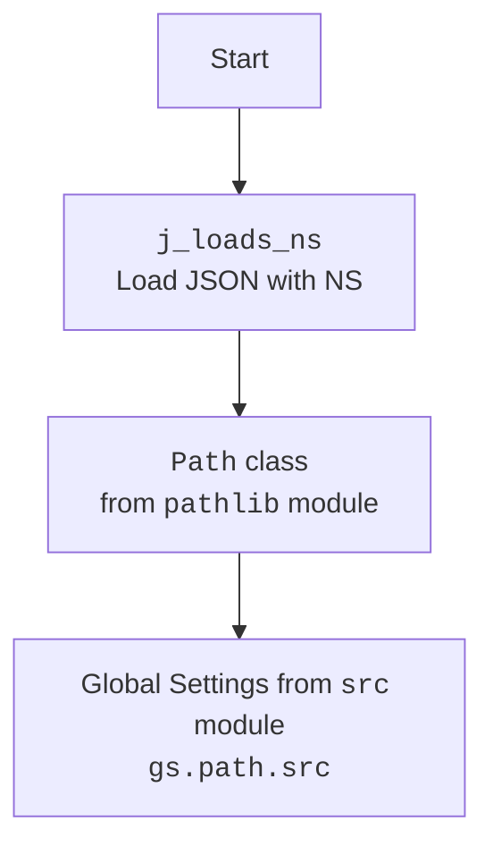

### **Анализ кода `hypotez`**

=========================================================================================

Описание функциональности и анализ кода проекта `hypotez`, расположенного в файле `/src/endpoints/advertisement/facebook/scenarios/login.py`.

#### **1. <алгоритм>**:

1.  **Начало**: Функция `login` принимает экземпляр драйвера `Driver` в качестве аргумента.
2.  **Загрузка учетных данных**: Извлекаются учетные данные Facebook (имя пользователя и пароль) из глобальных настроек `gs.facebook_credentials[0]`.
3.  **Ввод логина**:
    *   Пытается ввести имя пользователя в поле, найденное по локатору `locators.email`.
    *   Если возникает исключение, логируется ошибка и возвращается `False`.
4.  **Ожидание**: Ожидание в течение 1.3 секунды.
5.  **Ввод пароля**:
    *   Пытается ввести пароль в поле, найденное по локатору `locators['password']`.
    *   Если возникает исключение, логируется ошибка и возвращается `False`.
6.  **Ожидание**: Ожидание в течение 0.5 секунды.
7.  **Нажатие кнопки входа**:
    *   Пытается нажать на кнопку входа, найденную по локатору `locators['button']`.
    *   Если возникает исключение, логируется ошибка и возвращается `False`.
8.  **Успех**: Если все шаги выполнены успешно, возвращается `True`.

#### **2. <mermaid>**:

```mermaid
flowchart TD
    A[Начало: Функция login(d: Driver)] --> B{Загрузка учетных данных из gs.facebook_credentials[0]}
    B --> C{Ввод логина в поле locators.email}
    C -- Успех --> D{Ожидание 1.3 секунды}
    C -- Ошибка --> E[Логирование ошибки и возврат False]
    D --> F{Ввод пароля в поле locators['password']}
    F -- Успех --> G{Ожидание 0.5 секунды}
    F -- Ошибка --> H[Логирование ошибки и возврат False]
    G --> I{Нажатие кнопки входа locators['button']}
    I -- Успех --> J[Возврат True]
    I -- Ошибка --> K[Логирование ошибки и возврат False]
    E --> L[Конец]
    H --> L
    K --> L
    J --> L
```



#### **3. <объяснение>**:

*   **Импорты**:
    *   `pathlib.Path`: Используется для работы с путями к файлам.
    *   `typing.Dict`: Используется для аннотации типов.
    *   `src.gs`: Глобальные настройки проекта.
    *   `src.webdriver.driver.Driver`: Драйвер для управления веб-браузером.
    *   `src.utils.jjson.j_loads, j_loads_ns, j_dumps`: Функции для работы с JSON.
    *   `src.logger.logger`: Модуль для логирования.

*   **Переменные**:
    *   `locators`: Словарь с локаторами веб-элементов, загруженный из JSON-файла.
    *   `credentials`: Объект с учетными данными Facebook (имя пользователя и пароль).

*   **Функции**:
    *   `login(d: Driver) -> bool`:
        *   Аргументы:
            *   `d (Driver)`: Экземпляр драйвера для управления веб-браузером.
        *   Возвращаемое значение:
            *   `bool`: `True`, если авторизация прошла успешно, иначе `False`.
        *   Назначение:
            *   Выполняет вход на Facebook, используя предоставленный драйвер и учетные данные.

*   **Потенциальные ошибки и области для улучшения**:

    *   Обработка исключений: В блоках `try...except` логируется только ошибка, но не предпринимается никаких действий для восстановления после ошибки. Возможно, стоит добавить повторные попытки или другие стратегии обработки ошибок.
    *   Использование `j_loads_ns`: Использование `j_loads_ns` для загрузки `login.json` кажется подходящим, учитывая структуру проекта.
    *   Ожидания: Использование `d.wait()` может быть улучшено заменой на `WebDriverWait` с явными условиями ожидания для повышения надежности.
    *   Безопасность: Хранение учетных данных в `gs.facebook_credentials` может быть небезопасным. Рекомендуется использовать более безопасные способы хранения и обработки учетных данных.