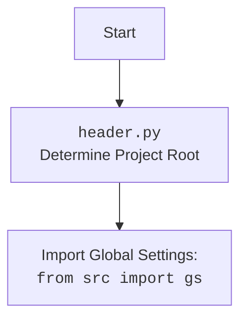

# Проект `hypotez`
# Роль `code explainer`

## АНАЛИЗ КОДА: `hypotez/src/endpoints/gemini_simplechat/main.py`

### 1. Алгоритм

1.  **Инициализация приложения FastAPI**:
    *   Создается экземпляр `FastAPI`.
    *   Конфигурируется `CORSMiddleware` для разрешения запросов с любых доменов (в целях тестирования).
2.  **Определение модели запроса**:
    *   Определяется класс `ChatRequest` с использованием `BaseModel` из `pydantic` для валидации входящих сообщений.
3.  **Инициализация модели Gemini**:
    *   Читается `system_instruction` из файла `instructions/system_instruction.md`.
    *   Создается экземпляр `GoogleGenerativeAI` с использованием ключа API, имени модели и системных инструкций из `gs.credentials.gemini`.
4.  **Определение маршрута `/`**:
    *   При GET-запросе к `/` возвращается HTML-контент из файла, указанного в `gs.fast_api.index_path`.
    *   Если происходит ошибка при чтении файла, возвращается HTTP-исключение с кодом 500.
        *   *Пример*: Если `gs.fast_api.index_path` указывает на несуществующий файл, будет выброшено исключение.
5.  **Определение маршрута `/api/chat`**:
    *   При POST-запросе к `/api/chat` вызывается метод `chat` модели `GoogleGenerativeAI` с сообщением из запроса.
    *   Возвращается JSON-ответ с результатом чата.
    *   При возникновении ошибки логируется сообщение об ошибке и возвращается HTTP-исключение с кодом 500.
        *   *Пример*: Если API-ключ Gemini недействителен, будет выброшено исключение.
6.  **Запуск сервера Uvicorn**:
    *   Если скрипт запускается напрямую (не импортируется как модуль), запускается сервер `uvicorn` с хостом и портом, указанными в `gs.fast_api`.

### 2. Mermaid

```mermaid
flowchart TD
    subgraph FastAPI Application
        A[Create FastAPI app] --> B(Configure CORSMiddleware);
        B --> C{Define ChatRequest model};
        C --> D(Read system_instruction);
        D --> E{Initialize GoogleGenerativeAI model};
    end

    subgraph Route /
        F[GET "/": Read HTML content from file] --> G{Return HTMLResponse};
        G --> H{Handle exceptions};
    end

    subgraph Route /api/chat
        I[POST "/api/chat": Call model.chat(request.message)] --> J{Return {"response": response}};
        J --> K{Handle exceptions and log errors};
    end

    subgraph Uvicorn Server
        L[if __name__ == "__main__":] --> M(Run uvicorn server);
    end

    FastAPI Application --> Route /
    FastAPI Application --> Route /api/chat
```

**Объяснение зависимостей `mermaid`**:

*   `FastAPI`: Основной фреймворк для создания API.
*   `CORSMiddleware`: Middleware для обработки CORS (Cross-Origin Resource Sharing) запросов.
*   `ChatRequest`: Pydantic модель для валидации запросов чата.
*   `GoogleGenerativeAI`: Класс для взаимодействия с моделью Gemini.
*   `Path`: Класс из модуля `pathlib` для работы с путями к файлам.
*   `HTMLResponse`: Класс для возврата HTML-ответов.
*   `uvicorn`: ASGI-сервер для запуска FastAPI-приложения.
*   `gs`: Глобальные настройки приложения.



### 3. Объяснение

#### Импорты:

*   `sys`, `os`: Стандартные модули Python для работы с системными переменными и операционной системой.
*   `Path` (из `pathlib`): Класс для представления путей к файлам и директориям. Используется для чтения HTML-контента и системных инструкций.
*   `SimpleNamespace` (из `types`): Класс для создания объектов с атрибутами, доступными через точку.
*   `CORSMiddleware` (из `fastapi.middleware.cors`): Middleware для настройки CORS, позволяющий браузерам делать запросы к API с других доменов.
*   `FastAPI`, `HTTPException` (из `fastapi`): Основные классы для создания API и обработки HTTP-исключений.
*   `HTMLResponse` (из `fastapi.responses`): Класс для возврата HTML-ответов.
*   `BaseModel` (из `pydantic`): Базовый класс для создания моделей данных с валидацией типов.
*   `uvicorn`: ASGI-сервер для запуска FastAPI-приложения.
*   `header`: Модуль, определяющий корень проекта.
*   `__root__` (из `header`): Корневой путь проекта.
*   `gs` (из `src`): Объект с глобальными настройками приложения.
*   `GoogleGenerativeAI` (из `src.ai`): Класс для взаимодействия с моделью Gemini.
*   `j_loads_ns` (из `src.utils.jjson`): Функция для загрузки JSON-файлов в объект SimpleNamespace.
*   `logger` (из `src.logger`): Модуль для логирования событий.

#### Классы:

*   `ChatRequest` (из `pydantic.BaseModel`):
    *   Роль: Модель данных для запросов чата.
    *   Атрибуты:
        *   `message` (str): Сообщение пользователя.
    *   Методы: Нет.
    *   Взаимодействие: Используется для валидации входящих POST-запросов к `/api/chat`.
*   `GoogleGenerativeAI` (из `src.ai`):
    *   Роль: Класс для взаимодействия с моделью Gemini.
    *   Атрибуты:
        *   `api_key` (str): Ключ API для доступа к Gemini.
        *   `model_name` (str): Имя используемой модели Gemini.
        *   `system_instruction` (str): Системные инструкции для модели.
    *   Методы:
        *   `chat(message: str)`: Асинхронный метод для отправки сообщения в чат и получения ответа.
    *   Взаимодействие: Используется в маршруте `/api/chat` для обработки сообщений пользователей.

#### Функции:

*   `root()`:
    *   Аргументы: Нет.
    *   Возвращаемое значение: `HTMLResponse`.
    *   Назначение: Обрабатывает GET-запросы к `/`, возвращая HTML-контент.
    *   Пример:
        *   Запрос: `GET /`
        *   Ответ: HTML-страница из файла, указанного в `gs.fast_api.index_path`.
*   `chat(request: ChatRequest)`:
    *   Аргументы:
        *   `request` (ChatRequest): Объект с сообщением пользователя.
    *   Возвращаемое значение: `dict`.
    *   Назначение: Обрабатывает POST-запросы к `/api/chat`, отправляя сообщение в модель Gemini и возвращая ответ.
    *   Пример:
        *   Запрос: `POST /api/chat` с JSON-телом `{"message": "Hello"}`
        *   Ответ: `{"response": "Hi there!"}`

#### Переменные:

*   `app` (FastAPI): Экземпляр приложения FastAPI.
*   `system_instruction` (str): Системные инструкции для модели Gemini, прочитанные из файла.
*   `model` (GoogleGenerativeAI): Экземпляр класса `GoogleGenerativeAI`, используемый для взаимодействия с моделью Gemini.

#### Потенциальные ошибки и области для улучшения:

*   Обработка исключений: В маршруте `/api/chat` исключение логируется, но сообщение об ошибке, возвращаемое клиенту, содержит переменную `e`, которая не определена. Следует использовать `ex` вместо `e`.
*   Безопасность: Использование `allow_origins=["*"]` в `CORSMiddleware` не рекомендуется в production-окружении. Следует указать конкретные домены, которым разрешено делать запросы к API.
*   Логирование: Можно добавить больше информации в логи, например, IP-адрес клиента и время запроса.

#### Взаимосвязи с другими частями проекта:

*   `header`: Определяет корневой путь проекта, который используется для чтения HTML-шаблонов.
*   `src.gs`: Содержит глобальные настройки приложения, такие как API-ключ Gemini, имя модели и пути к файлам.
*   `src.ai.GoogleGenerativeAI`: Предоставляет класс для взаимодействия с моделью Gemini.
*   `src.utils.jjson.j_loads_ns`: Используется для загрузки JSON-файлов с настройками.
*   `src.logger.logger`: Используется для логирования ошибок и других событий.