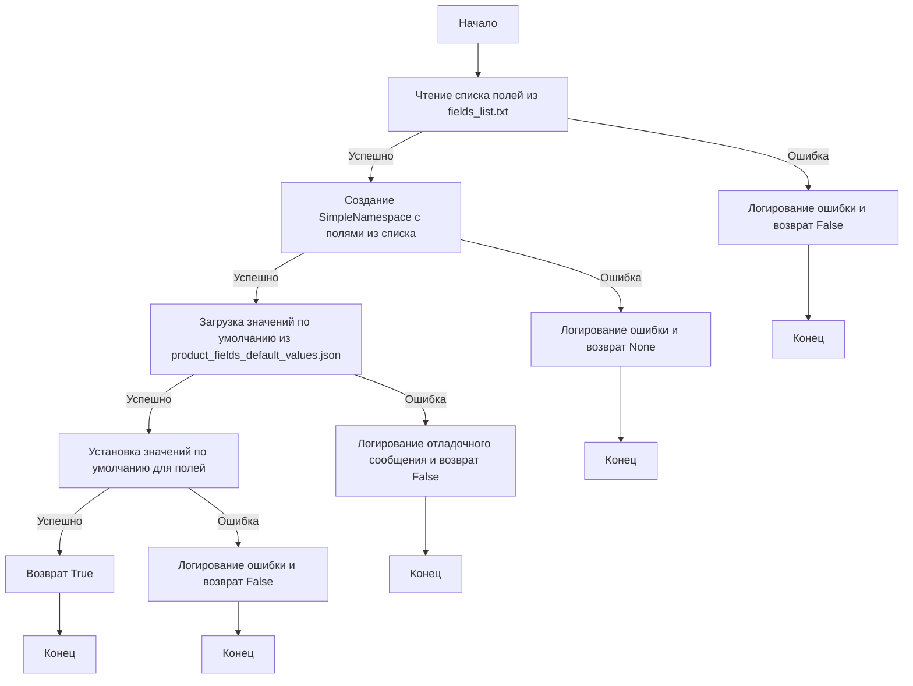
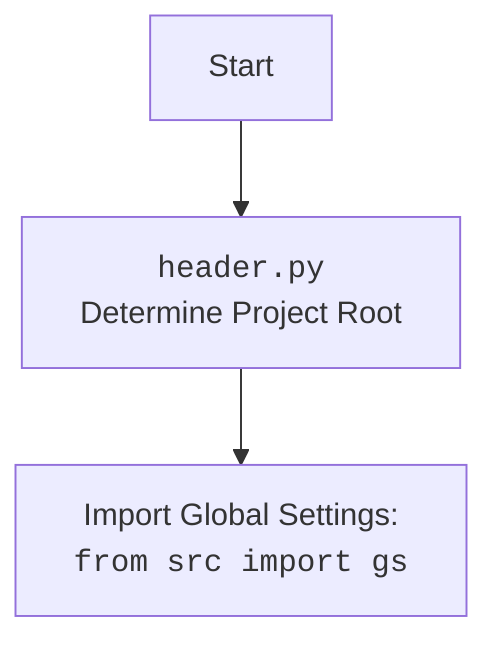

### **Алгоритм**

1.  **Инициализация `ProductFields`**:
    *   При создании экземпляра класса `ProductFields` вызывается метод `__post_init__`, который, в свою очередь, вызывает метод `_payload` для загрузки дефолтных значений полей.
    *   Пример:

    ```python
    product = ProductFields(id_lang=2)
    ```

2.  **Загрузка дефолтных значений полей (`_payload`)**:
    *   Определяется базовый путь к файлам конфигурации и спискам полей.
    *   Считывается список полей из файла `fields_list.txt` с использованием функции `read_text_file` и сохраняется в `presta_fields_list`.
        *   Если `presta_fields_list` пуст, логируется ошибка и возвращается `False`.
        *   Пример:

        ```python
        base_path = __root__ / 'src' / 'endpoints' / 'prestashop'
        presta_fields_list = read_text_file(base_path / 'product_fields' / 'fields_list.txt', as_list=True)
        ```

    *   Создается объект `SimpleNamespace` с атрибутами, соответствующими полям из `presta_fields_list`, и все значения устанавливаются в `None`.
        *   В случае ошибки логируется исключение.
        *   Пример:

        ```python
        self.presta_fields = SimpleNamespace(**{key: None for key in presta_fields_list})
        ```

    *   Загружаются дефолтные значения полей из JSON-файла `product_fields_default_values.json` с использованием функции `j_loads` и сохраняются в `data_dict`.
        *   Если `data_dict` пуст, логируется сообщение об ошибке и возвращается `False`.
        *   Пример:

        ```python
        data_dict = j_loads(base_path / 'product_fields' / 'product_fields_default_values.json')
        ```

    *   Для каждого элемента в `data_dict` устанавливается соответствующий атрибут в `self.presta_fields`.
        *   Пример:

        ```python
        for name, value in data_dict.items():
            setattr(self.presta_fields, name, value)
        ```

3.  **Установка мультиязычного значения (`_set_multilang_value`)**:
    *   Присваивает мультиязычное значение для указанного поля товара.
    *   Формируется структура данных для хранения мультиязычного значения, где `id` — это индекс языка, а `value` — само значение.
        *   Пример:

        ```python
        lang_data = {
            'language': {
                'id': _lang_index
            },
            'value': value
        }
        ```

    *   Проверяется, существует ли уже значение для данного поля. Если нет, создается список и добавляется `lang_data`.
        *   Пример:

        ```python
        if field is None:
            setattr(self.presta_fields, field_name, [lang_data])
        ```

    *   Если поле уже существует, `lang_data` добавляется к существующему списку.
        *   Пример:

        ```python
        field.append(lang_data)
        ```

4.  **Property и Setter методы для полей `ps_product` и `ps_product_lang`**:
    *   Для каждого поля в таблицах `ps_product` и `ps_product_lang` определены property и setter методы. Property методы возвращают текущее значение поля, а setter методы устанавливают новое значение.
    *   Пример для поля `id_product`:

    ```python
    @property
    def id_product(self) -> Optional[int]:
        """property `ps_product.id_product: int(10) unsigned`"""
        return self.presta_fields.id_product

    @id_product.setter
    def id_product(self, value: int = None):
        """setter `ID` товара. Для нового товара id назначается из `PrestaShop`."""
        try:
            self.presta_fields.id_product = value
        except Exception as ex:
            logger.error(f"Ошибка при установке id_product:", ex)
    ```

5.  **Методы для работы с associations (связями)**:
    *   Определены методы для добавления, очистки и получения связей с другими сущностями, такими как категории, изображения и комбинации.
    *   Пример:

    ```python
    def additional_category_append(self, category_id: int | str):
        """Добавляет связь с категорией, если ее еще нет."""
        ...
    ```

6.  **Метод `to_dict`**:
    *   Преобразует объект `ProductFields` в словарь, готовый для отправки в API PrestaShop.
    *   Происходит итерация по всем полям объекта, и если поле имеет значение (не `None` и не пустая строка), оно добавляется в словарь.
        *   Пример:

        ```python
        if self.id_product is not None:
            product_dict["id_product"] = str_val(self.id_product)
        ```

    *   Мультиязычные поля форматируются с использованием метода `_format_multilang_value`.
        *   Пример:

        ```python
        if self.description:
            product_dict["description"] = self._format_multilang_value(self.description)
        ```

    *   Associations также добавляются в словарь, если они существуют.

7.  **Метод `_format_multilang_value`**:
    *   Форматирует мультиязычные значения в список словарей, где каждый словарь содержит `id` и `value` для каждого языка.
    *   Пример:

    ```python
    def _format_multilang_value(self, data: Any) -> List[Dict[str, str]]:
        ...
    ```

### **mermaid**





### **Объяснение**

#### **Импорты**:

*   `asyncio`: Используется для поддержки асинхронных операций. В данном коде напрямую не используется, но может быть необходим для будущих расширений, связанных с асинхронной обработкой данных.
*   `datetime`: Предоставляет классы для работы с датой и временем. Используется для установки значений полей, связанных с датой, таких как `available_date`, `date_add` и `date_upd`.
*   `enum.Enum`: Базовый класс для создания перечислений. Используется для определения типов перечислений, таких как `EnumRedirect` и `EnumCondition`.
*   `dataclasses.dataclass`, `dataclasses.field`: Используются для автоматического создания методов, таких как `__init__`, `__repr__` и `__eq__`, на основе аннотаций типов. Класс `ProductFields` декорирован `@dataclass`.
*   `pathlib.Path`: Предоставляет способ представления путей к файлам и директориям. Используется для работы с путями к файлам конфигурации и спискам полей.
*   `typing.List`, `typing.Dict`, `typing.Optional`, `typing.Any`: Используются для аннотации типов, что улучшает читаемость и помогает в отладке кода.
*   `types.SimpleNamespace`: Простой класс для создания объектов с произвольными атрибутами. Используется для хранения полей товара в `self.presta_fields`.
*   `header`: Содержит общие настройки и переменные для проекта.
*   `src.gs`: Глобальные настройки проекта.
*   `src.utils.jjson.j_loads`, `src.utils.jjson.j_loads_ns`: Функции для загрузки JSON-данных из файлов.
*   `src.utils.file.read_text_file`: Функция для чтения текстовых файлов.
*   `src.utils.string.normalizer`: Модуль, содержащий функции для нормализации данных, такие как `normalize_boolean`, `normalize_float`, `normalize_sql_date` и `normalize_int`.
*   `src.logger.logger`: Модуль для логирования событий.
*   `src.logger.exceptions.ProductFieldException`: Класс исключений, специфичный для работы с полями товаров.

#### **Классы**:

*   `ProductFields`:
    *   **Роль**: Представляет поля товара в формате, соответствующем API PrestaShop.
    *   **Атрибуты**:
        *   `presta_fields` (SimpleNamespace): Объект, хранящий все поля товара.
        *   `id_lang` (int): ID языка, используемого для мультиязычных полей.
    *   **Методы**:
        *   `__post_init__`: Инициализирует объект, вызывая метод `_payload` для загрузки дефолтных значений.
        *   `_payload`: Загружает дефолтные значения полей из файлов конфигурации.
        *   `_set_multilang_value`: Устанавливает мультиязычное значение для заданного поля.
        *   Property и setter методы для каждого поля в таблицах `ps_product` и `ps_product_lang`.
        *   Методы для работы с associations (связями).
        *   `to_dict`: Преобразует объект в словарь, готовый для отправки в API PrestaShop.
        *   `_format_multilang_value`: Форматирует мультиязычные значения для API PrestaShop.
    *   **Взаимодействие с другими компонентами**:
        *   Использует `j_loads` для загрузки данных из JSON-файлов.
        *   Использует `read_text_file` для чтения списка полей из текстового файла.
        *   Использует `logger` для логирования ошибок и отладочных сообщений.
        *   Использует `normalize_float` для нормализации значений.
*   `EnumRedirect`:
    *   **Роль**: Перечисление для типов редиректов.
    *   **Элементы**:
        *   `ERROR_404`
        *   `REDIRECT_301_PRODUCT`
        *   `REDIRECT_302_PRODUCT`
        *   `REDIRECT_301_CATEGORY`
        *   `REDIRECT_302_CATEGORY`
*   `EnumCondition`:
    *   **Роль**: Перечисление для состояний товара.
    *   **Элементы**:
        *   `NEW`
        *   `USED`
        *   `REFURBISHED`
*   `EnumVisibity`:
    *   **Роль**: Перечисление для видимости товара.
    *   **Элементы**:
        *   `BOTH`
        *   `CATALOG`
        *   `SEARCH`
        *   `NONE`
*   `EnumProductType`:
    *   **Роль**: Перечисление для типов товаров.
    *   **Элементы**:
        *   `STANDARD`
        *   `PACK`
        *   `VIRTUAL`
        *   `COMBINATIONS`
        *   `EMPTY`

#### **Функции**:

*   `_payload(self) -> bool`:
    *   **Аргументы**:
        *   `self`: Экземпляр класса `ProductFields`.
    *   **Возвращаемое значение**:
        *   `bool`: `True`, если загрузка прошла успешно, иначе `False`.
    *   **Назначение**: Загружает дефолтные значения полей из файлов конфигурации.
    *   **Пример**:

    ```python
    self._payload()
    ```

*   `_set_multilang_value(self, field_name: str, value: str) -> bool`:
    *   **Аргументы**:
        *   `self`: Экземпляр класса `ProductFields`.
        *   `field_name` (str): Имя поля.
        *   `value` (str): Значение для установки.
    *   **Возвращаемое значение**:
        *   `bool`: `True`, если установка значения прошла успешно, иначе `None`.
    *   **Назначение**: Устанавливает мультиязычное значение для заданного поля.
    *   **Пример**:

    ```python
    self._set_multilang_value('name', 'Example Product')
    ```

*   `to_dict(self) -> Dict[str, Any]`:
    *   **Аргументы**:
        *   `self`: Экземпляр класса `ProductFields`.
    *   **Возвращаемое значение**:
        *   `Dict[str, Any]`: Словарь с полями, готовый для PrestaShop API.
    *   **Назначение**: Преобразует объект `ProductFields` в словарь для PrestaShop API.
    *   **Пример**:

    ```python
    product_dict = self.to_dict()
    ```

*   `_format_multilang_value(self, data: Any) -> List[Dict[str, str]]`:
    *   **Аргументы**:
        *   `self`: Экземпляр класса `ProductFields`.
        *   `data` (Any): Значение поля.
    *   **Возвращаемое значение**:
        *   `List[Dict[str, str]]`: Список словарей с мультиязычными значениями.
    *   **Назначение**: Форматирует мультиязычные значения в список словарей для PrestaShop API.
    *   **Пример**:

    ```python
    formatted_value = self._format_multilang_value('Example')
    ```

#### **Переменные**:

*   `presta_fields` (SimpleNamespace): Объект, хранящий все поля товара.
*   `id_lang` (int): ID языка, используемого для мультиязычных полей.
*   `base_path` (Path): Базовый путь к файлам конфигурации.
*   `presta_fields_list` (list): Список полей, прочитанных из файла `fields_list.txt`.
*   `data_dict` (dict): Словарь с дефолтными значениями полей, прочитанными из JSON-файла.

#### **Потенциальные ошибки и области для улучшения**:

*   Обработка ошибок:
    *   В некоторых блоках `try...except` логируется ошибка, но не предпринимается никаких действий для восстановления или обработки исключения.
    *   Рекомендуется добавить логику обработки исключений, чтобы предотвратить сбои в работе программы.
*   Типизация:
    *   В некоторых местах отсутствует точная типизация. Например, в методе `_format_multilang_value` не указан тип для переменной `data`.
    *   Рекомендуется добавить аннотации типов для улучшения читаемости и предотвращения ошибок.
*   Дублирование кода:
    *   Многие property и setter методы для полей `ps_product` и `ps_product_lang` имеют схожую структуру.
    *   Рекомендуется рассмотреть возможность использования метаклассов или дескрипторов для уменьшения дублирования кода.
*   Метод `images_urls_append`:
    *   Происходит проверка `if 'images_urls' not in self.assist_fields_dict:`, где `self.assist_fields_dict` не определен. Предположительно, здесь должна быть проверка в `self.presta_fields`.

#### **Взаимосвязи с другими частями проекта**:

*   `header`: Используется для определения корневого пути проекта (`__root__`).
*   `src.gs`: Используется для получения глобальных настроек проекта.
*   `src.utils.jjson`: Используется для загрузки JSON-данных из файлов конфигурации.
*   `src.utils.file`: Используется для чтения текстовых файлов.
*   `src.utils.string.normalizer`: Используется для нормализации данных.
*   `src.logger`: Используется для логирования событий.

Этот код предназначен для управления и представления полей товара в PrestaShop, обеспечивая гибкий и структурированный способ работы с данными товаров через API.