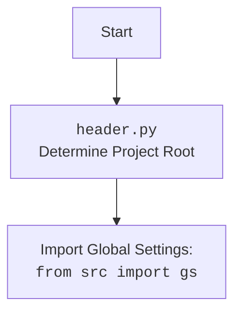

### **Анализ кода проекта `hypotez`**

=========================================================================================

#### **1. <алгоритм>**:

Модуль `logger.py` предназначен для логирования сообщений различных уровней (INFO, DEBUG, ERROR, WARNING, CRITICAL) в консоль и в файлы. Он использует паттерн Singleton для обеспечения единственного экземпляра логгера. Вот пошаговое описание работы:

1.  **Инициализация**:
    *   При первом вызове `Logger()` создается экземпляр класса. Метакласс `SingletonMeta` гарантирует, что последующие вызовы `Logger()` будут возвращать тот же экземпляр.
    *   В `__init__` определяются пути к файлам логов (info.log, debug.log, errors.log, json). Если пути не переданы, используются значения по умолчанию.
    *   Создаются директории и файлы логов, если они не существуют.

2.  **Создание логгеров**:
    *   Создаются отдельные логгеры для консоли, файлов info, debug, errors и json.
    *   Для каждого файлового логгера добавляется обработчик (`logging.FileHandler`), который записывает сообщения в соответствующий файл.
    *   Для json-логгера используется кастомный форматтер `JsonFormatter`, который форматирует сообщения в JSON.

3.  **Метод `log`**:
    *   Этот метод является центральным для логирования сообщений. Он принимает уровень логирования, сообщение и опциональные параметры (исключение, цвет).
    *   Форматирует сообщение с помощью `_format_message`, добавляя к нему символ уровня логирования и цвет (если указан).
    *   Выводит отформатированное сообщение в консоль и записывает в соответствующие файлы.

4.  **Методы уровней логирования**:
    *   Методы `info`, `debug`, `warning`, `error`, `critical` являются обертками для метода `log`. Они устанавливают уровень логирования и цвет по умолчанию для каждого типа сообщений.

**Пример**:

```python
logger.info('Сообщение для info лога', text_color='green')
```

В данном примере:

*   Вызывается метод `info` с сообщением и указанием зеленого цвета текста.
*   Метод `info` вызывает метод `log` с уровнем `logging.INFO`.
*   Метод `log` форматирует сообщение, добавляя к нему символ `ℹ️` и зеленый цвет.
*   Отформатированное сообщение выводится в консоль и записывается в файл `info.log`.

#### **2. <mermaid>**:

```mermaid
flowchart TD
    A[Logger Instance] --> B{SingletonMeta}
    B -- First Instance? --> C{Create New Instance}
    C --> D[Initialize Logger]
    D --> E[Define Log Paths]
    E --> F[Create Directories and Files]
    F --> G[Create Loggers (console, info, debug, errors, json)]
    G --> H[Add Handlers to Loggers]
    H --> I[Set Formatters for Handlers]
    I --> J[log(level, message, ...)]
    J --> K{_format_message()}
    K --> L[Format Message with Color and Symbol]
    L --> M[Output to Console and Files]
    B -- Existing Instance --> A
    style A fill:#f9f,stroke:#333,stroke-width:2px
```

**Объяснение диаграммы:**

1.  **Logger Instance**: Начальная точка, представляющая попытку получить экземпляр логгера.
2.  **SingletonMeta**: Метакласс, управляющий созданием экземпляров логгера. Проверяет, существует ли уже экземпляр класса.
3.  **Create New Instance**: Если это первый вызов, создается новый экземпляр логгера.
4.  **Initialize Logger**: Инициализация экземпляра логгера.
5.  **Define Log Paths**: Определение путей к файлам логов.
6.  **Create Directories and Files**: Создание необходимых директорий и файлов логов.
7.  **Create Loggers (console, info, debug, errors, json)**: Создание отдельных логгеров для консоли и файлов.
8.  **Add Handlers to Loggers**: Добавление обработчиков к логгерам для записи сообщений в соответствующие места (консоль или файлы).
9.  **Set Formatters for Handlers**: Установка форматтеров для обработчиков, определяющих формат записи сообщений.
10. **log(level, message, ...)**: Метод логирования сообщений.
11. **\_format\_message()**: Форматирование сообщения с добавлением цвета и символа уровня логирования.
12. **Format Message with Color and Symbol**: Процесс форматирования сообщения.
13. **Output to Console and Files**: Вывод сообщения в консоль и запись в файлы логов.

**Дополнительный `mermaid` блок для `header.py`**:



#### **3. <объяснение>**:

**Импорты**:

*   `logging`: Стандартный модуль Python для логирования.
*   `colorama`: Модуль для добавления цветов в вывод консоли.
*   `datetime`: Модуль для работы с датой и временем.
*   `json`: Модуль для работы с JSON.
*   `inspect`: Модуль для интроспекции кода (получение информации о текущем стеке вызовов).
*   `threading`: Модуль для работы с потоками.
*   `pathlib`: Модуль для работы с путями к файлам и директориям.
*   `typing`: Модуль для аннотации типов.
*   `types`: Модуль, содержащий определения встроенных типов.
*   `header`: Локальный модуль, определяющий корневой каталог проекта.

**Классы**:

*   `SingletonMeta`: Метакласс, реализующий паттерн Singleton. Гарантирует, что у класса будет только один экземпляр.
*   `JsonFormatter`: Пользовательский форматтер для логирования в формате JSON.
*   `Logger`: Основной класс логгера. Реализует Singleton pattern, позволяет логировать сообщения в консоль и файлы разных уровней.

**Функции**:

*   `__init__(self, info_log_path=None, debug_log_path=None, errors_log_path=None, json_log_path=None)`: Конструктор класса `Logger`. Инициализирует пути к файлам логов, создает директории и файлы, создает логгеры и добавляет обработчики.
*   `_format_message(self, message, ex=None, color=None, level=None)`: Форматирует сообщение, добавляя к нему символ уровня логирования и цвет (если указан).
*   `_ex_full_info(self, ex)`: Возвращает полную информацию об исключении, включая имя файла, имя функции и номер строки, где произошло исключение.
*   `log(self, level, message, ex=None, exc_info=False, color=None)`: Общий метод для логирования сообщений на указанном уровне.
*   `info(self, message, ex=None, exc_info=False, text_color='green', bg_color='')`: Логирует информационное сообщение.
*   `success(self, message, ex=None, exc_info=False, text_color='yellow', bg_color='')`: Логирует сообщение об успехе.
*   `warning(self, message, ex=None, exc_info=False, text_color='light_red', bg_color='')`: Логирует предупреждение.
*   `debug(self, message, ex=None, exc_info=True, text_color='cyan', bg_color='')`: Логирует отладочное сообщение.
*   `exception(self, message, ex=None, exc_info=True, text_color='cyan', bg_color='light_gray')`: Логирует сообщение об исключении.
*   `error(self, message, ex=None, exc_info=True, text_color='red', bg_color='')`: Логирует сообщение об ошибке.
*   `critical(self, message, ex=None, exc_info=True, text_color='red', bg_color='white')`: Логирует критическое сообщение.

**Переменные**:

*   `TEXT_COLORS`: Словарь, содержащий коды цветов текста для `colorama`.
*   `BG_COLORS`: Словарь, содержащий коды цветов фона для `colorama`.
*   `LOG_SYMBOLS`: Словарь, содержащий символы для разных уровней логирования.
*   `logger`: Экземпляр класса `Logger`.

**Потенциальные ошибки и области для улучшения**:

*   В методе `_ex_full_info` глубина стека вызовов захардкожена на 3 (`inspect.stack()[3]`). Это может быть ненадежно, если метод вызывается из другого места.
*   Обработка исключений в методе `log` может быть улучшена. Сейчас, если `exc_info` и `ex` указаны, используется `self.logger_console.exception(formatted_message)`, что может привести к дублированию информации в логах.

**Взаимосвязи с другими частями проекта**:

*   Модуль `header` используется для определения корневого каталога проекта. Это позволяет логгеру находить файл конфигурации (`config.json`) и пути к файлам логов.

```python
config = SimpleNamespace(
    **json.loads(Path(__root__ / "src" / "config.json").read_text(encoding="UTF-8"))
)
```

Здесь `__root__` определяется в модуле `header` и представляет собой корневой каталог проекта.