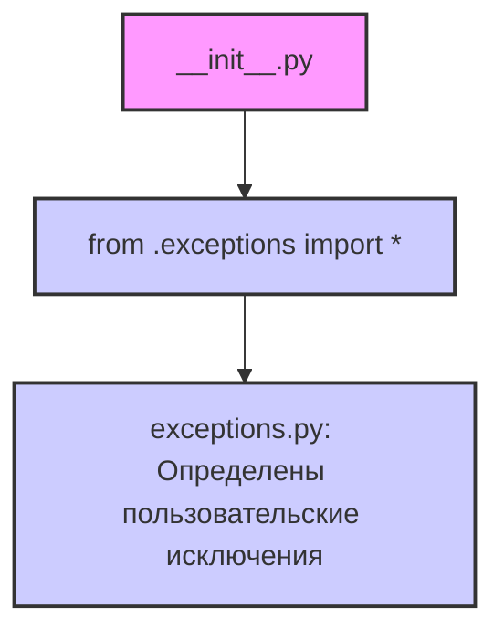

## Анализ кода `hypotez/src/suppliers/aliexpress/api/errors/__init__.py`

### 1. <алгоритм>

1.  **Импорт модуля `exceptions`**: Импортируются все элементы из модуля `exceptions`, находящегося в той же директории.
2.  **Экспорт содержимого**: Все классы и функции, определенные в модуле `exceptions`, становятся доступными для использования в других частях проекта, которые импортируют `src.suppliers.aliexpress.api.errors`.

Пример:
Допустим, в `exceptions.py` определен класс `APIError`.
```python
# exceptions.py
class APIError(Exception):
    def __init__(self, message):
        self.message = message

    def __str__(self):
        return self.message
```
Тогда в других модулях его можно использовать следующим образом:
```python
# some_module.py
from src.suppliers.aliexpress.api.errors import APIError

try:
    # Что-то, что может вызвать ошибку API
    raise APIError('Произошла ошибка API')
except APIError as e:
    print(f'Ошибка: {e}')
```

### 2. <mermaid>



**Объяснение зависимостей `mermaid`:**

*   `__init__.py`:  Этот файл является частью пакета `src.suppliers.aliexpress.api.errors` и служит для инициализации пакета.
*   `from .exceptions import *`:  Эта строка импортирует все имена (классы, функции, переменные) из модуля `exceptions.py`, находящегося в той же директории. Это позволяет использовать исключения, определенные в `exceptions.py`, напрямую через пакет `src.suppliers.aliexpress.api.errors`.
*   `exceptions.py`:  Этот файл содержит определения пользовательских классов исключений, специфичных для API Aliexpress.

### 3. <объяснение>

**Импорты:**

*   `from .exceptions import *`: Импортирует все классы исключений, определенные в файле `exceptions.py`, расположенном в той же директории. Это позволяет другим модулям в проекте использовать эти исключения, импортируя только пакет `src.suppliers.aliexpress.api.errors`.

**Файлы:**

*   `__init__.py`:  Делает пакет `src.suppliers.aliexpress.api.errors` доступным для импорта. Он импортирует все исключения из `exceptions.py`, что позволяет использовать их через импорт пакета.
*   `exceptions.py`: Содержит определения пользовательских исключений.

**Потенциальные улучшения и ошибки:**

*   Использование `import *` может привести к конфликту имен, если в `exceptions.py` определены имена, которые уже используются в текущем модуле. Рекомендуется явно указывать, какие имена импортировать: `from .exceptions import APIError, ...`.
*   Необходимо убедиться, что все исключения, определенные в `exceptions.py`, имеют содержательные имена и документацию, чтобы разработчики могли правильно их использовать и обрабатывать.