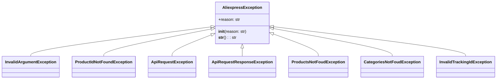

## Анализ кода `hypotez/src/suppliers/aliexpress/api/errors/exceptions.py`

### 1. <алгоритм>

Этот модуль определяет набор пользовательских исключений, специфичных для работы с AliExpress API. Все исключения наследуются от базового класса `AliexpressException`.

1.  **`AliexpressException`**:
    *   Базовый класс для всех исключений AliExpress API.
    *   Принимает аргумент `reason` (строка), который описывает причину исключения.
    *   Метод `__str__` возвращает строку с описанием причины исключения.

    ```python
    class AliexpressException(Exception):
        def __init__(self, reason: str):
            super().__init__()
            self.reason = reason

        def __str__(self) -> str:
            return '%s' % self.reason
    ```

    *Пример:*

    ```python
    raise AliexpressException('Generic AliExpress API error')
    ```

2.  **`InvalidArgumentException`**:
    *   Вызывается, когда аргументы, переданные в API, некорректны.
    *   Наследуется от `AliexpressException`.

    ```python
    class InvalidArgumentException(AliexpressException):
        pass
    ```

    *Пример:*

    ```python
    raise InvalidArgumentException('Invalid product ID format')
    ```

3.  **`ProductIdNotFoundException`**:
    *   Вызывается, когда ID продукта не найден.
    *   Наследуется от `AliexpressException`.

    ```python
    class ProductIdNotFoundException(AliexpressException):
        pass
    ```

    *Пример:*

    ```python
    raise ProductIdNotFoundException('Product ID 12345 not found')
    ```

4.  **`ApiRequestException`**:
    *   Вызывается, когда запрос к AliExpress API завершается неудачно.
    *   Наследуется от `AliexpressException`.

    ```python
    class ApiRequestException(AliexpressException):
        pass
    ```

    *Пример:*

    ```python
    raise ApiRequestException('Failed to connect to AliExpress API')
    ```

5.  **`ApiRequestResponseException`**:
    *   Вызывается, когда ответ от AliExpress API не является валидным.
    *   Наследуется от `AliexpressException`.

    ```python
    class ApiRequestResponseException(AliexpressException):
        pass
    ```

    *Пример:*

    ```python
    raise ApiRequestResponseException('Invalid JSON response from API')
    ```

6.  **`ProductsNotFoudException`**:
    *   Вызывается, когда продукты не найдены.
    *   Наследуется от `AliexpressException`.

    ```python
    class ProductsNotFoudException(AliexpressException):
        pass
    ```

    *Пример:*

    ```python
    raise ProductsNotFoudException('No products found matching the criteria')
    ```

7.  **`CategoriesNotFoudException`**:
    *   Вызывается, когда категории не найдены.
    *   Наследуется от `AliexpressException`.

    ```python
    class CategoriesNotFoudException(AliexpressException):
        pass
    ```

    *Пример:*

    ```python
    raise CategoriesNotFoudException('No categories found')
    ```

8.  **`InvalidTrackingIdException`**:
    *   Вызывается, когда идентификатор отслеживания не существует или является недействительным.
    *   Наследуется от `AliexpressException`.

    ```python
    class InvalidTrackingIdException(AliexpressException):
        pass
    ```

    *Пример:*

    ```python
    raise InvalidTrackingIdException('Invalid tracking ID format')
    ```

### 2. <mermaid>



**Объяснение зависимостей:**

*   `AliexpressException` является базовым классом для всех остальных исключений. Это означает, что `InvalidArgumentException`, `ProductIdNotFoundException`, `ApiRequestException`, `ApiRequestResponseException`, `ProductsNotFoudException`, `CategoriesNotFoudException` и `InvalidTrackingIdException` наследуют свои свойства и методы от `AliexpressException`.
*   `reason` - это атрибут базового класса, который содержит описание ошибки.

### 3. <объяснение>

**Импорты:**

*   `# -*- coding: utf-8 -*-` - указывает кодировку файла как UTF-8. Это необходимо для правильной обработки символов, отличных от ASCII.

**Классы:**

*   **`AliexpressException(Exception)`**:
    *   **Роль**: Базовый класс для всех исключений, специфичных для AliExpress API.
    *   **Атрибуты**:
        *   `reason` (str): Описание причины исключения.
    *   **Методы**:
        *   `__init__(self, reason: str)`: Конструктор класса. Принимает строку `reason` в качестве аргумента и инициализирует атрибут `self.reason`.
        *   `__str__(self) -> str`: Возвращает строковое представление исключения, которое содержит описание причины исключения.
    *   **Взаимодействие**: Все остальные классы исключений в этом модуле наследуются от `AliexpressException`.

*   **`InvalidArgumentException(AliexpressException)`**:
    *   **Роль**: Исключение, которое вызывается, когда аргументы, переданные в API, некорректны.
    *   **Атрибуты**: Нет дополнительных атрибутов, кроме тех, что наследуются от `AliexpressException`.
    *   **Методы**: Нет дополнительных методов, кроме тех, что наследуются от `AliexpressException`.

*   **`ProductIdNotFoundException(AliexpressException)`**:
    *   **Роль**: Исключение, которое вызывается, когда ID продукта не найден.
    *   **Атрибуты**: Нет дополнительных атрибутов, кроме тех, что наследуются от `AliexpressException`.
    *   **Методы**: Нет дополнительных методов, кроме тех, что наследуются от `AliexpressException`.

*   **`ApiRequestException(AliexpressException)`**:
    *   **Роль**: Исключение, которое вызывается, когда запрос к AliExpress API завершается неудачно.
    *   **Атрибуты**: Нет дополнительных атрибутов, кроме тех, что наследуются от `AliexpressException`.
    *   **Методы**: Нет дополнительных методов, кроме тех, что наследуются от `AliexpressException`.

*   **`ApiRequestResponseException(AliexpressException)`**:
    *   **Роль**: Исключение, которое вызывается, когда ответ от AliExpress API не является валидным.
    *   **Атрибуты**: Нет дополнительных атрибутов, кроме тех, что наследуются от `AliexpressException`.
    *   **Методы**: Нет дополнительных методов, кроме тех, что наследуются от `AliexpressException`.

*   **`ProductsNotFoudException(AliexpressException)`**:
    *   **Роль**: Исключение, которое вызывается, когда продукты не найдены.
    *   **Атрибуты**: Нет дополнительных атрибутов, кроме тех, что наследуются от `AliexpressException`.
    *   **Методы**: Нет дополнительных методов, кроме тех, что наследуются от `AliexpressException`.

*   **`CategoriesNotFoudException(AliexpressException)`**:
    *   **Роль**: Исключение, которое вызывается, когда категории не найдены.
    *   **Атрибуты**: Нет дополнительных атрибутов, кроме тех, что наследуются от `AliexpressException`.
    *   **Методы**: Нет дополнительных методов, кроме тех, что наследуются от `AliexpressException`.

*   **`InvalidTrackingIdException(AliexpressException)`**:
    *   **Роль**: Исключение, которое вызывается, когда идентификатор отслеживания не существует или является недействительным.
    *   **Атрибуты**: Нет дополнительных атрибутов, кроме тех, что наследуются от `AliexpressException`.
    *   **Методы**: Нет дополнительных методов, кроме тех, что наследуются от `AliexpressException`.

**Функции:**

В данном модуле нет функций, только классы исключений.

**Переменные:**

В данном модуле нет глобальных переменных.

**Потенциальные ошибки или области для улучшения:**

*   **Единообразие**: Все классы исключений, кроме `AliexpressException`, не имеют собственной реализации `__init__`.  Было бы полезно добавить конструкторы для каждого класса исключений, даже если они просто вызывают `super().__init__(reason)`, чтобы можно было передавать более конкретные сообщения об ошибках.

**Взаимосвязи с другими частями проекта:**

Этот модуль используется другими модулями в проекте `hypotez`, которые взаимодействуют с AliExpress API.  Когда происходит ошибка при взаимодействии с API, вызывается одно из этих исключений, что позволяет вызывающему коду корректно обработать ошибку.  Например, модуль, который получает информацию о продукте, может вызвать `ProductIdNotFoundException`, если продукт с указанным ID не найден.