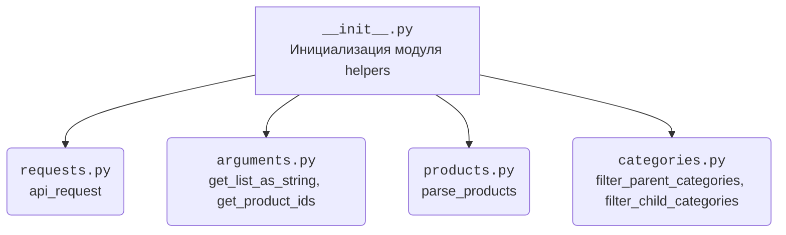

### **Анализ кода `hypotez/src/suppliers/aliexpress/api/helpers/__init__.py`**

#### **1. <алгоритм>**:

Этот файл (`__init__.py`) служит для упрощения импорта различных модулей и функций, связанных с API AliExpress. Он собирает в себе все необходимые компоненты, чтобы их можно было легко импортировать из одного места.

1.  **Импорт `api_request`**: Функция для выполнения API-запросов к AliExpress.

    *   Пример: `from .requests import api_request`
2.  **Импорт `get_list_as_string` и `get_product_ids`**: Функции для обработки аргументов запроса.

    *   `get_list_as_string` преобразует список в строку.
        *   Пример: `from .arguments import get_list_as_string`
    *   `get_product_ids` извлекает идентификаторы продуктов.
        *   Пример: `from .arguments import get_product_ids`
3.  **Импорт `parse_products`**: Функция для разбора данных о продуктах, полученных из API.

    *   Пример: `from .products import parse_products`
4.  **Импорт `filter_parent_categories` и `filter_child_categories`**: Функции для фильтрации категорий.

    *   `filter_parent_categories` фильтрует родительские категории.
        *   Пример: `from .categories import filter_parent_categories`
    *   `filter_child_categories` фильтрует дочерние категории.
        *   Пример: `from .categories import filter_child_categories`

#### **2. <mermaid>**:

**Объяснение зависимостей в `mermaid`**:

*   `__init__.py`: Инициализирует модуль `helpers` и собирает в себе импорты из других модулей.
*   `requests.py`: Содержит функцию `api_request` для выполнения запросов к API AliExpress.
*   `arguments.py`: Содержит функции `get_list_as_string` и `get_product_ids` для обработки аргументов запроса.
*   `products.py`: Содержит функцию `parse_products` для разбора данных о продуктах.
*   `categories.py`: Содержит функции `filter_parent_categories` и `filter_child_categories` для фильтрации категорий.

#### **3. <объяснение>**:

**Импорты**:

*   `.requests import api_request`: Импортирует функцию `api_request` из модуля `requests.py`, который, вероятно, содержит логику для отправки HTTP-запросов к API AliExpress.
*   `.arguments import get_list_as_string, get_product_ids`: Импортирует функции `get_list_as_string` и `get_product_ids` из модуля `arguments.py`. Эти функции, вероятно, используются для форматирования и подготовки аргументов для API-запросов.
*   `.products import parse_products`: Импортирует функцию `parse_products` из модуля `products.py`. Эта функция, вероятно, используется для обработки и структурирования данных о продуктах, полученных от API AliExpress.
*   `.categories import filter_parent_categories, filter_child_categories`: Импортирует функции `filter_parent_categories` и `filter_child_categories` из модуля `categories.py`. Эти функции, вероятно, используются для фильтрации и организации категорий продуктов.

**Роль файла**:

Файл `__init__.py` в директории `helpers` служит для организации и упрощения доступа к функциям, которые используются для взаимодействия с API AliExpress. Он действует как единая точка входа для импорта этих функций в другие модули проекта.

**Возможные улучшения**:

*   Добавить документацию к каждой из импортированных функций, чтобы было легче понять их назначение и использование.
*   Рассмотреть возможность добавления обработки исключений для более надежной работы.