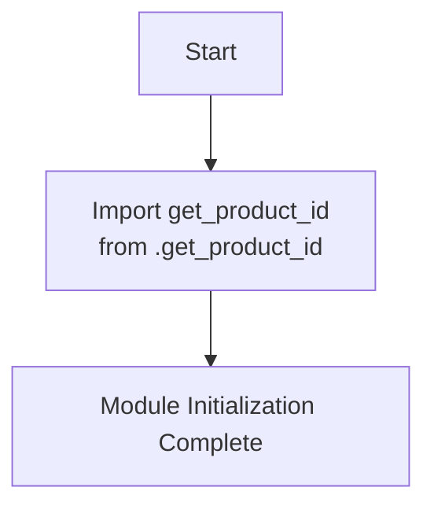

## Анализ кода `hypotez/src/suppliers/aliexpress/api/tools/__init__.py`

### 1. <алгоритм>

#### Блок-схема:
1. **Начало**: Инициализация модуля `src.suppliers.aliexpress.api.tools`.
2. **Импорт**: Импорт функции `get_product_id` из модуля `.get_product_id`.
3. **Конец**: Завершение инициализации модуля.

#### Пример:

```python
# Пример использования функции get_product_id
from src.suppliers.aliexpress.api.tools import get_product_id

product_url = "https://www.aliexpress.com/item/1005006280991420.html"
product_id = get_product_id(product_url)
print(f"Product ID: {product_id}")
```

### 2. <mermaid>



**Анализ зависимостей:**
- `get_product_id`: Функция, импортируемая из модуля `.get_product_id`, предположительно предназначенная для извлечения идентификатора продукта из URL AliExpress.

### 3. <объяснение>

#### Общее описание
Файл `__init__.py` в директории `src/suppliers/aliexpress/api/tools` служит для инициализации пакета `tools`. Он импортирует функцию `get_product_id` из модуля `.get_product_id`, делая её доступной для использования при импорте пакета `tools`.

#### Импорты
- `.get_product_id`: Импортирует функцию `get_product_id` из одноименного модуля. Эта функция, вероятно, содержит логику для извлечения ID продукта из URL, полученного с сайта AliExpress.

#### Функции
- `get_product_id`: Функция, предназначенная для извлечения идентификатора продукта из URL AliExpress.

#### Переменные
В данном коде отсутствуют явно объявленные переменные. Однако, функция `get_product_id` может использовать переменные внутри себя для обработки URL и извлечения ID.

#### Потенциальные ошибки и области для улучшения
- **Обработка ошибок**: Необходимо предусмотреть обработку ошибок в функции `get_product_id`, чтобы избежать неожиданных сбоев при некорректном формате URL или отсутствии ID.
- **Логирование**: Добавить логирование для отслеживания работы функции и записи ошибок.