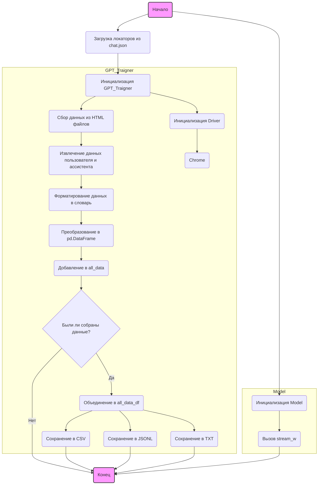
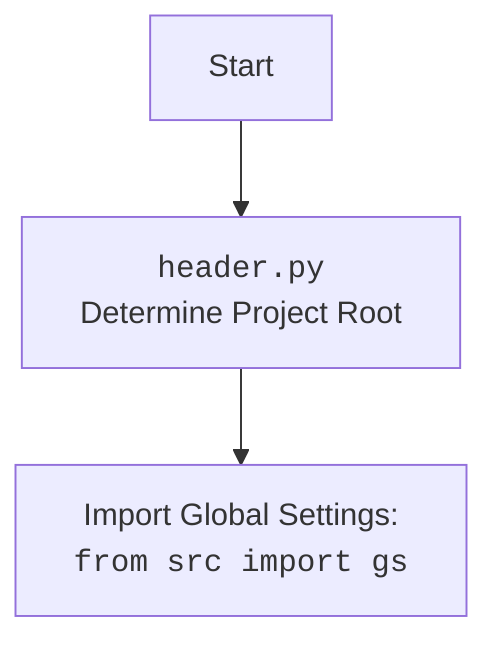

## \\file /src/suppliers/chat_gpt/gpt_traigner.py

### <алгоритм>

1.  **Инициализация:**
    *   Создается экземпляр класса `GPT_Traigner`.
    *   Инициализируется `Driver` с типом браузера `Chrome`.
    *   Инициализируется `GptGs`.
    *   Загружаются локаторы из `chat.json`.

2.  **Сбор данных:**
    *   Функция `dump_downloaded_conversations` собирает HTML-файлы из указанной директории (`gs.path.google_drive / 'chat_gpt' / 'conversation'`).
    *   Для каждого HTML-файла:
        *   Извлекается URI файла.
        *   `Driver` переходит по URI файла.
        *   Извлекаются элементы, соответствующие пользователю и ассистенту, с использованием локаторов.
        *   Извлекается текст из найденных элементов.
        *   Данные форматируются в виде словаря, содержащего роли ('user', 'assistant'), контент (текст пользователя и ассистента) и сентимент ('neutral', 'neutral').
        *   Каждый словарь преобразуется в `pd.DataFrame` и добавляется в список `all_data`.
        *   Выводится информация о количестве обработанных файлов.
    *   Если данные были собраны:
        *   Список `pd.DataFrame` объединяется в один `all_data_df`.
        *   `all_data_df` сохраняется в формате CSV (`all_conversations.csv`) и JSONL (`all_conversations.jsonl`).
        *   Содержимое столбца 'content' из `all_data_df` объединяется в одну строку и сохраняется в текстовый файл (`raw_conversations.txt`).

3.  **Использование модели:**
    *   Создается экземпляр класса `Model`.
    *   Вызывается метод `stream_w` для обработки данных из CSV-файла (`all_conversations.csv`).

### <mermaid>

Диаграмма `mermaid` описывает процесс сбора данных из HTML-файлов и их последующей обработки. Сначала происходит инициализация класса `GPT_Traigner`, загрузка локаторов и инициализация драйвера `Chrome`. Затем запускается процесс сбора данных, который включает извлечение данных пользователя и ассистента, форматирование данных, добавление их в список и сохранение в различных форматах (CSV, JSONL, TXT). После этого происходит инициализация класса `Model` и вызов метода `stream_w` для обработки данных.

### <объяснение>

*   **Импорты:**
    *   `re`: Используется для работы с регулярными выражениями. В данном коде не используется.
    *   `argparse`: Используется для разбора аргументов командной строки. В данном коде не используется.
    *   `asyncio`: Используется для написания конкурентного кода с использованием синтаксиса async/await.
    *   `pathlib.Path`: Используется для представления путей к файлам и директориям.
    *   `itertools.zip_longest`: Используется для итерации по нескольким итерируемым объектам параллельно.
    *   `pandas as pd`: Используется для анализа и манипулирования данными, в частности, для создания DataFrame.
    *   `aioconsole.ainput`: Используется для асинхронного ввода данных с консоли. В данном коде не используется.
    *   `header`: Локальный модуль, вероятно, содержащий общие функции или переменные для проекта.
    *   `src.gs`: Локальный модуль, вероятно, содержащий глобальные настройки и пути.
    *   `src.logger.logger`: Локальный модуль для логирования событий.
    *   `src.suppliers.chat_gpt.GptGs`: Локальный модуль, вероятно, содержащий специфичные настройки для GPT.
    *   `src.webdriver.driver.Driver, Chrome, Firefox, Edge`: Локальные модули для управления веб-браузером.
    *   `src.ai.openai.model.Model`: Локальный модуль, представляющий модель OpenAI.
    *   `src.utils.jjson.j_dumps, j_loads, j_loads_ns, clean_string`: Локальные модули для работы с JSON.
    *   `src.utils.convertors.dict2csv, json2csv`: Локальные модули для преобразования данных в CSV формат.
    *   `src.utils.printer.pprint`: Локальный модуль для "красивого" вывода данных.

*   **Класс `GPT_Traigner`:**
    *   `driver`: Атрибут класса, представляющий экземпляр класса `Driver` с типом браузера `Chrome`.
    *   `__init__`: Метод инициализации класса.
        *   Инициализирует атрибут `gs` экземпляром класса `GptGs`.
    *   `determine_sentiment`: Определяет сентимент для пары диалогов. В текущей реализации всегда возвращает "positive".
    *   `save_conversations_to_jsonl`: Сохраняет список диалогов в формате JSONL.
    *   `dump_downloaded_conversations`: Собирает диалоги из HTML-файлов, извлекает текст пользователя и ассистента, форматирует данные и сохраняет их в CSV, JSONL и TXT файлы.

*   **Функции:**
    *   `determine_sentiment(self, conversation_pair: dict[str, str], sentiment: str = 'positive') -> str`: Определяет сентимент для пары диалогов.
        *   `conversation_pair`: Словарь, содержащий пару диалогов.
        *   `sentiment`: Сентимент (по умолчанию 'positive').
        *   Возвращает строку "positive" или "negative".
    *   `save_conversations_to_jsonl(self, data: list[dict], output_file: str)`: Сохраняет список диалогов в формате JSONL.
        *   `data`: Список словарей, содержащих диалоги.
        *   `output_file`: Путь к файлу для сохранения.
        *   Ничего не возвращает.
    *   `dump_downloaded_conversations(self)`: Собирает диалоги из HTML-файлов и сохраняет их в CSV, JSONL и TXT файлы.
        *   Ничего не принимает.
        *   Ничего не возвращает.

*   **Переменные:**
    *   `locator`: Словарь, содержащий локаторы для поиска элементов на веб-странице.
    *   `traigner`: Экземпляр класса `GPT_Traigner`.
    *   `model`: Экземпляр класса `Model`.

*   **Потенциальные ошибки и области для улучшения:**
    *   В функции `determine_sentiment` всегда возвращается "positive" или "negative" в зависимости от наличия аргумента `sentiment`.
    *   В функции `dump_downloaded_conversations` не обрабатываются ошибки, которые могут возникнуть при чтении HTML-файлов или извлечении данных.
    *   Жестко заданные пути к файлам и директориям.
    *   Не используется модуль `re` и `argparse`.
    *   Не используется асинхронный ввод `aioconsole.ainput`.

*   **Взаимосвязи с другими частями проекта:**
    *   Используется модуль `header` для определения корневой директории проекта.
    *   Используется модуль `src.gs` для получения глобальных настроек и путей.
    *   Используется модуль `src.logger.logger` для логирования событий.
    *   Используется модуль `src.suppliers.chat_gpt.GptGs` для получения специфичных настроек для GPT.
    *   Используются модули `src.webdriver.driver.Driver, Chrome, Firefox, Edge` для управления веб-браузером.
    *   Используется модуль `src.ai.openai.model.Model` для работы с моделью OpenAI.
    *   Используются модули `src.utils.jjson.j_dumps, j_loads, j_loads_ns, clean_string` для работы с JSON.
    *   Используются модули `src.utils.convertors.dict2csv, json2csv` для преобразования данных в CSV формат.
    *   Используется модуль `src.utils.printer.pprint` для "красивого" вывода данных.