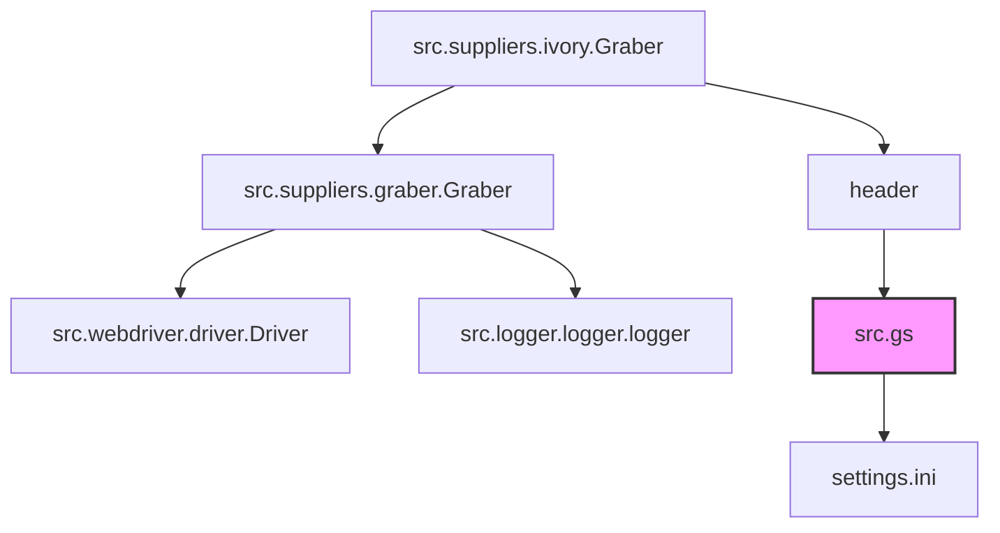
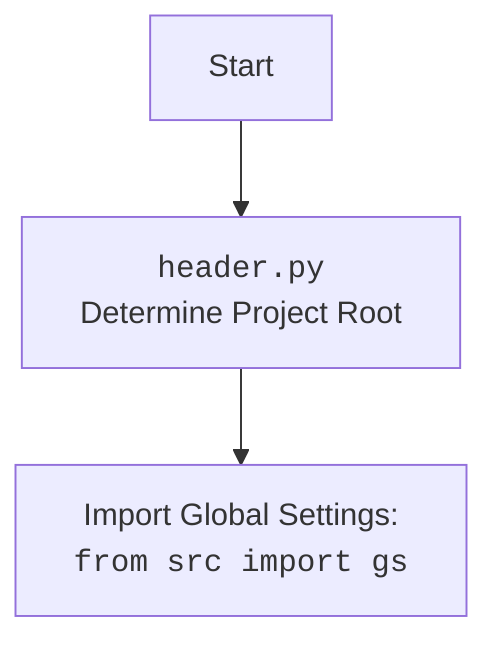

# Проект `hypotez`
# Роль `code explainer`
## АНАЛИЗ КОДА: `hypotez/src/suppliers/ivory/graber.py`

### 1. <алгоритм>

1.  **Инициализация**:
    *   Класс `Graber` наследуется от класса `Graber` (который, вероятно, является базовым классом для граберов) из модуля `src.suppliers.graber`.
    *   При инициализации устанавливается префикс поставщика (`supplier_prefix`) как `'ivory'`.
    *   Вызывается конструктор родительского класса с указанием префикса поставщика, драйвера и индекса языка.
    *   Устанавливается `Context.locator_for_decorator` в `None`.

2.  **Декоратор (закомментированный)**:
    *   Присутствует закомментированный код, предназначенный для реализации декоратора `@close_pop_up`. Этот декоратор должен закрывать всплывающие окна перед выполнением основной логики функции.
    *   Если `Context.locator_for_decorator` установлен, декоратор пытается выполнить локатор для закрытия всплывающего окна.

#### Блок-схема:

```mermaid
graph LR
    A[Начало] --> B{Инициализация класса Graber};
    B --> C{Установка supplier_prefix = 'ivory'};
    C --> D{Вызов конструктора родительского класса Graber};
    D --> E{Установка Context.locator_for_decorator = None};
    E --> F{Проверка наличия декоратора @close_pop_up (закомментирован)};
    F -- Да --> G{Выполнение локатора для закрытия всплывающего окна, если Context.locator_for_decorator установлен};
    G --> H[Конец];
    F -- Нет --> H;
```

### 2. <mermaid>



#### Объяснение зависимостей:

*   `src.suppliers.ivory.Graber`: Класс, который является основной частью этого файла. Он зависит от `src.suppliers.graber.Graber` (родительский класс), `src.webdriver.driver.Driver` (для управления веб-драйвером) и `src.logger.logger.logger` (для логирования).
*   `src.suppliers.graber.Graber`: Родительский класс для `Graber`, вероятно, содержит общую логику для граберов.
*   `src.webdriver.driver.Driver`: Класс для управления веб-драйвером, используется для взаимодействия с веб-страницами.
*   `src.logger.logger.logger`: Модуль для логирования событий и ошибок.
*   `header`: Файл определяющий корневую директорию проекта. Нужен для корректной работы импортов.
    *   `src.gs`: Глобальные настройки.
        *   `settings.ini`: Конфигурационный файл, содержащий глобальные настройки.



### 3. <объяснение>

#### Импорты:

*   `typing.Any`: Используется для аннотации типов, когда тип переменной может быть любым.
*   `header`:  Определяет корневую директорию проекта. Нужен для корректной работы импортов.
*   `src.suppliers.graber.Graber as Grbr`: Импортирует базовый класс `Graber` из модуля `src.suppliers.graber` и переименовывает его в `Grbr` для краткости. Этот класс, вероятно, содержит общую логику для всех граберов.
*   `src.suppliers.graber.Context`: Импортирует класс `Context` из модуля `src.suppliers.graber`. Этот класс, вероятно, используется для хранения контекстной информации, такой как драйвер и локаторы.
*   `src.suppliers.graber.close_pop_up`: Импортирует функцию `close_pop_up` из модуля `src.suppliers.graber`. Вероятно, используется для закрытия всплывающих окон.
*   `src.webdriver.driver.Driver`: Импортирует класс `Driver` из модуля `src.webdriver.driver`. Этот класс используется для управления веб-драйвером, например, для открытия страниц, поиска элементов и выполнения JavaScript.
*   `src.logger.logger.logger`: Импортирует модуль `logger` из `src.logger.logger`. Используется для логирования событий и ошибок.

#### Классы:

*   `Graber(Grbr)`:
    *   Роль: Класс для сбора данных с веб-сайта `ivory.co.il`.
    *   Атрибуты:
        *   `supplier_prefix (str)`: Префикс поставщика, установлен в `'ivory'`.
    *   Методы:
        *   `__init__(self, driver: Driver, lang_index)`: Конструктор класса. Инициализирует `supplier_prefix`, вызывает конструктор родительского класса и устанавливает `Context.locator_for_decorator` в `None`.

#### Переменные:

*   `supplier_prefix (str)`: Префикс поставщика, используется для идентификации поставщика.
* `Context.locator_for_decorator`: Если установлено значение - то оно выполнится в декораторе `@close_pop_up`

#### Потенциальные ошибки и области для улучшения:

*   **Закомментированный декоратор**: Код декоратора `@close_pop_up` закомментирован. Если этот декоратор необходим, его следует раскомментировать и настроить.
*   **Обработка исключений в декораторе**: В закомментированном коде декоратора есть блок `try...except` для обработки исключений при выполнении локатора. Однако, исключение просто логируется, и выполнение продолжается. Возможно, следует добавить более надежную обработку исключений.
*   **Отсутствие реализации `...`**: В закомментированном коде декоратора есть строка `...`. Это означает, что код не реализован полностью и требует доработки.

#### Взаимосвязи с другими частями проекта:

*   Класс `Graber` наследуется от базового класса `Graber` из модуля `src.suppliers.graber`, что указывает на общую архитектуру для граберов разных поставщиков.
*   Используется класс `Driver` из модуля `src.webdriver.driver` для управления веб-драйвером, что позволяет взаимодействовать с веб-страницами.
*   Используется модуль `logger` из `src.logger.logger` для логирования событий и ошибок, что помогает в отладке и мониторинге работы грабера.