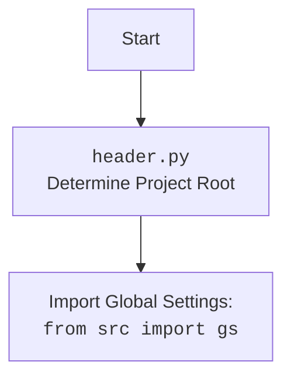

ОК. Вот анализ кода в формате Markdown:

```md
# Анализ кода `hypotez/src/utils/string/header.py`

## 1. <алгоритм>

Этот скрипт предназначен для определения корневой директории проекта и загрузки основных настроек проекта из файла `settings.json`.

**Блок-схема:**

1.  **Определение корневой директории проекта (`set_project_root`)**:
    *   Начать с директории, в которой находится текущий файл.
    *   Проверить, содержит ли текущая директория или любая из ее родительских директорий маркерные файлы (например, `__root__`, `.git`).
    *   Если маркерный файл найден, установить родительскую директорию в качестве корневой директории проекта.
    *   Добавить корневую директорию проекта в `sys.path`, чтобы обеспечить корректные импорты модулей.

    ```python
    # Пример:
    # Если файл находится в /path/to/project/src/utils/string/header.py
    # и /path/to/project/ содержит файл .git,
    # то корневой директорией будет /path/to/project/
    ```

2.  **Загрузка настроек из `settings.json`**:
    *   Попытаться открыть и прочитать файл `settings.json`, расположенный в директории `src` относительно корневой директории проекта.
    *   Если файл существует и является корректным JSON, загрузить настройки в словарь `settings`.
    *   Если файл не найден или содержит некорректный JSON, пропустить этот шаг.

    ```python
    # Пример:
    # Если settings.json содержит {"project_name": "hypotez", "version": "1.0.0"},
    # то словарь settings будет содержать эти значения.
    ```

3.  **Загрузка документации из `README.MD`**:
    *   Попытаться открыть и прочитать файл `README.MD`, расположенный в директории `src` относительно корневой директории проекта.
    *   Если файл существует, загрузить содержимое в строковую переменную `doc_str`.
    *   Если файл не найден, пропустить этот шаг.

    ```python
    # Пример:
    # Если README.MD содержит "Описание проекта",
    # то переменная doc_str будет содержать эту строку.
    ```

4.  **Определение переменных проекта**:
    *   Использовать значения из словаря `settings` для определения основных переменных проекта, таких как `__project_name__`, `__version__`, `__author__`, `__copyright__`, `__cofee__`.
    *   Если словарь `settings` не был загружен (например, файл `settings.json` не найден), установить значения по умолчанию.

    ```python
    # Пример:
    # Если settings содержит {"project_name": "hypotez"},
    # то __project_name__ будет равно "hypotez".
    # Если settings не содержит "project_name",
    # то __project_name__ будет равно "hypotez" (значение по умолчанию).
    ```

## 2. <mermaid>

```mermaid
flowchart TD
    Start --> FindRoot[Найти корневую директорию проекта (set_project_root)]
    FindRoot --> CheckMarkerFiles[Проверить наличие маркерных файлов (__root__, .git)]
    CheckMarkerFiles -- Найдено --> SetRoot[Установить корневую директорию]
    CheckMarkerFiles -- Не найдено --> UseCurrentDir[Использовать текущую директорию]
    SetRoot --> AddToSysPath[Добавить в sys.path]
    UseCurrentDir --> AddToSysPath
    AddToSysPath --> LoadSettings[Загрузить настройки из settings.json]
    LoadSettings -- Файл найден --> ParseSettings[Парсинг settings.json]
    LoadSettings -- Файл не найден --> SetDefaults[Установить значения по умолчанию]
    ParseSettings --> SetProjectVars[Установить переменные проекта]
    SetDefaults --> SetProjectVars
    LoadReadme[Загрузить документацию из README.MD]
    SetProjectVars --> LoadReadme
    LoadReadme -- Файл найден --> ReadmeParse[Парсинг README.MD]
    LoadReadme -- Файл не найден --> IgnoreReadme[Игнорировать README.MD]
    ReadmeParse --> End[Конец]
    IgnoreReadme --> End

```

**Объяснение диаграммы `mermaid`:**

*   **Start**: Начало скрипта.
*   **FindRoot**: Функция `set_project_root` пытается найти корневую директорию проекта, начиная с директории, содержащей скрипт.
*   **CheckMarkerFiles**: Проверяет наличие маркерных файлов (например, `__root__`, `.git`) в текущей или родительских директориях.
*   **SetRoot**: Если маркерные файлы найдены, устанавливает родительскую директорию в качестве корневой.
*   **UseCurrentDir**: Если маркерные файлы не найдены, использует директорию, содержащую скрипт, в качестве корневой.
*   **AddToSysPath**: Добавляет корневую директорию в `sys.path` для обеспечения корректных импортов.
*   **LoadSettings**: Пытается загрузить настройки из файла `settings.json`.
*   **ParseSettings**: Если файл `settings.json` найден, парсит его содержимое.
*   **SetDefaults**: Если файл `settings.json` не найден, устанавливает значения по умолчанию для переменных проекта.
*   **SetProjectVars**: Устанавливает переменные проекта, такие как `__project_name__`, `__version__` и т. д., используя загруженные настройки или значения по умолчанию.
*   **LoadReadme**: Пытается загрузить документацию из файла `README.MD`.
*   **ReadmeParse**: Если файл `README.MD` найден, парсит его содержимое.
*   **IgnoreReadme**: Если файл `README.MD` не найден, игнорирует его.
*   **End**: Конец скрипта.



## 3. <объяснение>

**Импорты:**

*   `sys`: Используется для работы с системными переменными, в частности, для добавления корневой директории проекта в `sys.path`.
*   `json`: Используется для чтения данных из файла `settings.json`.
*   `packaging.version.Version`: Используется для работы с версиями пакетов.
*   `pathlib.Path`: Используется для работы с путями к файлам и директориям.
*   `src.gs`:  Используется для доступа к глобальным настройкам проекта.

**Функции:**

*   `set_project_root(marker_files: tuple = ('__root__', '.git')) -> Path`:
    *   **Аргументы**:
        *   `marker_files` (tuple): Список файлов или директорий, которые используются для определения корневой директории проекта. По умолчанию `('__root__', '.git')`.
    *   **Возвращаемое значение**:
        *   `Path`: Путь к корневой директории проекта.
    *   **Назначение**:
        *   Функция определяет корневую директорию проекта, начиная с директории, в которой находится текущий файл, и двигаясь вверх по дереву директорий, пока не будет найдена директория, содержащая один из маркерных файлов.
        *   Добавляет найденную корневую директорию в `sys.path`, чтобы обеспечить корректные импорты модулей.

**Переменные:**

*   `__root__` (Path): Путь к корневой директории проекта.
*   `settings` (dict): Словарь, содержащий настройки проекта, загруженные из файла `settings.json`.
*   `__project_name__` (str): Название проекта.
*   `__version__` (str): Версия проекта.
*   `__doc__` (str): Документация проекта (содержимое файла `README.MD`).
*   `__author__` (str): Автор проекта.
*   `__copyright__` (str): Информация об авторских правах.
*   `__cofee__` (str): Сообщение с предложением поддержать разработчика.

**Потенциальные ошибки и области для улучшения:**

*   Обработка ошибок при чтении файлов `settings.json` и `README.MD` выполняется с помощью `try...except`, но логирование ошибок отсутствует. Рекомендуется добавить логирование с использованием модуля `logger` для упрощения отладки.
*   В случае, если файлы `settings.json` или `README.MD` не найдены, используются значения по умолчанию для переменных проекта. Возможно, стоит добавить механизм для генерации исключения или предупреждения в таких случаях, чтобы уведомить пользователя о проблеме.

**Взаимосвязи с другими частями проекта:**

*   Этот скрипт является центральным для определения корневой директории проекта и загрузки основных настроек. Он используется другими модулями проекта для определения путей к файлам и директориям, а также для доступа к настройкам проекта.
*   Переменная `__root__` используется другими модулями для построения путей к файлам и директориям относительно корневой директории проекта.
*   Словарь `settings` используется другими модулями для доступа к настройкам проекта, таким как название проекта, версия, автор и т. д.

```python
# Пример использования logger.error:
import json
from pathlib import Path
import sys

from packaging.version import Version

from src import gs

def set_project_root(marker_files: tuple = ('__root__', '.git')) -> Path:
    """
    Finds the root directory of the project starting from the current file's directory,
    searching upwards and stopping at the first directory containing any of the marker files.

    Args:
        marker_files (tuple): Filenames or directory names to identify the project root.

    Returns:
        Path: Path to the root directory if found, otherwise the directory where the script is located.
    """
    __root__: Path
    current_path: Path = Path(__file__).resolve().parent
    __root__ = current_path
    for parent in [current_path] + list(current_path.parents):
        if any((parent / marker).exists() for marker in marker_files):
            __root__ = parent
            break
    if __root__ not in sys.path:
        sys.path.insert(0, str(__root__))
    return __root__


# Get the root directory of the project
__root__: Path = set_project_root()
"""__root__ (Path): Path to the root directory of the project"""


settings: dict = None
try:
    with open(gs.path.root / 'src' / 'settings.json', 'r') as settings_file:
        settings = json.load(settings_file)
except (FileNotFoundError, json.JSONDecodeError) as e:
    import logging
    logging.error(f'Error while loading settings.json: {e}', exc_info=True)


doc_str: str = None
try:
    with open(gs.path.root / 'src' / 'README.MD', 'r') as settings_file:
        doc_str = settings_file.read()
except (FileNotFoundError, json.JSONDecodeError) as e:
    import logging
    logging.error(f'Error while loading README.MD: {e}', exc_info=True)


__project_name__ = settings.get("project_name", 'hypotez') if settings else 'hypotez'
__version__: str = settings.get("version", '') if settings else ''
__doc__: str = doc_str if doc_str else ''
__details__: str = ''
__author__: str = settings.get("author", '') if settings else ''
__copyright__: str = settings.get("copyrihgnt", '') if settings else ''
__cofee__: str = settings.get("cofee",
                              "Treat the developer to a cup of coffee for boosting enthusiasm in development: https://boosty.to/hypo69") if settings else "Treat the developer to a cup of coffee for boosting enthusiasm in development: https://boosty.to/hypo69"
```