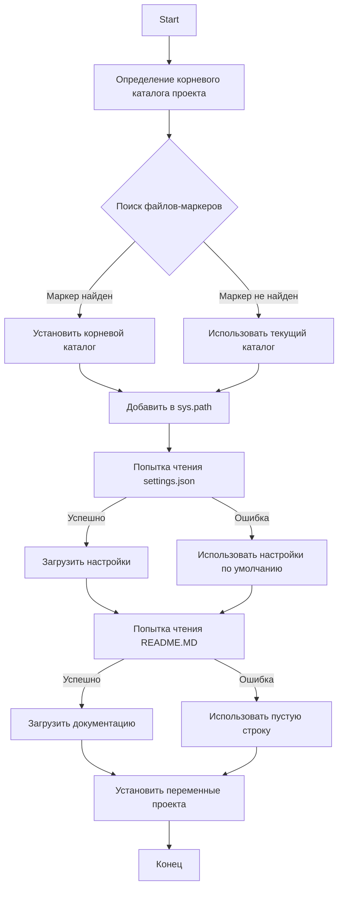
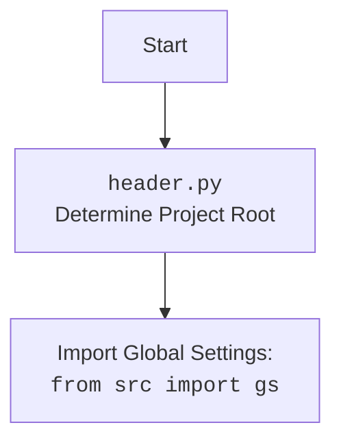

# Проект `hypotez`
# Роль `code explainer`
## АНАЛИЗ КОДА: `hypotez/src/ai/dialogflow/header.py`

### 1. <алгоритм>

**Блок-схема рабочего процесса:**

```mermaid
graph TD
    A[Начало] --> B{Определить корневой каталог проекта};
    B --> C{Поиск файлов-маркеров (например, '__root__', '.git')};
    C --> D{Найден ли маркер?};
    D -- Да --> E[Установить корневой каталог проекта];
    D -- Нет --> F[Использовать текущий каталог как корневой];
    E --> G[Добавить корневой каталог в sys.path];
    F --> G;
    G --> H{Попытка чтения settings.json};
    H --> I{Файл найден и успешно прочитан?};
    I -- Да --> J[Загрузить настройки из settings.json];
    I -- Нет --> K[Использовать значения по умолчанию];
    J --> L{Попытка чтения README.MD};
    K --> L;
    L --> M{Файл найден и успешно прочитан?};
    M -- Да --> N[Загрузить документацию из README.MD];
    M -- Нет --> O[Использовать пустую строку для документации];
    N --> P[Установить переменные проекта (__project_name__, __version__, и т.д.)];
    O --> P;
    P --> Q[Конец];
```

**Примеры для каждого логического блока:**

1.  **Определение корневого каталога проекта**:

    *   Начинаем с текущего каталога файла `header.py`.
    *   Ищем файлы-маркеры (`__root__`, `.git`) в текущем и родительских каталогах.
    *   Если маркер найден, устанавливаем родительский каталог как корневой.
    *   Если нет, используем каталог, где находится `header.py`.
2.  **Чтение `settings.json`**:

    *   Пытаемся открыть и прочитать `settings.json` из `src/settings.json` относительно корневого каталога.
    *   Если файл найден и успешно прочитан, загружаем настройки.
    *   Если файл не найден или произошла ошибка при чтении JSON, используем значения по умолчанию.
3.  **Чтение `README.MD`**:

    *   Пытаемся открыть и прочитать `README.MD` из `src/README.MD` относительно корневого каталога.
    *   Если файл найден и успешно прочитан, загружаем документацию.
    *   Если файл не найден или произошла ошибка при чтении, используем пустую строку для документации.
4.  **Установка переменных проекта**:

    *   Используем значения из `settings.json` для установки переменных проекта, таких как `__project_name__`, `__version__`, `__author__`, `__copyright__` и `__cofee__`.
    *   Если `settings.json` не был успешно прочитан, используются значения по умолчанию.

### 2. <mermaid>



**Объяснение зависимостей:**

*   `pathlib.Path`: Используется для работы с путями к файлам и каталогам.
*   `sys`: Используется для добавления корневого каталога проекта в `sys.path`.
*   `json`: Используется для чтения данных из `settings.json`.
*   `packaging.version.Version`: Используется для работы с версиями пакетов.



### 3. <объяснение>

**Импорты**:

*   `sys`: Предоставляет доступ к некоторым переменным и функциям, взаимодействующим с интерпретатором Python. Здесь используется для добавления корневой директории проекта в `sys.path`, чтобы обеспечить доступ к модулям проекта.
*   `json`: Используется для работы с данными в формате JSON. В данном коде используется для чтения файла `settings.json`, который содержит настройки проекта.
*   `packaging.version.Version`: Используется для работы с версиями пакетов.
*   `pathlib.Path`: Предоставляет способ представления путей к файлам и директориям, что упрощает операции с файловой системой.

**Функции**:

*   `set_project_root(marker_files=('__root__', '.git')) -> Path`:
    *   **Аргументы**:
        *   `marker_files` (tuple): Кортеж имен файлов или директорий, которые используются для определения корневой директории проекта. По умолчанию `('__root__', '.git')`.
    *   **Возвращаемое значение**:
        *   `Path`: Объект `Path`, представляющий корневую директорию проекта.
    *   **Назначение**:
        *   Функция определяет корневую директорию проекта, начиная поиск от директории текущего файла и двигаясь вверх по дереву директорий. Поиск останавливается, когда найдена директория, содержащая один из файлов-маркеров.
    *   **Пример**:
        ```python
        root_path = set_project_root()
        print(root_path)  # Вывод: /путь/к/корневой/директории/проекта
        ```

**Переменные**:

*   `__root__`: Объект `Path`, представляющий корневую директорию проекта. Инициализируется результатом вызова функции `set_project_root()`.
*   `settings`: Словарь, содержащий настройки проекта, загруженные из файла `settings.json`.
*   `doc_str`: Строка, содержащая документацию проекта, загруженную из файла `README.MD`.
*   `__project_name__`: Строка, содержащая имя проекта. Значение по умолчанию — `'hypotez'`.
*   `__version__`: Строка, содержащая версию проекта. Значение по умолчанию — `''`.
*   `__doc__`: Строка, содержащая документацию проекта. Значение по умолчанию — `''`.
*   `__details__`: Строка, содержащая детали проекта. Значение по умолчанию — `''`.
*   `__author__`: Строка, содержащая имя автора проекта. Значение по умолчанию — `''`.
*   `__copyright__`: Строка, содержащая информацию об авторских правах проекта. Значение по умолчанию — `''`.
*   `__cofee__`: Строка, содержащая сообщение о поддержке разработчика. Значение по умолчанию — `"Treat the developer to a cup of coffee for boosting enthusiasm in development: https://boosty.to/hypo69"`.

**Потенциальные ошибки и области для улучшения**:

*   **Обработка ошибок чтения файлов**: В случае, если файлы `settings.json` или `README.MD` не найдены или не могут быть прочитаны, в коде используется `...`. Необходимо заменить это на логирование ошибок с использованием `logger.error` и, возможно, предусмотреть альтернативные действия (например, загрузку настроек по умолчанию).

**Взаимосвязи с другими частями проекта**:

*   Файл `header.py` используется для определения корневой директории проекта и загрузки общих настроек, которые затем используются в других модулях. Это позволяет избежать дублирования кода и обеспечивает централизованное управление конфигурацией проекта.
*   Импорт `from src import gs` указывает на использование глобальных настроек, определенных в модуле `gs` внутри пакета `src`.

```python
# пример с использованием logger.error
import logging
logger = logging.getLogger(__name__)

settings:dict = None
try:
    with open(gs.path.root / 'src' /  'settings.json', 'r') as settings_file:
        settings = json.load(settings_file)
except (FileNotFoundError, json.JSONDecodeError) as e:
    logger.error(f'Error while loading settings.json: {e}', exc_info=True)
    settings = {}  # Provide a default value