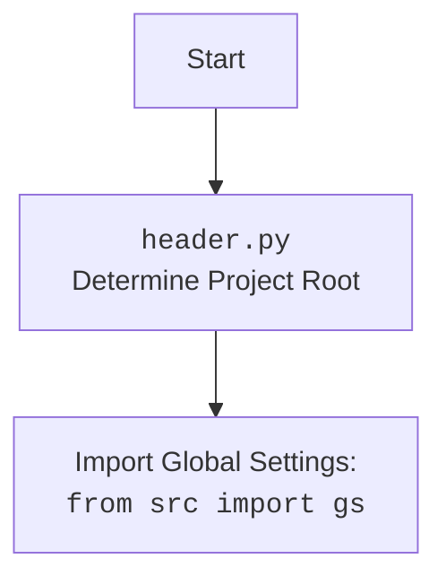

## Анализ кода

### 1. **Алгоритм**

1.  **Инициализация**:
    *   Запускается скрипт `pricelist_generator.py`.
    *   Импортируются необходимые библиотеки и модули, включая `header`, `asyncio`, `dataclasses`, `src.gs`, `json`, `pathlib`, `jinja2`, `pdfkit`, `src.utils.jjson`, `src.utils.file`, `src.utils.pdf`, `src.utils.convertors.html`, `src.utils.image`, `src.utils.printer`, и `src.logger.logger`.
    *   Определяется класс `ReportGenerator` с методом `generate_html` и `create_report`.

2.  **Загрузка данных**:
    *   В функции `main` формируется путь к данным: `base_path = gs.path.external_storage / 'kazarinov' / 'mexironim' / mexiron`
    *   Из JSON-файла загружаются данные с использованием `j_loads`: `data:dict = j_loads(base_path / f'{lang}.json')`

3.  **Генерация HTML**:
    *   В `ReportGenerator.create_report` создается словарь `service_dict` с данными о сервисе.
    *   Данные о сервисе добавляются в общий словарь `data['products'].append(service_dict)`.
    *   Вызывается метод `self.generate_html(data,lang)`, который выбирает шаблон в зависимости от языка (`template_table_he.html` для иврита и `template_table_ru.html` для русского).
    *   Шаблон заполняется данными с использованием Jinja2.
    *   Сгенерированный HTML сохраняется в файл: `Path(html_file).write_text(data = html_content, encoding='UTF-8')`.

4.  **Генерация PDF**:
    *   Создается экземпляр класса `PDFUtils`: `pdf = PDFUtils()`.
    *   HTML-контент преобразуется в PDF с использованием метода `pdf.save_pdf_pdfkit(html_content,pdf_file)`.
    *   Если преобразование PDF не удалось, логируется ошибка.

5.  **Запуск**:
    *   В блоке `if __name__ == "__main__":` задаются значения для `mexiron` и `lang`.
    *   Вызывается функция `main(mexiron,lang)`, которая запускает процесс генерации отчёта.
    *   Внутри `main` создается экземпляр `ReportGenerator` и вызывается асинхронный метод `create_report` через `asyncio.run`.

**Примеры**:

*   **Загрузка данных**:
    ```python
    base_path:Path =  gs.path.external_storage / 'kazarinov' / 'mexironim' / mexiron
    data:dict = j_loads(base_path / f'{lang}.json')
    ```
    Здесь формируется путь к JSON-файлу и происходит загрузка данных с использованием `j_loads`.

*   **Генерация HTML**:
    ```python
    template:str = 'template_table_he.html' if lang == 'he' else  'template_table_ru.html'
    template_path: str  =  str(gs.path.endpoints / 'kazarinov' / 'pricelist_generator' / 'templates' / template)
    template_string = Path(template_path).read_text(encoding = 'UTF-8')
    template = self.env.from_string(template_string)
    return template.render(**data)
    ```
    В зависимости от языка выбирается шаблон, читается его содержимое, и с помощью Jinja2 происходит заполнение данными.

### 2. **Mermaid**

```mermaid
flowchart TD
    A[Начало] --> B{Определение путей и параметров};
    B --> C{Загрузка данных из JSON (j_loads)};
    C --> D{Создание экземпляра ReportGenerator};
    D --> E{Создание service_dict};
    E --> F{Добавление service_dict в data['products']};
    F --> G{Генерация HTML (generate_html)};
    G --> H{Сохранение HTML в файл};
    H --> I{Создание экземпляра PDFUtils};
    I --> J{Генерация PDF (save_pdf_pdfkit)};
    J --> K{Проверка успешности генерации PDF};
    K -- Да --> L[Успешное завершение];
    K -- Нет --> M[Логирование ошибки];
    M --> N[Завершение с ошибкой];
```

**Объяснение зависимостей в Mermaid**:

*   **Начало**: Начальная точка скрипта.
*   **Определение путей и параметров**: Определяются пути к файлам и параметры, такие как язык (`lang`) и имя мехирона (`mexiron`).
*   **Загрузка данных из JSON (j\_loads)**: Загрузка данных из JSON-файла, используя функцию `j_loads` из `src.utils.jjson`.
*   **Создание экземпляра ReportGenerator**: Создается экземпляр класса `ReportGenerator`, который отвечает за генерацию HTML и PDF.
*   **Создание service\_dict**: Создается словарь с данными о сервисе.
*   **Добавление service\_dict в data\['products']**: `service_dict` добавляется в общий словарь данных для отчёта.
*   **Генерация HTML (generate\_html)**: Генерация HTML-контента на основе данных и шаблона.
*   **Сохранение HTML в файл**: HTML-контент сохраняется в файл.
*   **Создание экземпляра PDFUtils**: Создается экземпляр класса `PDFUtils`, который отвечает за генерацию PDF.
*   **Генерация PDF (save\_pdf\_pdfkit)**: Генерация PDF-файла из HTML-контента.
*   **Проверка успешности генерации PDF**: Проверяется, успешно ли сгенерирован PDF-файл.
*   **Успешное завершение**: Скрипт успешно завершил свою работу.
*   **Логирование ошибки**: В случае ошибки при генерации PDF, информация об ошибке логируется.
*   **Завершение с ошибкой**: Скрипт завершает свою работу с ошибкой.



### 3. **Объяснение**

*   **Импорты**:
    *   `header`: Предположительно, содержит общие функции или настройки проекта.
    *   `asyncio`: Используется для асинхронного выполнения операций, таких как генерация отчёта.
    *   `dataclasses`: Используется для создания классов данных (`ReportGenerator`).
    *   `src.gs`: Глобальные настройки проекта, такие как пути к файлам и папкам.
    *   `json`: Используется для работы с JSON-файлами (хотя фактически используется `src.utils.jjson.j_loads`).
    *   `pathlib`: Используется для работы с путями к файлам и папкам.
    *   `jinja2`: Используется для генерации HTML из шаблонов.
    *   `pdfkit`: Используется для генерации PDF-файлов из HTML.
    *   `src.utils.jjson.j_loads`: Функция для загрузки данных из JSON-файлов.
    *   `src.utils.file.read_text_file`, `src.utils.file.save_text_file`: Функции для чтения и записи текстовых файлов.
    *   `src.utils.pdf.PDFUtils`: Класс, содержащий утилиты для работы с PDF.
    *   `src.utils.convertors.html.html2pdf`: Функция для конвертации HTML в PDF.
    *   `src.utils.image.random_image`: Функция для выбора случайного изображения.
    *   `src.utils.printer.pprint`: Функция для красивой печати данных.
    *   `src.logger.logger`: Модуль для логирования событий.

*   **Классы**:
    *   `ReportGenerator`: Класс, отвечающий за генерацию HTML и PDF отчётов.
        *   Атрибуты:
            *   `env`: Объект `jinja2.Environment` для работы с шаблонами.
        *   Методы:
            *   `generate_html(self, data:dict, lang:str) -> str`: Генерирует HTML-контент на основе данных и шаблона.
            *   `create_report(self, data: dict, lang:str, html_file:str| Path, pdf_file:str |Path) -> bool`: Полный цикл генерации отчёта, включающий генерацию HTML, сохранение в файл и генерацию PDF.

*   **Функции**:
    *   `main(mexiron:str,lang:str) ->bool`: Главная функция, которая запускает процесс генерации отчёта.
        *   Аргументы:
            *   `mexiron (str)`: Имя мехирона.
            *   `lang (str)`: Язык отчёта.
        *   Возвращаемое значение:
            *   `bool`: True, если отчёт успешно сгенерирован, иначе False.

*   **Переменные**:
    *   `base_path (Path)`: Путь к папке с данными мехирона.
    *   `data (dict)`: Данные, загруженные из JSON-файла.
    *   `html_file (Path)`: Путь к HTML-файлу.
    *   `pdf_file (Path)`: Путь к PDF-файлу.
    *   `r (ReportGenerator)`: Экземпляр класса `ReportGenerator`.

**Потенциальные ошибки и области для улучшения**:

1.  **Обработка ошибок**: В коде есть логирование ошибки при неудачной компиляции PDF, но обработка `...` не реализована. Необходимо добавить обработку исключений и логирование для всех потенциальных ошибок.
2.  **Управление зависимостями**: Используется `pdfkit`, который требует установленного `wkhtmltopdf`. Необходимо добавить проверку наличия `wkhtmltopdf` и инструкцию по установке.
3.  **Асинхронность**: Метод `create_report` объявлен как `async`, но внутри него выполняются синхронные операции (например, чтение файлов). Необходимо использовать асинхронные аналоги для неблокирующего чтения файлов.
4.  **Конфигурация**: Пути к шаблонам и файлам жёстко заданы в коде. Необходимо вынести их в конфигурационный файл.
5.  **Логирование**: Добавить больше логов для отслеживания хода выполнения программы и отладки.

**Цепочка взаимосвязей с другими частями проекта**:

*   Данный скрипт использует глобальные настройки из `src.gs` для определения путей к файлам и папкам.
*   Используются утилиты из `src.utils` для работы с JSON, файлами, PDF, HTML и изображениями.
*   Логирование осуществляется через модуль `src.logger.logger`.
*   Скрипт является частью endpoints `kazarinov`, что указывает на его использование для конкретного клиента или типа отчётов.