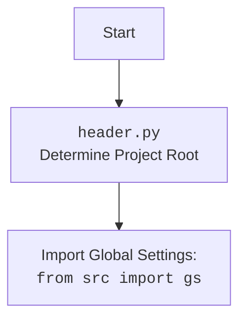

### **Анализ кода `hypotez/src/endpoints/hypo69/code_assistant/header.py`**

#### **1. Алгоритм**

1.  **Определение корневой директории проекта**:
    *   Функция `set_project_root` ищет корневую директорию проекта, начиная с директории текущего файла.
    *   Она ищет маркерные файлы (например, `__root__` или `.git`) в текущей директории и в ее родительских директориях.
    *   Как только один из маркерных файлов найден, директория, содержащая этот файл, устанавливается как корневая директория проекта.
    *   Если маркерные файлы не найдены, корневой директорией становится директория, где расположен скрипт.
    *   Корневая директория добавляется в `sys.path`, если ее там еще нет.

    ```python
    # Пример:
    # Если маркерный файл '.git' найден в '/path/to/project', то '/path/to/project' будет корневой директорией.
    # Если маркерные файлы не найдены, корневой директорией будет директория, где расположен скрипт.
    ```

2.  **Чтение настроек из файла `settings.json`**:
    *   Пытается прочитать файл `settings.json` из директории `src` относительно корневой директории проекта.
    *   Использует `json.load` для преобразования содержимого файла в словарь Python.
    *   При возникновении ошибок `FileNotFoundError` или `json.JSONDecodeError` переменной `settings` присваивается `None`.

    ```python
    # Пример:
    # Если файл 'settings.json' содержит '{"project_name": "hypotez", "version": "1.0"}',
    # то переменная settings будет равна {'project_name': 'hypotez', 'version': '1.0'}.
    # Если файл не найден или содержит некорректный JSON, settings будет равна None.
    ```

3.  **Чтение документации из файла `README.MD`**:
    *   Пытается прочитать файл `README.MD` из директории `src` относительно корневой директории проекта.
    *   При возникновении ошибок `FileNotFoundError` или `json.JSONDecodeError` переменной `doc_str` присваивается `None`.

    ```python
    # Пример:
    # Если файл 'README.MD' содержит "# Hypotez Project",
    # то переменная doc_str будет равна "# Hypotez Project".
    # Если файл не найден, doc_str будет равна None.
    ```

4.  **Определение переменных проекта**:
    *   Определяет переменные проекта, такие как `__project_name__`, `__version__`, `__doc__`, `__author__`, `__copyright__` и `__cofee__`.
    *   Если переменная `settings` содержит значения, они используются для инициализации этих переменных.
    *   Если `settings` равно `None`, используются значения по умолчанию.

    ```python
    # Пример:
    # Если settings = {'project_name': 'hypotez', 'version': '1.0', 'author': 'User'},
    # то __project_name__ = 'hypotez', __version__ = '1.0', __author__ = 'User'.
    # Если settings = None,
    # то __project_name__ = 'hypotez', __version__ = '', __author__ = ''.
    ```

#### 2. **Mermaid**

```mermaid
flowchart TD
    subgraph Project Setup
        A[Начало] --> B{Определение корневой директории проекта}
        B --> C{Поиск маркерных файлов}
        C -- Файл найден --> D[Установка корневой директории]
        C -- Файл не найден --> E[Установка директории скрипта как корневой]
        D --> F[Добавление корневой директории в sys.path]
        E --> F
        F --> End[Конец определения корневой директории]
    end

    subgraph Settings Loading
        StartSettings[Начало чтения настроек] --> LoadSettings{Чтение settings.json}
        LoadSettings -- Успешно --> ParseSettings[Парсинг JSON]
        LoadSettings -- Ошибка --> SettingsNone[settings = None]
        ParseSettings --> ApplySettings[Применение настроек]
        SettingsNone --> ApplySettings
        ApplySettings --> EndSettings[Конец чтения настроек]
    end

    subgraph Documentation Loading
        StartDoc[Начало чтения документации] --> LoadDoc{Чтение README.MD}
        LoadDoc -- Успешно --> ReadDoc[Чтение содержимого]
        LoadDoc -- Ошибка --> DocNone[doc_str = None]
        ReadDoc --> ApplyDoc[Применение документации]
        DocNone --> ApplyDoc
        ApplyDoc --> EndDoc[Конец чтения документации]
    end

    subgraph Variable Initialization
        StartVars[Начало инициализации переменных] --> CheckSettings{Проверка settings}
        CheckSettings -- settings существует --> UseSettings[Использование значений из settings]
        CheckSettings -- settings отсутствует --> UseDefaults[Использование значений по умолчанию]
        UseSettings --> InitVars[Инициализация переменных проекта]
        UseDefaults --> InitVars
        InitVars --> EndVars[Конец инициализации переменных]
    end

    Project Setup --> Settings Loading
    Settings Loading --> Documentation Loading
    Documentation Loading --> Variable Initialization
```

**Объяснение зависимостей:**

*   `sys`: Используется для работы с системными параметрами и функциями, такими как `sys.path`.
*   `json`: Используется для чтения данных из JSON-файла (`settings.json`).
*   `packaging.version`: Используется для работы с версиями пакетов.
*   `pathlib.Path`: Используется для работы с путями к файлам и директориям.
*   `header`:  Импортируется сам модуль, что позволяет использовать объявленные в нем функции и переменные.
*   `src.gs`: Используется для получения глобальных настроек проекта.



#### 3. **Объяснение**

*   **Импорты**:
    *   `sys`: Используется для работы с системными параметрами и функциями, такими как `sys.path`.
    *   `json`: Используется для чтения данных из JSON-файла (`settings.json`).
    *   `packaging.version`: Используется для работы с версиями пакетов.
    *   `pathlib.Path`: Используется для работы с путями к файлам и директориям.
    *   `src.gs`:  Предположительно, `gs` является сокращением для "global settings". Этот модуль, вероятно, содержит глобальные переменные и настройки, используемые в проекте.

*   **Классы**:
    В данном коде нет явно определенных классов.

*   **Функции**:
    *   `set_project_root(marker_files: tuple = ('__root__', '.git')) -> Path`:
        *   Аргументы:
            *   `marker_files`: Кортеж имен файлов или директорий, используемых для определения корневой директории проекта. По умолчанию `('__root__', '.git')`.
        *   Возвращаемое значение:
            *   `Path`: Путь к корневой директории проекта.
        *   Назначение:
            *   Функция ищет корневую директорию проекта, начиная с директории текущего файла, и останавливается на первой директории, содержащей любой из маркерных файлов.
            *   Если маркерные файлы не найдены, корневой директорией становится директория, где расположен скрипт.
            *   Корневая директория добавляется в `sys.path`, если ее там еще нет.
        *   Пример:
            ```python
            root_path = set_project_root()
            print(root_path)  # Выводит путь к корневой директории проекта
            ```

*   **Переменные**:
    *   `__root__`:  Путь к корневой директории проекта.
    *   `settings`:  Словарь, содержащий настройки проекта, прочитанные из файла `settings.json`.
    *   `doc_str`:  Строка, содержащая документацию проекта, прочитанную из файла `README.MD`.
    *   `__project_name__`:  Имя проекта.
    *   `__version__`:  Версия проекта.
    *   `__doc__`:  Документация проекта.
    *   `__details__`:  Детали проекта (в данном коде не используются).
    *   `__author__`:  Автор проекта.
    *   `__copyright__`:  Информация об авторских правах.
    *   `__cofee__`:  Сообщение с предложением поддержать разработчика.

*   **Потенциальные ошибки и области для улучшения**:
    *   Обработка исключений при чтении файлов `settings.json` и `README.MD` может быть улучшена. В текущей реализации просто устанавливаются значения `None` для переменных `settings` и `doc_str`, что может привести к проблемам в дальнейшем, если эти переменные используются без проверки на `None`.
    *   Отсутствует обработка исключений при добавлении корневой директории в `sys.path`.
    *   Было бы полезно добавить логирование для отладки и мониторинга.

*   **Взаимосвязи с другими частями проекта**:
    *   Данный модуль является центральным для определения корневой директории проекта и загрузки основных настроек и документации. Он используется другими модулями для получения информации о проекте и доступа к файлам настроек.
    *   Модуль `src.gs` предоставляет глобальные настройки, которые используются для определения пути к файлам настроек и документации.

```