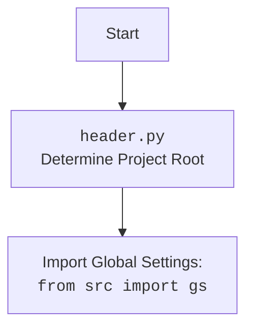

## Проект `hypotez`
## Роль `code explainer`

### **1. <алгоритм>**:

1.  **Запуск приложения**:
    *   Приложение FastAPI инициализируется и конфигурируется.
    *   Настраивается middleware CORS для разрешения запросов с любых источников.
    *   Определяются пути к шаблонам и локалям.

2.  **Определение моделей данных**:
    *   `ChatRequest` (pydantic BaseModel): Используется для определения структуры запроса чата, содержащего поле `message`.

3.  **Инициализация `GoogleGenerativeAI`**:
    *   При старте приложения `GoogleGenerativeAI` не инициализируется.
    *   Первый запрос к `/api/chat` создает экземпляр `GoogleGenerativeAI` с использованием API-ключа из `gs.credentials.gemini.games` и модели `gemini-2.0-flash-exp`.

4.  **Обработка запросов**:
    *   `GET /`:
        *   Возвращает содержимое файла `index.html`.
        *   В случае ошибки (отсутствие файла или ошибка чтения) возвращает HTTP-ответ с кодом 500.
    *   `POST /api/chat`:
        *   Принимает `ChatRequest` с сообщением пользователя.
        *   Если модель `GoogleGenerativeAI` не инициализирована, создает экземпляр.
        *   Отправляет сообщение в `GoogleGenerativeAI` и возвращает ответ.
        *   В случае ошибки возвращает HTTP-ответ с кодом 500.
    *   `GET /locales/{lang}.json`:
        *   Возвращает JSON-файл локали для указанного языка.
        *   В случае отсутствия файла возвращает HTTP-ответ с кодом 404.
        *   В случае ошибки чтения или неверного формата JSON возвращает HTTP-ответ с кодом 500.

5.  **Запуск Uvicorn**:
    *   Если скрипт запускается напрямую (`if __name__ == "__main__":`), запускается Uvicorn-сервер на `127.0.0.1:8000`.

### **2. <mermaid>**:

```mermaid
flowchart TD
    subgraph FastAPI Application
        A[GET / <br> Return index.html] --> B{index_file.exists()};
        B -- Yes --> C[Read index.html content];
        C --> D[Return HTMLResponse];
        B -- No --> E[Raise HTTPException 500];
        
        F[POST /api/chat <br> Receive ChatRequest] --> G{model is None?};
        G -- Yes --> H[Initialize GoogleGenerativeAI];
        H --> I[model.chat(request.message)];
        G -- No --> I;
        I --> J[Return {"response": response}];

        K[GET /locales/{lang}.json] --> L[get_locale_file(lang)];
        L --> M{locale_file exists?};
        M -- Yes --> N[Read and return locale JSON];
        M -- No --> O[Raise HTTPException 404];
    end

    subgraph GoogleGenerativeAI
        P[GoogleGenerativeAI <br> api_key, model_name]
    end

    A --> templates_path
    C --> templates_path
    H --> P
    I --> P
    L --> locales_path
    
    style A fill:#f9f,stroke:#333,stroke-width:2px
    style F fill:#f9f,stroke:#333,stroke-width:2px
    style K fill:#f9f,stroke:#333,stroke-width:2px
```

Диаграмма описывает основные маршруты FastAPI приложения и их взаимодействие с `GoogleGenerativeAI`.
*   `GET /` возвращает HTML-контент из `index.html`.
*   `POST /api/chat` принимает запросы чата и использует `GoogleGenerativeAI` для получения ответа.
*   `GET /locales/{lang}.json` возвращает файлы локализации.



### **3. <объяснение>**:

*   **Импорты**:
    *   `sys`: Для доступа к некоторым переменным и функциям, взаимодействующим с интерпретатором Python.
    *   `pathlib.Path`: Для работы с путями к файлам и директориям.
    *   `types.SimpleNamespace`: Для создания простых объектов, доступ к атрибутам которых осуществляется через точку.
    *   `fastapi`: Фреймворк для создания API.
    *   `fastapi.middleware.cors.CORSMiddleware`: Middleware для обработки CORS.
    *   `fastapi.responses.HTMLResponse`: Для возврата HTML-ответов.
    *   `fastapi.staticfiles.StaticFiles`: Для обслуживания статических файлов.
    *   `pydantic.BaseModel`: Для определения структуры данных запросов и ответов.
    *   `uvicorn`: ASGI-сервер для запуска FastAPI-приложения.
    *   `json`: Для работы с JSON-данными.
    *   `header`: Определяет корень проекта.
    *   `src.gs`: Глобальные настройки проекта.
    *   `src.logger.logger`: Модуль логирования.
    *   `src.ai.GoogleGenerativeAI`: Класс для взаимодействия с Google Gemini AI.

*   **Переменные**:
    *   `base_path`: Путь к директории `desktop_assistant`.
    *   `templates_path`: Путь к директории с HTML-шаблонами.
    *   `locales_path`: Путь к директории с файлами локализации.
    *   `app`: Экземпляр FastAPI-приложения.
    *   `model`: Экземпляр `GoogleGenerativeAI`. Изначально `None`, инициализируется при первом запросе к `/api/chat`.
    *   `api_key`: API-ключ для доступа к Google Gemini AI. Берется из `gs.credentials.gemini.games`.
    *    `system_instruction:str = ""`: Пустая строка. Не используется.

*   **Классы**:
    *   `ChatRequest(BaseModel)`: Модель данных для запроса чата. Содержит поле `message: str`.

*   **Функции**:
    *   `root()`:
        *   Обрабатывает GET-запросы к корневому пути ("/").
        *   Читает содержимое файла `index.html` и возвращает его в качестве HTML-ответа.
        *   В случае ошибки возвращает HTTP-ответ с кодом 500.
    *   `chat(request: ChatRequest)`:
        *   Обрабатывает POST-запросы к пути "/api/chat".
        *   Принимает `ChatRequest` с сообщением пользователя.
        *   Если модель `GoogleGenerativeAI` не инициализирована, создает экземпляр.
        *   Отправляет сообщение в `GoogleGenerativeAI` и возвращает ответ.
        *   В случае ошибки возвращает HTTP-ответ с кодом 500.
    *   `get_locale_file(lang: str)`:
        *   Формирует путь к файлу локали на основе переданного языка.
        *   Пытается открыть и прочитать JSON-файл локали.
        *   Возвращает содержимое файла в виде словаря.
        *   В случае ошибки (отсутствие файла, ошибка чтения или неверный формат JSON) возвращает HTTP-ответ с соответствующим кодом.
    *   `locales(lang: str)`:
        *   Обрабатывает GET-запросы к пути "/locales/{lang}.json".
        *   Вызывает `get_locale_file(lang)` для получения файла локали.
        *   Возвращает JSON-ответ с содержимым файла локали.

*   **Потенциальные ошибки и области для улучшения**:
    *   Обработка ошибок: В блоках `try...except` обрабатываются общие исключения (`Exception`). Желательно уточнить типы исключений для более точной обработки.
    *   Инициализация `GoogleGenerativeAI`: Модель `GoogleGenerativeAI` инициализируется только при первом запросе к `/api/chat`. Возможно, стоит инициализировать ее при старте приложения, чтобы избежать задержки при первом запросе.
    *    `system_instruction:str = ""`: Пустая строка. Не используется.

*   **Взаимосвязи с другими частями проекта**:
    *   Использует `src.gs` для получения глобальных настроек, таких как API-ключ для Gemini.
    *   Использует `src.logger.logger` для логирования ошибок и отладочной информации.
    *   Использует `src.ai.GoogleGenerativeAI` для взаимодействия с Google Gemini AI.
    *   Использует `header` для определения коря проекта.