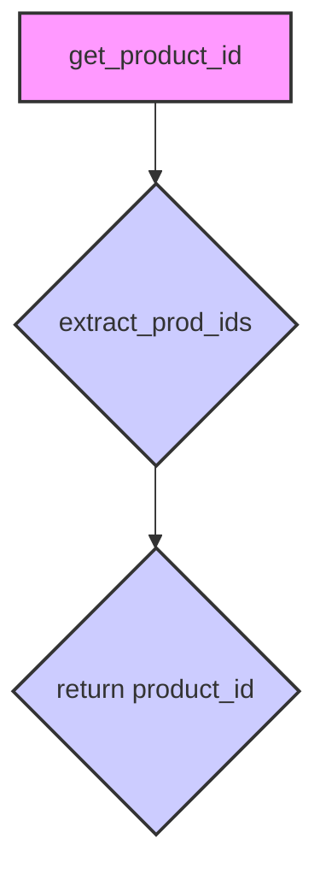

### **Алгоритм**

1.  **Функция `get_product_id`**:
    *   Принимает строку `raw_product_id` в качестве аргумента.
    *   Вызывает функцию `extract_prod_ids` из модуля `src.suppliers.aliexpress.utils.extract_product_id` с аргументом `raw_product_id`.
    *   Возвращает результат, полученный от функции `extract_prod_ids`.

### **mermaid**



**Объяснение зависимостей:**

*   `get_product_id` зависит от функции `extract_prod_ids` из модуля `src.suppliers.aliexpress.utils.extract_product_id`.

### **Объяснение**

**Импорты:**

*   `from ..errors import ProductIdNotFoundException`: Импортирует исключение `ProductIdNotFoundException` из модуля `errors`, расположенного на уровень выше в иерархии пакетов. Это исключение используется, когда не удается найти ID продукта.
*   `from src.suppliers.aliexpress.utils.extract_product_id import extract_prod_ids`: Импортирует функцию `extract_prod_ids` из модуля `extract_product_id`, расположенного в пакете `src.suppliers.aliexpress.utils`. Эта функция, вероятно, содержит логику для извлечения ID продукта из различных форматов входных данных (например, URL, текста).
*   `import re`: Импортирует модуль `re` для работы с регулярными выражениями. В текущей реализации не используется.

**Функции:**

*   `get_product_id(raw_product_id: str) -> str`:
    *   Аргументы:
        *   `raw_product_id` (str): Строка, содержащая "сырой" ID продукта, который может быть в любом формате (например, просто ID, URL, текст с ID).
    *   Возвращаемое значение:
        *   `str`: ID продукта в строковом формате.
    *   Назначение:
        *   Извлекает ID продукта из предоставленной строки `raw_product_id` с использованием функции `extract_prod_ids`.
        *   В случае неудачи (например, если `extract_prod_ids` не находит ID) должна возбуждать исключение `ProductIdNotFoundException`, но в текущей реализации это не происходит.
    *   Пример:
        ```python
        product_id = get_product_id("https://aliexpress.com/item/1234567890.html")
        print(product_id)  # Вывод: 1234567890 (если extract_prod_ids извлекает ID из URL)
        ```

**Переменные:**

*   В данном коде нет явно определенных переменных, кроме аргумента функции `raw_product_id`.

**Потенциальные ошибки и области для улучшения:**

1.  **Отсутствие обработки исключений:** Функция `get_product_id` не обрабатывает исключение `ProductIdNotFoundException`, которое может быть вызвано функцией `extract_prod_ids`.  Это может привести к необработанным исключениям в вызывающем коде.
2.  **Неиспользуемый код:** Закомментированный код с использованием `re` (регулярных выражений) предполагает альтернативные способы извлечения ID продукта, которые в данный момент не используются.  Этот код можно либо удалить, либо пересмотреть и интегрировать в `extract_prod_ids`.
3.  **Нечеткая документация:** Документация функции `get_product_id` указывает, что она "Raises ProductIdNotFoundException on fail", но текущая реализация не делает этого.  Необходимо либо добавить обработку исключений, либо обновить документацию.

**Взаимосвязи с другими частями проекта:**

*   Функция `get_product_id` является частью API для работы с AliExpress и зависит от модуля `src.suppliers.aliexpress.utils.extract_product_id` для извлечения ID продукта. Она также использует `ProductIdNotFoundException` для обработки ситуаций, когда ID не найден. Эта функция, вероятно, используется другими частями проекта для получения ID продукта из различных источников данных.